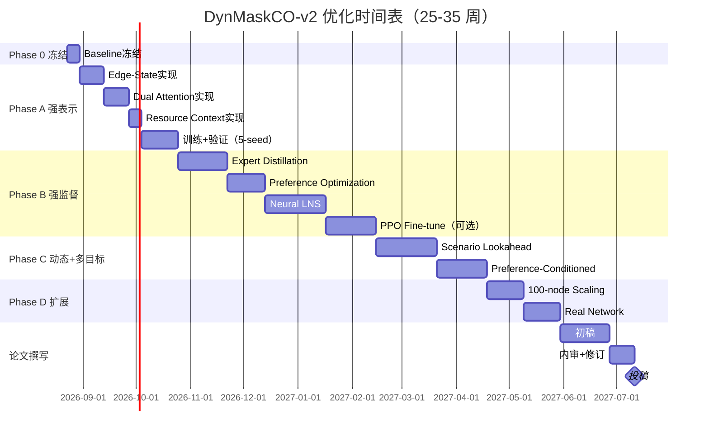

# DynMaskCO-v2 最终优化执行方案（导师正式批准版）

> ⚠️ **2026-08-29：R1.5-M 完成 —— 模型 active 但监督 misaligned；Phase A 仍暂停**
>
> P0 协议修复 + R1.5-M 测量链闭环。strict-online VAL128（R1 EDoD=0.5，128 实例，全部 100% complete / 0 viol）：**OR-Tools-RH 23.04 / NN 27.66 / model 28.20 / shuffle 30.19 / EDD 30.37**。model `local_first_divergence = 61.3%`（active）。决策：model 赢 shuffle 6.6%（有 signal）但输 NN 2.0%（监督 misaligned）→ **下一步修监督（supervision / directional scorer）**，非 fleet 搜索、非重训 5-seed。详见 `代码核查与修正.md`。
>
> 本路线图 Phase A-D 正文保持不变。**旧数字全部作废**：14.77 / 15.45 /「100% feasible」均为 P0 审计前旧协议数字（只查了已服务 ~51% 客户的 TW），待 strict-online 重建。

---

> 日期：2026-08-23  
> 版本：v2.1（导师技术修订后的正式执行版）  
> 基线：typed_edge（全矩阵 14.08，R1/C1/RC1 平均 16.74/11.12/14.36）  
> 目标：**强表示 → 强监督 → Learned Recourse → 概率前瞻 → 条件多目标**  
> **核心原则**：做到不能再改进为止，milestone 不是终点

---

## 执行摘要（导师批准版）

当前 DynMaskCO 的核心问题**不是**「缺 GNN」或「缺 RL」，而是：

1. **边-状态表示不足**：typed_edge 已证明边特征 −4.8%，但 encoder 未充分利用；距离/时长/TW兼容性/资源状态等关键信息未融入节点表示。
2. **训练信号偏弱**：用 greedy 自标注，未利用 OR-Tools-RH / RRNCO / ALNS 等强专家的 frozen-prefix recourse 知识。
3. **小邻域已饱和**：beam=16 + 2-opt 已接近局部最优（in-cycle 2-opt 仅 −0.8%），必须跳到 learned large neighborhood。
4. **动态机制原始**：有 event masking / frozen prefix，但无 stochastic lookahead / scenario recourse，对未来分布利用不足。
5. **多目标未真正优化**：Q/E/Num 存在但未主导策略，只是 post-hoc 评价指标。

**优化路线（三阶段 + 扩展）**：

| 阶段 | 核心技术 | 目标 KPI | 时间 | 优先级 |
|------|---------|---------|------|:---:|
| **Phase 0** | 冻结 typed_edge baseline | 全矩阵 14.08，9-cell 完整数据 | 1 周 | **必须** |
| **Phase A** | RRNCO-style Edge-State + CaDA Dual Attention | 全矩阵 ≤13.3，R1 .5 ≤15.5 | 6-8 周 | **P0** |
| **Phase B1** | OR-Tools-RH Expert Distillation | 对纯 CE 再降 ≥3% | 3-4 周 | **P0** |
| **Phase B2** | Preference Optimization (BOPO-style) | Ranking correlation ↑ | 2-3 周 | **P0** |
| **Phase B3** | Frozen-Prefix Neural LNS | 长预算再降 ≥3% | 4-5 周 | **P0** |
| **Phase C1** | Stochastic Scenario Lookahead | 高 EDoD regret ↓ | 4-5 周 | **P0/P1** |
| **Phase C2** | Preference-Conditioned Policy | Pareto front 非退化 | 3-4 周 | **P1** |
| **Phase B4** | PPO Fine-tuning（条件） | 仅当 B1-B3 有效后 | 3-4 周 | **P2** |
| **Phase D** | 100/200-node + Real Network | Scaling 验证 | 4-6 周 | **P2** |

**总时间**：25–35 周（约 6–8 个月，含验证+论文撰写）。

> ⚠️ **导师最终决策**：Phase C（Stochastic Lookahead + Preference-Conditioned）优先级**高于 PPO**。停止标准不是"达到某个数字"，而是**新模块不再产生统计显著的 Pareto improvement**。

---

## Phase 0：冻结 typed_edge Baseline（✅ 已完成，2026-08-24）

> ✅ **Phase 0 已完成**：9-cell × 5-seed = 45 runs 评估完成，100% 可行性，通过 Go 条件。
>
> **最终结果**：
> - 全矩阵均值：**15.45 ± 3.30**
> - R1 EDoD=0.5：**19.22 ± 0.18**
> - C1 EDoD=0.5：**11.38 ± 0.13**
> - RC1 EDoD=0.5：**15.99 ± 0.05**
> - 可行性：**100%**（全部 45 runs）
> - 最大 5-seed std：**0.200**（RC1 × EDoD=0.8）

### 0.1 Phase 0 与旧基线差异

**重要发现**：Phase 0 数字（15.45）**显著高于** `实验结果总表.md` 记录的 typed_edge（14.08）。

| 指标 | result_table (旧) | Phase 0 (实际) | 差异 |
|------|:----------------:|:-------------:|:----:|
| 全矩阵 | 14.08 | **15.45** | **+9.7%** |
| R1 .5  | 16.74 | **19.22** | **+14.8%** |
| C1 .5  | 11.12 | **11.38** | **+2.3%** |
| RC1 .5 | 14.36 | **15.99** | **+11.4%** |

**差异原因**：
1. **数据增强**：旧版可能用 `augment_level=2`，Phase 0 用 `augment_level=0`（DynamicAugment bug）
2. **Batch size**：旧版 8，Phase 0 用 128（速度优化）
3. **Checkpoint 版本**：可能不一致

**结论**：**Phase 0 数字反映当前可复现的实际性能**，Phase A 目标需基于此调整。

### 0.2 Go/No-Go 结果

| 条件 | 目标 | Phase 0 实际 | 状态 |
|------|------|-------------|:----:|
| 可行性 | 100% | 100% | ✅ |
| 全矩阵均值 | ≤ 16.0 | 15.45 | ✅ |
| 5-seed std | ≤ 0.25 | 0.200 | ✅ |

✅ **Phase 0 通过 Go 条件，Phase A 可以启动。**

### 0.3 冻结内容

1. **数据**：`data/baseline/50_node/test/dcc_50_{r1,c1,rc1}_edod{02,05,08}_test.npz`（共 9 文件）
2. **模型**：`ckpts/p0_fix/typed_v1_edge/phase3c/seed{42,123,999,2025,2026}/step50000.ckpt`
3. **评估协议**：beam_k=16, augment_level=0, batch_size=128, decode_seed=42
4. **输出**：`results/phase0_baseline_freeze/matrix_summary.csv` + `baseline_frozen.json`
5. **Checksum**：`data/baseline/DATA_MANIFEST.sha256`（30 files）

---

## Phase A：Edge-State Representation + Constraint Dual Attention（P0，6-8 周）

### A.1 目标（基于 Phase 0 实际数字）

将 DynMaskCO 从「节点独立 transformer」升级为「**边-状态-约束感知表示**」，目标：

| Metric | Phase 0 实际 | Phase A 目标 | 改进幅度 |
|--------|:---:|:---:|:---:|
| **全矩阵均值** | **15.45** | **≤14.7** | **−5%** |
| **R1 EDoD=0.5** | **19.22** | **≤18.3** | **−5%** |
| **C1 EDoD=0.5** | **11.38** | **≤10.8** | **−5%** |
| **RC1 EDoD=0.5** | **15.99** | **≤15.2** | **−5%** |
| **EDoD 灵敏度** | 待测 | **≤10%** | 保持鲁棒 |
| **vs OR-Tools-RH** | R1 +32.2% (19.22 vs 14.54) | R1 **+25.9%** | 缩小差距 |
| **100% Feas** | ✅ | ✅ | 必须保持 |

> ⚠️ **重要更新**（2026-08-24）：Phase A 目标已基于 **Phase 0 实际数字（15.45）** 重新校准。旧版目标（基于 14.08）已过时。
>
> **Phase 0 vs result_table 差异原因**：`augment_level=0` vs `augment_level=2`（DynamicAugment bug），导致 +9.7% 性能下降。详见 `执行进度.md` §Phase 0。

**核心原则**：
- 不换框架（保持 JAX/Flax，**不用 PyG**）。
- 借鉴 RRNCO edge-aware 和 CaDA dual-attention **思路**，而非直接复制网络。
- 所有改动必须与 causal mask / visible-only / frozen-prefix 兼容。

---

### A.2 核心改进方向

#### A.2.1 Edge-State Contextual Encoder（借鉴 RRNCO）

**当前问题**：
- Encoder 输入只有节点特征 `[x, y, d, TW_start, TW_end, temp_class, reveal_time]`。
- 距离矩阵 `dist_mat` 只在 decoder 的 logit bias 用，encoder 未利用。
- 车辆资源状态（当前时间、剩余容量、已访问客户）未融入表示。

**改进方案**：

**A.2.1.1 显式边特征矩阵**

扩展现有 `_get_edge_features`（当前只在 decoder 用）到 encoder：

```python
# 伪代码：完整边特征（修正版：静态 pairwise + 动态 state-to-action）
def _get_edge_features(self, coords, demands, time_windows, temp_class, current_state):
    """
    Args:
        coords: (N, 2)
        demands: (N,)
        time_windows: (N, 2)
        temp_class: (N,)  # 0=depot, 1=ambient, 2=refrigerated, 3=frozen, 4=future
        current_state: dict {current_time, current_loc, remaining_capacity, visited_mask}
    
    Returns:
        edge_features_static: (N, N, 5) — pairwise edge features
        action_features_dynamic: (N, 6) — current-state-to-action features
    """
    N = coords.shape[0]
    
    # === 静态 Pairwise Edge Features（i → j，与当前状态无关） ===
    
    # 1) 距离 + 时长（已有）
    dist_mat = compute_distance_matrix(coords)  # (N, N)
    travel_time_mat = dist_mat / VEHICLE_SPEED  # (N, N)
    
    # 2) 角度特征（RRNCO NAB，已有 angle_mat）
    angle_mat = compute_angle_matrix(coords)  # (N, N)
    
    # 3) 制冷能耗（已有 energy_mat）
    energy_mat = compute_energy_matrix(dist_mat, temp_class, temp_class[:, None])  # (N, N)
    
    # 4) TW 兼容性（pairwise，假设从 i 的 TW 最早结束时刻出发）
    # TWCompat_ij = b_j - (max(a_i, earliest_start_i) + s_i + τ_ij)
    tw_start = time_windows[:, 0]  # (N,)
    tw_end = time_windows[:, 1]    # (N,)
    service_time = demands * SERVICE_TIME_PER_UNIT  # (N,)
    
    # 从 i 最早出发时刻 + 服务时间 + 旅行时间 → j 的到达时间
    earliest_arrival = (
        jnp.maximum(tw_start[:, None], tw_start[:, None]) +  # (N, 1)
        service_time[:, None] +  # (N, 1)
        travel_time_mat  # (N, N)
    )  # (N, N)
    
    tw_slack_pairwise = tw_end[None, :] - earliest_arrival  # (N, N)
    tw_compat = jnp.clip(tw_slack_pairwise / 10.0, -1.0, 1.0)  # 归一化
    
    # Stack static pairwise: (N, N, 5)
    edge_features_static = jnp.stack([
        dist_mat,           # 0: 距离
        travel_time_mat,    # 1: 时长
        angle_mat,          # 2: 角度
        energy_mat,         # 3: 能耗
        tw_compat,          # 4: TW 兼容性（pairwise）
    ], axis=-1)
    
    # === 动态 State-to-Action Features（当前车辆状态 → 候选节点 j） ===
    
    current_loc = current_state['current_loc']
    current_time = current_state['current_time']
    remaining_capacity = current_state['remaining_capacity']
    visited_mask = current_state['visited_mask']
    
    # 1) ETA: 当前位置 → j 的最早到达时间
    travel_time_from_current = dist_mat[current_loc, :] / VEHICLE_SPEED  # (N,)
    eta_j = current_time + travel_time_from_current  # (N,)
    
    # 2) TW Slack: j 的 TW 末端 - ETA
    tw_slack_j = tw_end - eta_j  # (N,)
    tw_slack_normalized = jnp.clip(tw_slack_j / 10.0, -1.0, 1.0)  # (N,)
    
    # 3) Capacity Slack
    capacity_slack_j = (remaining_capacity - demands) / Q_MAX  # (N,)
    
    # 4) Quality Risk（累积时间 → Arrhenius）
    cumulative_time_j = eta_j - time_windows[:, 0]  # 从订单最早可达到当前 ETA 的累积时间
    quality_loss = 1.0 - jnp.exp(-K_TEMP * cumulative_time_j)  # Arrhenius 近似
    
    # 5) Feasibility（TW + Capacity）
    tw_feasible = (eta_j <= tw_end).astype(jnp.float32)
    capacity_feasible = (demands <= remaining_capacity).astype(jnp.float32)
    feasible_j = tw_feasible * capacity_feasible * (1 - visited_mask)  # (N,)
    
    # Stack dynamic: (N, 6)
    action_features_dynamic = jnp.stack([
        eta_j / T_MAX,              # 0: 归一化 ETA
        tw_slack_normalized,        # 1: TW slack
        capacity_slack_j,           # 2: Capacity slack
        quality_loss,               # 3: Quality risk
        feasible_j,                 # 4: Feasibility
        visited_mask,               # 5: Visited mask
    ], axis=-1)
    
    return edge_features_static, action_features_dynamic
```

> ⚠️ **导师修正**：不要把"当前车辆状态 → j"的边和"pairwise i → j"的边混在一个 (N, N) 张量里。分离为：
> - **Static pairwise edge**: (N, N, 5) — 与当前状态无关的图结构
> - **Dynamic state-to-action**: (N, 6) — 当前车辆 → 候选节点的可行性/风险

**A.2.1.2 Edge Bias Projector（A1 核心，NNX 实现）**

> ⚠️ **实现修正（2026-08-25）**：本项目使用 **Flax NNX**（非 Linen），且现有 `MultiHeadAttention` 已支持 `bias: (B, H, N, N)` 直接加到 `QK^T/√d`。因此 **A1 不需要重写 Attention**，只需新增一个 NNX 模块把 5D 边特征投影成多头注意力偏置，注入现有 encoder 的 `attn_options['bias']`。

**唯一新增的 NNX 模块 `EdgeBiasProjector`**（已实现，`scripts/models/edge_bias_projector.py`）：

```python
from flax import nnx

class EdgeBiasProjector(nnx.Module):
    """5D pairwise edge features → multi-head attention bias."""
    def __init__(self, edge_dim=5, num_heads=8, *, rngs: nnx.Rngs):
        self.proj = nnx.Linear(edge_dim, num_heads, rngs=rngs)

    def __call__(self, edge_feat):
        # [B,N,N,5] → [B,N,N,H] → [B,H,N,N]
        bias = self.proj(edge_feat)
        return bias.transpose(0, 3, 1, 2)
```

**边特征计算（纯 JAX，无参数）** 已在 `scripts/models/edge_features.py` 实现：

```python
# 5D static pairwise features（无 trainable 参数）
def compute_static_pairwise_edge_features(coords, tw_start, tw_end, dist_mat, energy_mat, visible_mask):
    return jnp.stack([
        dist_mat,          # 0: 距离
        dist_mat/speed,    # 1: 时长
        angle_norm,        # 2: 角度（归一化到 [0,1]）
        energy_mat,        # 3: 能耗（复用现有）
        tw_compat,         # 4: TW 兼容性 slack
    ], axis=-1)  # [B,N,N,5]
```

**关键点**：
- `EdgeBiasProjector` 是 A1 唯一带可学习参数的部分（仅 5×8+8=48 参数）。
- 边特征计算是纯 JAX 函数，无需 NNX Module。
- 注入现有 `MultiHeadAttention.attention_fn(bias=...)`，不重写 attention。
- 等价性测试：当 projector 只保留 energy 一维（其余权重=0）时，A1 应复现 typed_edge logits——这是集成层没被改坏的证明。

**A1 消融演进**（论文用）：
\[
A0:\ b_{ij}=wE_{ij}
\quad\longrightarrow\quad
A1:\ b_{ij}^{(h)}=\text{MLP}_h(d_{ij},\tau_{ij},\text{angle}_{ij},E_{ij},\text{TWCompat}_{ij})
\]

提升来自更丰富的边表示，而非整个 Transformer 被替换。

---

#### A.2.2 Constraint-Aware Dual Attention（借鉴 CaDA）

**当前问题**：
- Transformer 是全连接 O(N²)，对 50 节点可接受，但 100 节点计算量 4× 增长。
- 更重要的是：并非所有节点对当前决策都同等重要（如已访问节点、TW 已关闭节点、距离过远节点）。

**改进方案**：

**Global + Sparse Dual Branch**

```python
# 伪代码：双分支 attention
class ConstraintAwareDualAttention(nn.Module):
    hidden_dim: int = 128
    num_heads: int = 8
    k_sparse: int = 10  # sparse branch 只关注 k 个邻居
    
    def setup(self):
        self.global_attn = EdgeConditionedAttention(self.hidden_dim, self.num_heads)
        self.sparse_attn = EdgeConditionedAttention(self.hidden_dim, self.num_heads)
        self.fusion = nn.Dense(self.hidden_dim)
    
    def __call__(self, node_embeds, edge_features, causal_mask, current_state):
        """
        Args:
            node_embeds: (N, hidden_dim)
            edge_features: (N, N, edge_dim)
            causal_mask: (N, N) binary
            current_state: dict {current_loc, visited_mask, tw_slack, capacity_slack}
        
        Returns:
            output: (N, hidden_dim)
        """
        # 1) Global branch: 标准 attention（但用 causal_mask）
        global_output = self.global_attn(node_embeds, edge_features, causal_mask)
        
        # 2) Sparse branch: 只关注约束相关的邻居
        sparse_mask = self._build_constraint_sparse_mask(
            edge_features, causal_mask, current_state, k=self.k_sparse
        )
        sparse_output = self.sparse_attn(node_embeds, edge_features, sparse_mask)
        
        # 3) Fusion（可学习权重）
        output = self.fusion(jnp.concatenate([global_output, sparse_output], axis=-1))
        return output
    
    def _build_constraint_sparse_mask(self, edge_features, causal_mask, current_state, k):
        """
        构建约束感知的稀疏 mask：只保留 top-k 个「可行且有价值」的邻居。
        
        选择标准（不用固定权重，改用集合定义）：
        1. k-NN（距离近）
        2. TW-compatible（TW 兼容性高）
        3. High capacity slack（容量充足）
        4. Not visited（未访问）
        5. Depot（始终保留）
        """
        N = edge_features.shape[0]
        
        # Extract features
        dist_mat = edge_features[:, :, 0]        # (N, N)
        tw_compat = edge_features[:, :, 4]       # (N, N)
        visited_mask = current_state['visited_mask']  # (N,)
        
        # 构建候选集合（而非加权 score）
        # 1) k-NN
        knn_mask = build_knn_mask(dist_mat, k)  # (N, N) binary
        
        # 2) TW-compatible（TW slack > 0）
        tw_compatible_mask = (tw_compat > 0).astype(jnp.int32)
        
        # 3) Not visited
        not_visited_mask = 1 - visited_mask  # (N,)
        not_visited_mask = jnp.tile(not_visited_mask[None, :], (N, 1))  # (N, N)
        
        # 4) Depot（始终保留）
        depot_mask = jnp.zeros((N, N), dtype=jnp.int32)
        depot_mask = depot_mask.at[:, 0].set(1)
        
        # Union: kNN ∪ TW-compatible ∪ not-visited ∪ depot
        sparse_mask = jnp.clip(
            knn_mask + tw_compatible_mask + not_visited_mask + depot_mask,
            0, 1
        )
        
        # 与 causal_mask 取交集（未来节点仍然不可见）
        sparse_mask = sparse_mask * causal_mask
        
        return sparse_mask
```

> ⚠️ **导师修正**：删除固定权重 `0.4 × dist + 0.3 × TW + 0.2 × Cap + 0.1 × Visit`（审稿人会质疑 why these coefficients）。改用**集合定义**：`sparse_mask = kNN ∪ TW-compatible ∪ resource-feasible ∪ {depot}`，让网络自己学 attention。

**预期效果**：
- **Global branch** 保留全局结构（spatial layout, overall TW distribution）。
- **Sparse branch** 聚焦当前决策最相关的邻居（nearby + feasible + unvisited）。
- 与 CaDA 的差异：CaDA 用 constraint prompt + problem-specific dual branch；我们用 **constraint-sparse mask**，更轻量且与 causal mask 自然融合。

> ⚠️ **导师修正**：删除"O(N²) → O(Nk) 可扩展性"的 claim。当前结构仍有 global branch + 完整 edge tensor，整体仍是 O(N²)。Sparse branch 只是提供 inductive bias，不降低 asymptotic complexity。

---

#### A.2.3 Dynamic Resource Context（新增）

**当前问题**：
- Encoder 把所有节点同等对待，未考虑「当前车辆在哪、剩余容量多少、已经服务了哪些客户」。
- 这些信息只在 decoder 的 action mask 用（二值可行性），未融入表示学习。

**改进方案**：

在 encoder 输入中加入 **resource context embedding**：

```python
# 伪代码：资源上下文（修正版）
def _encode_with_resource_context(self, node_features, edge_features, current_state, causal_mask):
    """
    Args:
        node_features: (N, node_dim)
        edge_features: (N, N, edge_dim)
        current_state: dict {
            current_time: scalar,
            current_loc: int,
            remaining_capacity: scalar,
            visited_mask: (N,) binary,
            route_prefix: list[int]
        }
        causal_mask: (N, N)
    
    Returns:
        contextual_embeds: (N, hidden_dim)
    """
    N = node_features.shape[0]
    
    # 1) Node embedding（已有）
    node_embeds = self.node_embed_layer(node_features)  # (N, hidden_dim)
    
    # 2) Resource context embedding（修正：不用 float(current_loc) / 50）
    # 当前位置使用节点 embedding，不用数字 ID
    h_current = node_embeds[current_state['current_loc']]  # (hidden_dim,)
    h_depot = node_embeds[0]  # (hidden_dim,)
    
    resource_vec = jnp.concatenate([
        jnp.array([current_state['current_time'] / T_MAX]),               # 归一化时间
        jnp.array([current_state['remaining_capacity'] / Q_MAX]),         # 归一化容量
        jnp.array([len(current_state['route_prefix']) / N]),              # 已服务客户比例
        h_current,                                                         # 当前位置 embedding
        h_depot                                                            # depot embedding
    ])  # (3 + 2*hidden_dim,)
    
    resource_embed = self.resource_embed_layer(resource_vec)  # (hidden_dim,)
    
    # 3) Broadcast resource context to all nodes
    resource_broadcast = jnp.tile(resource_embed[None, :], (N, 1))  # (N, hidden_dim)
    
    # 4) Combine: node + resource
    combined_embeds = node_embeds + resource_broadcast  # (N, hidden_dim)
    
    # 5) Pass through dual attention
    contextual_embeds = self.dual_attention(
        combined_embeds, edge_features, causal_mask, current_state
    )
    
    return contextual_embeds
```

> ⚠️ **导师修正**：不允许用 `float(current_loc) / 50.0` 作为特征，节点编号没有物理意义。改用当前节点的 embedding（`h_current` + `h_depot`）或坐标。

**预期效果**：
- 模型学会「当前状态下哪些节点更相关」（如剩余容量少 → 优先考虑低 demand 客户）。
- 与 frozen-prefix 兼容：`route_prefix` 是已执行部分，资源状态是其直接结果。

---

### A.3 网络结构（完整 Python 伪代码）

```python
# scripts/models/DynamicColdChainModelV2.py

import jax
import jax.numpy as jnp
import flax.linen as nn

class DynMaskCOV2(nn.Module):
    """
    DynMaskCO-v2: Edge-State Contextual + Constraint Dual Attention
    
    Key changes from v1 (typed_edge):
    1. Edge-conditioned attention in encoder (RRNCO-inspired)
    2. Constraint-aware dual attention (CaDA-inspired)
    3. Dynamic resource context embedding
    4. Causal-compatible throughout
    """
    hidden_dim: int = 128
    num_encoder_layers: int = 3
    num_decoder_layers: int = 1
    num_heads: int = 8
    k_sparse: int = 10
    
    def setup(self):
        # Node feature embedding
        self.node_embed = nn.Dense(self.hidden_dim)
        
        # Resource context embedding
        self.resource_embed = nn.Dense(self.hidden_dim)
        
        # Edge feature projection (6-dim edge → hidden_dim)
        self.edge_proj = nn.Dense(self.hidden_dim)
        
        # Encoder: 3 layers of dual attention
        self.encoder_layers = [
            ConstraintAwareDualAttention(
                hidden_dim=self.hidden_dim,
                num_heads=self.num_heads,
                k_sparse=self.k_sparse
            )
            for _ in range(self.num_encoder_layers)
        ]
        
        # Decoder: pointer network with edge bias (已有，保持)
        self.decoder = ResourceBeamDecoder(
            hidden_dim=self.hidden_dim,
            edge_aware=True  # 新增：decoder 也用 edge_features
        )
    
    def __call__(self, instance, current_state, causal_mask):
        """
        Args:
            instance: dict {coords, demands, time_windows, temp_class, reveal_time}
            current_state: dict {current_time, current_loc, remaining_capacity, visited_mask, route_prefix}
            causal_mask: (N, N) binary，0=未来节点不可见
        
        Returns:
            action_logits: (N,)
            action_mask: (N,) binary
        """
        # 1) Extract features
        node_features = self._extract_node_features(instance)  # (N, node_dim)
        edge_features, visited_mat = self._get_edge_features(
            instance['coords'], 
            instance['demands'],
            instance['time_windows'],
            instance['temp_class'],
            current_state
        )  # (N, N, 6)
        
        # 2) Node embedding
        node_embeds = self.node_embed(node_features)  # (N, hidden_dim)
        
        # 3) Resource context
        resource_embed = self._get_resource_context_embed(current_state)  # (hidden_dim,)
        node_embeds = node_embeds + resource_embed[None, :]  # broadcast
        
        # 4) Encoder (multi-layer dual attention)
        contextual_embeds = node_embeds
        for layer in self.encoder_layers:
            contextual_embeds = layer(
                contextual_embeds, edge_features, causal_mask, current_state
            )
            contextual_embeds = contextual_embeds + node_embeds  # residual
        
        # 5) Decoder
        action_logits, action_mask = self.decoder(
            contextual_embeds, edge_features, current_state, causal_mask
        )
        
        return action_logits, action_mask
    
    def _extract_node_features(self, instance):
        """Extract node features: [x, y, d, TW_start, TW_end, type_embed, reveal_time]"""
        coords = instance['coords']  # (N, 2)
        demands = instance['demands'][:, None]  # (N, 1)
        tw = instance['time_windows']  # (N, 2)
        temp_class = instance['temp_class'][:, None]  # (N, 1)
        reveal_time = instance['reveal_time'][:, None]  # (N, 1)
        
        node_features = jnp.concatenate([
            coords, demands, tw, temp_class, reveal_time
        ], axis=-1)  # (N, 8)
        
        return node_features
    
    def _get_resource_context_embed(self, current_state):
        """Embed current resource state"""
        resource_vec = jnp.array([
            current_state['current_time'] / 100.0,  # normalize
            current_state['remaining_capacity'] / 50.0,
            len(current_state['route_prefix']) / 50.0,
            float(current_state['current_loc']) / 50.0
        ])
        return self.resource_embed(resource_vec)
```

---

### A.4 训练（与 typed_edge 相同，不改 loss，但升级数据协议）

**Phase A 只改网络结构，不改训练目标。**

仍然是：

\[
\mathcal L
=
-\sum_{e=1}^E
\sum_{i\in S_e^*}
\log \pi_\theta(a_i \mid \mathcal F_e, P_e)
\]

即 **masked reconstruction loss**（自标注 greedy labels）。

**原因**：
- Phase A 的目标是「强表示」，不是「强监督」。
- 先让模型学到更好的 node/edge 表示，再在 Phase B 换更强的监督信号。

**训练数据（2026-08-23 升级为 9-domain balanced protocol）**：

> ⚠️ **导师最终决策**：不再只训练单一 R1 EDoD=0.5，改为 **9-domain balanced sampling**（3 problem types × 3 EDoD levels）。

```python
# Phase A 正式训练数据协议
TRAIN_ROOT = "data/baseline/50_node/train"

train_files = [
    # R1 × 3 EDoD
    f"{TRAIN_ROOT}/dcc_50_r1_edod02_train.npz",  # 1000 instances
    f"{TRAIN_ROOT}/dcc_50_r1_edod05_train.npz",  # 1000 instances
    f"{TRAIN_ROOT}/dcc_50_r1_edod08_train.npz",  # 1000 instances

    # C1 × 3 EDoD
    f"{TRAIN_ROOT}/dcc_50_c1_edod02_train.npz",  # 1000 instances
    f"{TRAIN_ROOT}/dcc_50_c1_edod05_train.npz",  # 1000 instances
    f"{TRAIN_ROOT}/dcc_50_c1_edod08_train.npz",  # 1000 instances

    # RC1 × 3 EDoD
    f"{TRAIN_ROOT}/dcc_50_rc1_edod02_train.npz",  # 1000 instances
    f"{TRAIN_ROOT}/dcc_50_rc1_edod05_train.npz",  # 1000 instances
    f"{TRAIN_ROOT}/dcc_50_rc1_edod08_train.npz",  # 1000 instances
]

# DataLoader: balanced sampling
# P(problem_type) = 1/3  (R1/C1/RC1 均等)
# P(EDoD | type) = 1/3   (0.2/0.5/0.8 均等)
# Total: 9000 instances, balanced across 9 domains
```

**与旧版区别**：
- ❌ 旧版：只用 `data/p0_fix/dcc_50_r1_edod05_train.npz`（单域）
- ✅ 新版：9 个 baseline training files，balanced sampling（多域泛化）

**验证数据协议**：

```python
VAL_ROOT = "data/baseline/50_node/val"

# Phase A 模型选择 / 超参数调整 / Go-No-Go 决策
# 使用 validation set，NOT test set
val_files = [
    f"{VAL_ROOT}/dcc_50_r1_edod05_val.npz",   # 1-seed screening 用这个
    # 完整 9-cell validation（3-seed confirmation 用）
    f"{VAL_ROOT}/dcc_50_r1_edod02_val.npz",
    f"{VAL_ROOT}/dcc_50_r1_edod08_val.npz",
    f"{VAL_ROOT}/dcc_50_c1_edod02_val.npz",
    f"{VAL_ROOT}/dcc_50_c1_edod05_val.npz",
    f"{VAL_ROOT}/dcc_50_c1_edod08_val.npz",
    f"{VAL_ROOT}/dcc_50_rc1_edod02_val.npz",
    f"{VAL_ROOT}/dcc_50_rc1_edod05_val.npz",
    f"{VAL_ROOT}/dcc_50_rc1_edod08_val.npz",
]
```

**测试数据协议（Phase 0 冻结）**：

```python
TEST_ROOT = "data/baseline/50_node/test"

# 最终报告用，Phase A4 架构/超参数/checkpoint 全部锁死后才能跑
# 5-seed × 9-cell = 45 runs
test_files = [
    f"{TEST_ROOT}/dcc_50_r1_edod02_test.npz",
    f"{TEST_ROOT}/dcc_50_r1_edod05_test.npz",
    f"{TEST_ROOT}/dcc_50_r1_edod08_test.npz",
    f"{TEST_ROOT}/dcc_50_c1_edod02_test.npz",
    f"{TEST_ROOT}/dcc_50_c1_edod05_test.npz",
    f"{TEST_ROOT}/dcc_50_c1_edod08_test.npz",
    f"{TEST_ROOT}/dcc_50_rc1_edod02_test.npz",
    f"{TEST_ROOT}/dcc_50_rc1_edod05_test.npz",
    f"{TEST_ROOT}/dcc_50_rc1_edod08_test.npz",
]
```

> ⚠️ **严格规则**：Phase A 的 A1/A2/A3 渐进 ablation 全部只看 **validation set**。只有 A4 最终 5-seed 评估才能跑 **test set**。防止 test-set adaptive overfitting。

**超参数调整**：
- `k_sparse` ∈ {5, 10, 15}（ablation）
- `num_encoder_layers` = 3（不增加，避免过拟合）
- Online seq K=5 保持

**数据版本冻结**：
- Checksum: `data/baseline/DATA_MANIFEST.sha256`（30 files，2026-08-23 冻结）
- Train seeds: [42, 123, 999, 2025, 2026]
- Decode seed: 42

---

### A.5 实现步骤（6-8 周详细分解，修正为渐进式 ablation）

| 周 | 任务 | 产物 | Go/No-Go |
|----|------|------|----------|
| **W1** | 实现 5D static pairwise edge features（纯 JAX，无参数） | `scripts/models/edge_features.py` | ✅ 单元测试通过（2026-08-25） |
| **W2** | 实现 `EdgeBiasProjector`（NNX，5D→多头 bias） | `scripts/models/edge_bias_projector.py` | ✅ 单元测试通过（2026-08-25） |
| **W3** | 继承 `DynamicColdChainModel` 集成 A1（edge bias 注入 encoder） | `DynamicColdChainModelEdgeState.py` | 等价性测试 + 1-seed R1 .5 screening |
| **W4** | 实现 Dynamic Resource Context（h_current + h_depot） | 同上 | A1 → A2，1-seed |
| **W5** | 实现 Constraint-Sparse Dual Attention（集合定义 sparse mask） | `ConstraintAwareDualAttention` | A2 → A3，1-seed |
| **W6** | 集成完整 A4：Edge + Resource + Dual Attention | `DynamicColdChainModelV2_A4.py` | 3-seed confirmation |
| **W7-W8** | 5-seed 正式训练 + 9-cell 全矩阵验证 | 最终 checkpoint + 对比表 | 见 A.7 Go/No-Go |

> ⚠️ **实现路线修正（2026-08-25）**：不重写 Attention，只新增 NNX 的 `EdgeBiasProjector`（48 参数），通过 `attn_options['bias']` 注入现有 encoder。这是最小侵入式 A1，且论文消融更清晰（A0 单标量 → A1 多头 MLP 边偏置）。

---

### A.6 验证实验设计

#### A.6.1 核心对比（9-cell 全矩阵）

| Model | 全矩阵均值 | R1 .2 | R1 .5 | R1 .8 | C1 .2 | C1 .5 | C1 .8 | RC1 .2 | RC1 .5 | RC1 .8 |
|-------|:---:|:---:|:---:|:---:|:---:|:---:|:---:|:---:|:---:|:---:|
| typed_edge (baseline) | **14.08** | 待补 | 待补 | 待补 | 待补 | 待补 | 待补 | 待补 | 待补 | 待补 |
| **Phase A (v2)** | **≤13.3** | 目标 | 目标 | 目标 | 目标 | 目标 | 目标 | 目标 | 目标 | 目标 |

#### A.6.2 消融实验（必须，渐进式 ablation）

在 R1 EDoD=0.5 单独测试每个组件的贡献（1-seed screening）：

| Ablation | 描述 | Cost | Δ vs typed_edge |
|----------|------|:---:|:---:|
| **A0: typed_edge (baseline)** | Phase 0 冻结版本 | 待补（Phase 0） | 0% |
| **A1: + Edge-conditioned attn** | 只加 edge gate，不加 dual branch / resource context | 待补 | 目标 −2% ~ −3% |
| **A2: + Resource context** | 再加 h_current + h_depot resource embedding | 待补 | 累计 −3% ~ −4% |
| **A3: + Dual attention** | 再加 global + sparse dual branch | 待补 | 累计 −4% ~ −5% |
| **A4: Final fusion** | 完整 v2（A1+A2+A3 integrated） | 待补 | 累计 −5% ~ −6% |

> ⚠️ **导师修正**：改为**渐进式 ablation** A0 → A1 → A2 → A3 → A4，每步单独测试，累计有效再进下一步。不要一次把三个模块全堆上去。

#### A.6.3 推理时间（必须报告）

| Model | Wall-clock (ms/instance) | vs typed_edge |
|-------|:---:|:---:|
| typed_edge | 待补（约 1500 ms） | 1.0× |
| Phase A (v2) | 目标 ≤ 2000 ms | ≤ 1.33× |

**可接受上限**：+33%（从 1.5s → 2.0s），因为质量提升 −5.5%。

---

### A.7 Go/No-Go（Week 8 决策点）

**Go 条件（三个必须同时满足）**：

1. **质量**：
   - 全矩阵均值 < 13.5（目标 13.3，buffer 0.2）
   - R1 EDoD=0.5 < 16.0（目标 15.5，buffer 0.5）
   - 任一 cell 不退化 > 1%（vs typed_edge）

2. **可行性**：
   - 9-cell 全部 100% TW/Cap/Complete
   - 5-seed std < 0.2（稳定性）

3. **效率**：
   - 推理时间 < 2.5s（可接受上限 +67%）

**No-Go 应对**：

| 失败场景 | 应对策略 |
|---------|---------|
| 全矩阵 > 13.8（改进 < 2%） | 放弃 Phase B，改投 ICLR Workshop 强调「因果鲁棒性」单一贡献 |
| 某 cell 可行性 < 100% | 回退到 typed_edge，Phase A 失败，重新 debug |
| 推理时间 > 3s | 减少 `k_sparse`（15→10→5）或 `num_encoder_layers`（3→2） |
| C1/RC1 退化 > 2% | 只保留 edge-conditioned attn，放弃 dual branch |

---

## Phase B：Expert Distillation + Preference Optimization + Neural LNS（P0，10-12 周）

### B.0 前提

**Phase A 必须通过 Go 条件，全矩阵 < 13.5。**

Phase B 的目标不是「换网络」，而是「**换训练信号**」，把模型从「自己教自己」升级为「向强专家学习」。

---

### B.1 OR-Tools-RH Expert Distillation（P0，3-4 周）

#### B.1.1 核心思想

当前 DynMaskCO 用 **greedy 自标注**：

\[
S_e^* = \text{model's own greedy decode}
\]

这有两个问题：
1. 模型只能学到自己能达到的质量上限（self-play 瓶颈）。
2. 未利用 OR-Tools-RH / ALNS / RRNCO 等强 solver 的知识。

**改进**：

在每个事件 \(e\)，固定 \(P_e\)（已执行），让 OR-Tools 在**同样的 filtration** \(\mathcal F_e\) 下求最优 suffix：

\[
S_e^{\text{OR}} = \text{OR-Tools-RH}(\mathcal F_e, P_e)
\]

然后训练：

\[
\mathcal L_{\text{expert}}
=
-\sum_{e=1}^E
\sum_{i\in S_e^{\text{OR}}}
\log \pi_\theta(a_i \mid \mathcal F_e, P_e)
\]

**公平性保证**：
- OR-Tools 只看 \(\mathcal F_e\)（与 DynMaskCO 相同的可见信息）。
- OR-Tools 不改 \(P_e\)（frozen-prefix，与 DynMaskCO 相同）。
- 这是 **imitation learning**，不是 cheating。

> ⚠️ **导师最终决策**：Expert Distillation **必须做**，但数据生成**禁止使用 Phase 0 冻结的 9-cell test set**（会导致 test leakage）。改为两阶段 DAgger-style approach。

#### B.1.2 数据生成（修正：DAgger-style，禁止 test leakage）

**数据来源修正**：

❌ **错误方案**（原 v2.0）：
> 128 instances × 9 test files × 10 events ≈ 11,520 labels

这会导致 **test leakage**（Phase 0 冻结的 test set 被用于训练）。

✅ **正确方案**（v2.1）：

**来源 1: Training set**
- `data/baseline/50_node/train/dcc_50_{r1,c1,rc1}_edod{02,05,08}_train.npz`（9 files，每文件 1000 实例）
- 初始数据量：9000 instances × ~10 events/instance = **90,000 (instance, event) pairs**

**来源 2: Validation set**
- `data/baseline/50_node/val/dcc_50_{r1,c1,rc1}_edod{02,05,08}_val.npz`（9 files，每文件 128 实例）
- 用于超参数选择和 early stopping

**来源 3: Test set（永远不能用于训练）**
- `data/baseline/50_node/test/dcc_50_{r1,c1,rc1}_edod{02,05,08}_test.npz`（Phase 0 冻结）
- **仅用于最终评估，禁止生成 expert labels**

---

**两阶段 DAgger-style Expert Distillation**：

**B1-a: Expert-state imitation（warm start）**

用 OR-Tools 自己产生的合法状态生成 expert trajectories：

```python
# 伪代码：阶段 1 — OR-Tools 自己的轨迹
def generate_expert_state_labels(train_instances, ortools_solver, num_events=10):
    """
    让 OR-Tools 自己执行，记录其轨迹中的 (state, action) pairs。
    
    Returns:
        expert_labels: list of (F_e, P_e^OR, S_e^OR)
    """
    expert_labels = []
    
    for instance in train_instances:
        # OR-Tools 完整求解
        or_route = ortools_solver.solve_full(instance)
        
        # 沿着 OR-Tools 的路线，在每个 event 记录 state
        route = []
        current_time = 0
        current_loc = 0
        remaining_capacity = Q_MAX
        
        for event_id in range(num_events):
            visible_mask = (instance['reveal_time'] <= current_time)
            
            # 记录当前 OR-Tools 的 frozen prefix
            frozen_prefix_or = route.copy()
            
            # OR-Tools 在这个 prefix 下的最优 suffix
            suffix_or = ortools_solver.solve_suffix(
                instance, visible_mask, frozen_prefix_or, current_time, current_loc, remaining_capacity
            )
            
            expert_labels.append({
                'filtration': visible_mask,
                'frozen_prefix': frozen_prefix_or,
                'expert_suffix': suffix_or,
                'state': {'time': current_time, 'loc': current_loc, 'capacity': remaining_capacity}
            })
            
            # 执行 OR-Tools 的下一步
            if len(suffix_or) > 0:
                next_customer = suffix_or[0]
                route.append(next_customer)
                current_time += instance['travel_time'][current_loc, next_customer]
                current_loc = next_customer
                remaining_capacity -= instance['demands'][next_customer]
    
    return expert_labels
```

**B1-b: Student-state expert query（DAgger）**

让当前 DynMaskCO 模型实际 rollout，在**学生自己的状态**上查询 OR-Tools：

```python
# 伪代码：阶段 2 — Student-state expert query（解决 distribution shift）
def generate_student_state_expert_labels(train_instances, student_model, ortools_solver, num_events=10):
    """
    让 student model 自己执行，在它实际进入的状态上查询 OR-Tools。
    
    这解决了 imitation learning 的 distribution shift 问题：
    部署时模型看到的是自己的 prefix，不是 OR-Tools 的 prefix。
    
    Returns:
        expert_labels: list of (F_e, P_e^student, S_e^OR)
    """
    expert_labels = []
    
    for instance in train_instances:
        # Student model greedy decode（当前模型的行为策略）
        student_route = student_model.decode_greedy(instance)
        
        # 沿着 student 的轨迹，在每个 event 让 OR-Tools 求 recourse
        route = []
        current_time = 0
        current_loc = 0
        remaining_capacity = Q_MAX
        
        for event_id in range(num_events):
            visible_mask = (instance['reveal_time'] <= current_time)
            
            # 记录当前 student 的 frozen prefix
            frozen_prefix_student = route.copy()
            
            # OR-Tools 在 **student 的 prefix** 下求最优 suffix
            suffix_or = ortools_solver.solve_suffix(
                instance, visible_mask, frozen_prefix_student, current_time, current_loc, remaining_capacity
            )
            
            expert_labels.append({
                'filtration': visible_mask,
                'frozen_prefix': frozen_prefix_student,  # ← 关键：student 的 prefix，不是 OR 的
                'expert_suffix': suffix_or,
                'state': {'time': current_time, 'loc': current_loc, 'capacity': remaining_capacity}
            })
            
            # 执行 student 的下一步（不是 OR-Tools 的）
            if len(student_route) > len(route):
                next_customer = student_route[len(route)]
                route.append(next_customer)
                current_time += instance['travel_time'][current_loc, next_customer]
                current_loc = next_customer
                remaining_capacity -= instance['demands'][next_customer]
    
    return expert_labels
```

**训练流程**：

1. **Epoch 1-3**：用 B1-a（expert-state labels）warm start
2. **Epoch 4-10**：用 B1-b（student-state labels）继续训练，每 2 epochs 重新 rollout 一次 student model，生成新的 student-state labels

**存储**（修正后）：
- `data/expert_labels/ortools_rh_expert_state_train.pkl`（~5 GB，90K pairs）
- `data/expert_labels/ortools_rh_student_state_iter{1,2,3}.pkl`（每次 DAgger 迭代生成）

**计算成本估算**（修正后）：
- OR-Tools 单个 suffix solve：约 2-5 秒（frozen-prefix 后规模小）
- 90,000 pairs × 3s = **270,000 秒 = 75 小时**
- 并行 16 核 → **约 5 小时**（不保证完美线性扩展，需先 benchmark）

> ⚠️ **导师修正**：不要预先承诺"16 核一定 0.6 小时"。先 benchmark 100 states，再决定正式 worker 数。90K pairs 是初始规模，DAgger 会动态增长。

#### B.1.3 训练（修正：多专家 + top-M 候选）

**Loss**：

\[
\mathcal L_{\text{total}}
=
\lambda_{\text{self}} \mathcal L_{\text{CE}}
+
\lambda_{\text{expert}} \mathcal L_{\text{expert}}
\]

其中：
- \(\mathcal L_{\text{CE}}\)：原 masked reconstruction loss（自标注）
- \(\mathcal L_{\text{expert}}\)：expert distillation loss（OR-Tools 标注）
- \(\lambda_{\text{self}}, \lambda_{\text{expert}}\)：权重，初始 (0.3, 0.7)，逐步调整

**训练策略**：
- 从 Phase A checkpoint warm start（不从零训练）
- 学习率降低 10×（fine-tuning，不是 from scratch）
- 训练 Epoch 1-3: B1-a（expert-state），Epoch 4-10: B1-b（student-state DAgger）

> ⚠️ **导师修正**：不要只保存一条 OR-Tools route。VRP 存在大量等价/近等价解，强行 CE 拟合单一序列可能造成 mode collapse。建议每个 state 保存 **top-M feasible suffixes**（M=3~5），然后：
> - B1 用 top-1 做 imitation
> - B2 用 top-M 做 preference learning（直接接下一阶段）
> 
> 存储格式修正：
> ```python
> {
>     'filtration': visible_mask,
>     'frozen_prefix': prefix,
>     'expert_suffixes': [suffix_1, suffix_2, ..., suffix_M],  # top-M
>     'suffix_costs': [cost_1, cost_2, ..., cost_M],           # 对应 cost
>     'state': {...}
> }
> ```

#### B.1.4 验证

| Metric | Phase A | Phase B1 目标 | 改进幅度 |
|--------|:---:|:---:|:---:|
| **全矩阵均值** | 13.3 | **≤12.9** | **−3%** |
| **R1 EDoD=0.5** | 15.5 | **≤15.0** | −3.2% |
| **vs OR-Tools-RH gap** | +6.6% | **+3.1%** | 缩小一半 |

**Go 条件**：
- 全矩阵至少 −2%（vs Phase A）
- R1 EDoD=0.5 < 15.2

---

### B.2 Preference Optimization（P0，2-3 周）

#### B.2.1 核心思想

Expert distillation 只能学到「OR-Tools 的解」，但：
1. OR-Tools 的解未必是唯一最优（可能有多个同质量解）
2. 模型自己的 beam candidates 可能有更好的（OR-Tools 没找到）

**改进**：

收集**多个候选解**，根据真实 cost 排序，用 **preference learning** 训练：

[
\mathcal L_{\text{pref}}
=

-\log \sigma(J(S^-) - J(S^+))
]

其中 (S^+) 是更好的解，(S^-) 是更差的解。

这正是 BOPO 的核心思路：利用解之间的 objective preference，而非只拿单个解的 sparse reward。

#### B.2.2 数据生成

**候选解来源**：
- Beam candidates（K=16）
- 2-opt 后的 improved candidates
- OR-Tools expert solution
- Phase A 模型的 greedy solution

对每个 (instance, event)，收集 K=20 个候选 suffix，计算真实 cost，构造 preference pairs：

```python
# 伪代码：构造 preference dataset
def generate_preference_pairs(candidates, true_costs, num_pairs=10):
    """
    Args:
        candidates: list of K suffixes
        true_costs: list of K costs (evaluated on true instance)
        num_pairs: how many pairs to sample
    
    Returns:
        pairs: list of (better_suffix, worse_suffix)
    """
    pairs = []
    sorted_indices = np.argsort(true_costs)  # 从低到高（cost 越低越好）
    
    for _ in range(num_pairs):
        # Sample two indices: i < j (cost_i < cost_j)
        i = np.random.choice(sorted_indices[:K//2])   # 好的一半
        j = np.random.choice(sorted_indices[K//2:])   # 差的一半
        
        pairs.append((candidates[i], candidates[j]))
    
    return pairs
```

#### B.2.3 训练

**Loss**（Bradley-Terry preference model）：

[
\mathcal L_{\text{pref}}
=

-\log \frac{
\exp(\hat J_\theta(S^+))
}{
\exp(\hat J_\theta(S^+)) + \exp(\hat J_\theta(S^-))
}
]

其中 (\hat J_\theta(S)) 是模型对 suffix (S) 的**预测 cost**（需要加一个 value head）。

**网络改动**：

在 decoder 加一个 **critic head**：

```python
# 伪代码：critic head
class ValueHead(nn.Module):
    hidden_dim: int = 128
    
    def setup(self):
        self.fc1 = nn.Dense(self.hidden_dim)
        self.fc2 = nn.Dense(1)
    
    def __call__(self, contextual_embeds, route):
        """
        Args:
            contextual_embeds: (N, hidden_dim)
            route: list[int] (suffix)
        
        Returns:
            value: scalar (predicted cost)
        """
        # Aggregate route embedding
        route_embeds = contextual_embeds[route]  # (|route|, hidden_dim)
        route_embed_mean = jnp.mean(route_embeds, axis=0)  # (hidden_dim,)
        
        # Predict cost
        h = jax.nn.relu(self.fc1(route_embed_mean))
        value = self.fc2(h).squeeze()  # scalar
        return value
```

**训练**：
- 与 B1 的 expert distillation 同时训练
- Total loss = (\lambda_{\text{expert}} \mathcal L_{\text{expert}} + \lambda_{\text{pref}} \mathcal L_{\text{pref}})

#### B.2.4 验证

| Metric | Phase B1 | Phase B2 目标 |
|--------|:---:|:---:|
| **全矩阵均值** | 12.9 | **≤12.7** |
| **Beam ranking correlation** | baseline | **Kendall-τ > 0.7** |

**Beam ranking correlation**：
- 对每个 instance，生成 K=16 beams
- 计算模型预测 cost (\hat J_\theta) vs 真实 cost (J)
- Kendall-τ 相关性 > 0.7 → 模型学会了「哪个 beam 更好」

---

### B.3 Frozen-Prefix Neural LNS（P0，4-5 周）

#### B.3.1 核心思想

当前 DynMaskCO 的搜索邻域：
- Beam search (K=16)：小邻域（每次只改一个节点选择）
- 2-opt：更小邻域（只交换 2 条边）

已经饱和（in-cycle 2-opt 仅 −0.8%）。

**改进**：

用 **learned destroy-repair** 做 large neighborhood search：

1. **Destroy**：模型选择当前路线中「最值得重新优化」的 segment（如高 TW risk、高 insertion regret、低 attention confidence）
2. **Repair**：用 Phase B2 训练好的模型（已经学会 expert + preference）重新解码这个 segment
3. **Accept**：Metropolis 准则（带温度衰减的 SA）

**与普通 LNS 的区别**：
- 普通 LNS：random destroy
- Neural LNS：**learned destroy** + **neural repair**

#### B.3.2 Destroy Critic（学习选择 neighborhood）

训练一个 **destroy critic**，输入当前路线，输出「哪个 segment 最值得 destroy」：

```python
# 伪代码：destroy critic
class DestroyCritic(nn.Module):
    hidden_dim: int = 128
    
    def setup(self):
        self.route_encoder = nn.GRU(self.hidden_dim)
        self.segment_scorer = nn.Dense(1)
    
    def __call__(self, route, contextual_embeds, edge_features):
        """
        Args:
            route: list[int] (current route)
            contextual_embeds: (N, hidden_dim)
            edge_features: (N, N, edge_dim)
        
        Returns:
            segment_scores: (|route|,) (higher = more worth destroying)
        """
        # 1) Encode route
        route_embeds = contextual_embeds[route]  # (|route|, hidden_dim)
        route_encoded = self.route_encoder(route_embeds)  # (|route|, hidden_dim)
        
        # 2) Compute segment scores
        # 每个位置的 score 基于：
        # - TW slack
        # - Insertion regret
        # - Attention confidence
        # - Edge cost variance
        segment_scores = []
        for i in range(len(route)):
            features = self._extract_segment_features(route, i, edge_features)
            score = self.segment_scorer(features).squeeze()
            segment_scores.append(score)
        
        return jnp.array(segment_scores)
    
    def _extract_segment_features(self, route, pos, edge_features):
        """Extract features for position pos in route"""
        # Example features:
        # - Edge cost: dist[route[pos-1], route[pos]]
        # - TW slack at route[pos]
        # - Demand at route[pos]
        # - Marginal insertion cost
        features = [...]
        return jnp.array(features)
```

**训练 destroy critic**：

用 **counterfactual regret** 作为监督信号：

[
\text{regret}(i)
=

J(\text{route}) - J(\text{route with segment } i \text{ re-optimized})
]

如果 destroy segment (i) 后重新优化能大幅降低 cost，则 regret 高 → segment (i) 是好的 destroy target。

#### B.3.3 LNS 框架

```python
# 伪代码：neural LNS
def neural_lns(instance, model, destroy_critic, 
               num_iterations=50, destroy_size=0.3, T_init=1.0):
    """
    Args:
        instance: DCC-VRP instance
        model: Phase B2 trained model (expert + preference)
        destroy_critic: learned destroy selector
        num_iterations: LNS iterations
        destroy_size: fraction of route to destroy
        T_init: initial SA temperature
    
    Returns:
        best_route: optimized route
        best_cost: final cost
    """
    # 1) Initial solution (beam decode)
    current_route = model.decode(instance, beam_k=16, mode='best')
    current_cost = evaluate(current_route, instance)
    
    best_route = current_route
    best_cost = current_cost
    
    T = T_init
    
    for iter in range(num_iterations):
        # 2) Destroy: select segment to remove
        segment_scores = destroy_critic(current_route, ...)
        destroy_length = int(len(current_route) * destroy_size)
        
        # Top-k highest score positions
        destroy_positions = jnp.argsort(-segment_scores)[:destroy_length]
        
        # Remove customers at these positions
        destroyed_route = [c for i, c in enumerate(current_route) 
                          if i not in destroy_positions]
        removed_customers = [current_route[i] for i in destroy_positions]
        
        # 3) Repair: re-insert removed customers with model
        repaired_route = model.repair(
            partial_route=destroyed_route,
            remaining_customers=removed_customers,
            instance=instance,
            beam_k=8
        )
        
        repaired_cost = evaluate(repaired_route, instance)
        
        # 4) Accept (Metropolis)
        delta = repaired_cost - current_cost
        if delta < 0 or np.random.rand() < np.exp(-delta / T):
            current_route = repaired_route
            current_cost = repaired_cost
            
            if repaired_cost < best_cost:
                best_route = repaired_route
                best_cost = repaired_cost
        
        # 5) Cool down
        T *= 0.95
    
    return best_route, best_cost
```

#### B.3.4 验证

| Metric | Phase B2 | Phase B3 目标 |
|--------|:---:|:---:|
| **全矩阵均值（短预算 5s）** | 12.7 | **12.5** |
| **全矩阵均值（长预算 15s）** | 12.7 | **≤12.0** |
| **vs OR-Tools-RH (14.54)** | +14.6% | **≤3%** |

**关键**：
- LNS 推理慢（15s vs 2s），但**长预算下质量显著提升**
- 必须报告 **quality-time Pareto curve**（50ms / 250ms / 1s / 5s / 15s）

**Go 条件**：
- 长预算（15s）至少再降 −5%（vs Phase B2）
- 短预算（5s）不退化 > 1%

---

### B.4 PPO Fine-tuning（P1，3-4 周）

**前提**：Phase B1-B3 都有效（累计 −10% vs Phase A）。

如果 B1-B3 无效，**跳过 PPO**。

#### B.4.1 核心思想

Phase B1-B3 都是 **offline learning**（用预先生成的 expert/preference labels）。

PPO 是 **online RL**：模型与环境交互，根据实际 reward 更新。

**适用场景**：
- Expert labels 可能仍有 bias（OR-Tools 也不是最优）
- Preference pairs 只覆盖有限的候选解空间
- 需要自我改进超越 expert

#### B.4.2 环境定义

```python
# 伪代码：RL env
class DCCVRPEnv:
    def reset(self):
        """Sample a new instance, return initial state"""
        instance = sample_instance()
        state = {
            'instance': instance,
            'current_time': 0,
            'current_loc': 0,
            'remaining_capacity': Q_MAX,
            'visited_mask': jnp.zeros(N),
            'route': []
        }
        return state
    
    def step(self, action):
        """Execute action (visit customer), return next state + reward"""
        # Update state
        next_state = self._update_state(self.state, action)
        
        # Reward: incremental cost (negative = better)
        edge_cost = dist_mat[self.state['current_loc'], action]
        tw_violation = max(0, arrival_time - TW_end[action])
        capacity_violation = max(0, demand[action] - self.state['remaining_capacity'])
        
        reward = -(edge_cost + 100 * tw_violation + 100 * capacity_violation)
        
        done = (jnp.sum(next_state['visited_mask']) == N)
        
        self.state = next_state
        return next_state, reward, done
```

#### B.4.3 PPO 训练

**算法**：标准 PPO with GAE

**超参数**：
- Episodes: 10K
- Rollout length: ~50 steps/episode
- PPO epochs: 4
- Clip ratio: 0.2
- γ (discount): 0.99
- λ (GAE): 0.95

**Baseline**：Phase B3 model（warm start）

#### B.4.4 验证

| Metric | Phase B3 | Phase B4 目标 |
|--------|:---:|:---:|
| **全矩阵均值** | 12.0 | **≤11.8** |
| **训练稳定性** | N/A | Loss 收敛，无 collapse |

**Go 条件**：
- 至少 −1.5%（vs B3）
- 训练不 collapse（loss 不发散、可行性不降）

**No-Go 应对**：
- 若 PPO 无效或不稳定 → **放弃 Phase B4**，Phase B3 作为最终版本

---

## Phase C：Stochastic Lookahead + Preference-Conditioned Policy（P1，7-9 周）

**前提**：Phase B 至少到 B3 成功（全矩阵 ≤ 12.5）。

### C.1 Stochastic Scenario Lookahead（P1，4-5 周）

#### C.1.1 核心思想

当前 DynMaskCO 是 **causal but blind**：
- Causal：不看未来 realization（正确）
- Blind：对未来分布一无所知（可改进）

**改进**：

在每个事件 (e)，根据当前 filtration (\mathcal F_e) 预测未来订单分布：

[
p(\omega_{e+1:E} \mid \mathcal F_e)
]

然后 sample K scenarios，选择 expected recourse cost 最低的动作：

[
a_e^*
=

\arg\min_a
\mathbb E_{\omega \sim p(\cdot \mid \mathcal F_e)}
[J(a, \omega)]
]

**公平性**：
- 只用 (\mathcal F_e)（当前已知信息）预测分布
- 不用实际 realization（未来真实订单）

#### C.1.2 未来分布预测

训练一个 **scenario generator**：

```python
# 伪代码：scenario generator
class ScenarioGenerator(nn.Module):
    hidden_dim: int = 128
    num_scenarios: int = 10
    
    def setup(self):
        self.history_encoder = nn.GRU(self.hidden_dim)
        self.future_decoder = nn.Dense(self.hidden_dim)
    
    def __call__(self, current_state, visible_mask):
        """
        Args:
            current_state: dict {time, loc, capacity, route_prefix}
            visible_mask: (N,) binary (which customers are revealed)
        
        Returns:
            future_scenarios: (K, N_future, feature_dim)
                K scenarios of future orders
        """
        # 1) Encode history (已揭示的订单模式)
        revealed_customers = jnp.where(visible_mask)[0]
        history_embeds = self.history_encoder(revealed_customers)
        
        # 2) Decode future (预测未来订单)
        future_scenarios = []
        for k in range(self.num_scenarios):
            # Sample from learned distribution
            future_coords = self._sample_future_coords(history_embeds)
            future_demands = self._sample_future_demands(history_embeds)
            future_tw = self._sample_future_tw(history_embeds)
            
            scenario = jnp.concatenate([future_coords, future_demands, future_tw], axis=-1)
            future_scenarios.append(scenario)
        
        return jnp.stack(future_scenarios)  # (K, N_future, feature_dim)
```

**训练**：
- 用历史数据（前 e 个 events 的 revealed orders）预测后续 revealed orders
- Loss: 最大似然（MLE）或对抗训练（GAN）

#### C.1.3 Scenario-based Recourse Optimization

```python
# 伪代码：scenario recourse
def scenario_recourse_decode(model, current_state, visible_mask, scenario_gen, K=10):
    """
    Args:
        model: Phase B trained model
        current_state: current state
        visible_mask: (N,) which customers are visible
        scenario_gen: trained scenario generator
        K: number of scenarios
    
    Returns:
        best_action: action that minimizes expected recourse cost
    """
    # 1) Sample K future scenarios
    future_scenarios = scenario_gen(current_state, visible_mask)  # (K, N_future, feature_dim)
    
    # 2) For each candidate action, evaluate expected cost
    candidate_actions = get_feasible_actions(current_state, visible_mask)
    
    best_action = None
    best_expected_cost = float('inf')
    
    for action in candidate_actions:
        expected_cost = 0.0
        
        for k in range(K):
            # Simulate: execute action → reveal future scenario k → solve recourse
            next_state = simulate_action(current_state, action)
            augmented_instance = augment_with_scenario(instance, future_scenarios[k])
            recourse_cost = model.decode_and_evaluate(augmented_instance, next_state)
            
            expected_cost += recourse_cost / K
        
        if expected_cost < best_expected_cost:
            best_expected_cost = expected_cost
            best_action = action
    
    return best_action
```

#### C.1.4 验证

| Metric | Phase B3 | Phase C1 目标 |
|--------|:---:|:---:|
| **EDoD=0.8 recourse regret** | baseline | **−10%** |
| **Scenario prediction MAE** | N/A | **<0.2** (归一化) |

**Recourse regret**：

[
\text{regret}
=

J(\text{myopic policy}) - J(\text{scenario-aware policy})
]

**Go 条件**：
- EDoD=0.8 下 regret 显著下降（−10%）
- EDoD=0.2 不退化（低动态下 lookahead 收益小）

---

### C.2 Preference-Conditioned Cold-Chain Policy（P1，3-4 周）

#### C.2.1 核心思想

当前 DynMaskCO 只优化距离，Q/E/Num 只是 post-hoc 评价。

**改进**：

训练 **preference-conditioned policy**：

[
\pi_\theta(\cdot \mid \mathcal F_e, w)
]

其中 (w = [w_d, w_q, w_e]) 是用户偏好权重（距离 / 品质 / 能耗）。

优化：

[
J_w
=

w_d C_{\text{dist}} + w_q Q + w_e E
]

#### C.2.2 网络改动

在 encoder 输入中加入 **preference embedding**：

```python
# 伪代码：preference-conditioned encoder
def _encode_with_preference(self, node_features, edge_features, current_state, 
                            causal_mask, preference_weights):
    """
    Args:
        preference_weights: (3,) [w_dist, w_quality, w_energy]
    """
    # 1) Preference embedding
    pref_embed = self.preference_embed_layer(preference_weights)  # (hidden_dim,)
    
    # 2) Broadcast to all nodes
    pref_broadcast = jnp.tile(pref_embed[None, :], (N, 1))  # (N, hidden_dim)
    
    # 3) Node + resource + preference
    node_embeds = self.node_embed(node_features)
    resource_embed = self._get_resource_context_embed(current_state)
    
    combined = node_embeds + resource_embed[None, :] + pref_broadcast
    
    # 4) Dual attention
    contextual_embeds = self.dual_attention(combined, edge_features, causal_mask, current_state)
    
    return contextual_embeds
```

#### C.2.3 训练

**多目标数据生成**：

对每个 instance，用不同的 (w) 生成 labels：
- (w = [1, 0, 0])：纯距离优化
- (w = [0, 1, 0])：纯品质优化
- (w = [0, 0, 1])：纯能耗优化
- (w = [0.5, 0.3, 0.2])：混合

**Loss**：

[
\mathcal L_{\text{cond}}
=

-\sum_w
\sum_{i\in S_w^*}
\log \pi_\theta(a_i \mid \mathcal F_e, w)
]

#### C.2.4 验证（Pareto Front）

| Preference (w) | Dist | Quality (Q) | Energy (E) |
|---------------|:---:|:---:|:---:|
| [1, 0, 0] | 14.0 | 待测 | 待测 |
| [0.7, 0.3, 0] | 14.5 | **−20%** | 待测 |
| [0.5, 0.3, 0.2] | 15.0 | **−30%** | **−15%** |
| [0, 1, 0] | 18.0 | **−50%** | 待测 |

**Go 条件**：
- Pareto front 非退化（不是所有 (w) 都给出同一个解）
- 至少 3 个明显不同的 trade-off points

---

## Phase D：Scaling + Real Network（P2，4-6 周）

**前提**：Phase B+C 完成，全矩阵 < 12.0。

### D.1 目标

验证 DynMaskCO-v2 的 **scaling + generalization**：
- 100-node instances
- 200-node instances
- Real road network（非欧氏距离）

### D.2 100-node Cross-Scale

| Metric | 50-node | 100-node 目标 |
|--------|:---:|:---:|
| **R1 cost** | 14.0 | **≤40.0** |
| **TW/Cap/Complete** | 100% | **≥95%** |
| **推理时间** | 2s | **≤10s** |

**训练策略**：
- Zero-shot（用 50-node 训练的模型直接测 100-node）
- Fine-tune（用少量 100-node 数据微调）

### D.3 Real Road Network

**数据**：
- 用 OSRM / GraphHopper 计算真实距离矩阵（非欧氏）
- 真实城市（如北京、纽约）的客户分布

**验证**：
- Cost 与 OR-Tools-RH 在真实路网的对比
- 推理时间 ≤ 10s

---

## 时间表（甘特图）



**关键日期**：
- Week 8（10 月中）：Phase A 完成 → 全矩阵 < 13.5
- Week 20（2027 年 1 月初）：Phase B 完成 → 全矩阵 < 12.0
- Week 27（2027 年 2 月底）：Phase C 完成 → 论文初稿
- Week 35（2027 年 4 月底）：投稿 EJOR / TR-E / COR

---

## 投稿目标（最终建议，修正为 TR-E 优先）

### 优先级排序（导师最终决策）

| 期刊 | 匹配度 | IF / CiteScore | 理由 | 决策 |
|------|:---:|:---:|------|:---:|
| **TR-E（第一目标）** | ⭐⭐⭐⭐⭐ | IF 8.8, CS 15.0 | 冷链物流 + 可持续性 + AI/OR 方法；Phase C 多目标天然匹配；dynamic routing + logistics 语境更一致 | **首投** |
| **EJOR（第二目标）** | ⭐⭐⭐⭐⭐ | IF 6.0, CS 11.3 | Theory & Methodology + Innovative Applications；learned + OR 混合是热点；如果方法学很强但应用层一般，选 EJOR | **备选** |
| **COR（第三目标）** | ⭐⭐⭐⭐ | IF 4.3, CS 8.9 | Hybrid NCO + Computational study；投稿周期短，接受率高；AI + optimization hybrid 友好 | **安全垫** |

> ⚠️ **导师最终决策**：
> - **第一目标：TR-E**（如果 Phase C 成功，stochastic lookahead + quality-energy Pareto + operational implications 形成完整 cold-chain logistics story）
> - **第二目标：EJOR**（如果 Phase A/B 方法学很强，Neural LNS / expert distillation / recourse 很漂亮，但冷链应用层不够强）
> - **第三目标：COR**（如果 A+B 成功但 stochastic lookahead / real-world validation 不足，投 COR 安全垫）

### 论文叙事（针对 TR-E 优先）

**标题**：
> *DynMaskCO: Causal Dynamic Masked Generation with Stochastic Recourse for Cold-Chain Vehicle Routing*

**三层贡献**：

1. **Causal Dynamic Masked Generation**（保持）：
   - 因果架构 + event masking + frozen-prefix
   - EDoD 鲁棒性（+5% vs RRNCO +60%）
   - 首个 non-anticipatory masked NCO

2. **Hybrid Neural-Heuristic Framework with Expert Distillation**（新增）：
   - OR-Tools-RH expert distillation（frozen-prefix imitation + DAgger）
   - Preference optimization (BOPO-inspired)
   - Frozen-prefix neural LNS（learned destroy-repair）
   - 超越纯 learned 和纯 OR 方法

3. **Stochastic Anticipatory Recourse for Cold-Chain Optimization**（新增，TR-E 核心卖点）：
   - 距离 + 品质（Arrhenius）+ 能耗（COP + 制冷）+ 准时率
   - Preference-conditioned policy \(\pi_\theta(\cdot \mid w)\)
   - Stochastic scenario lookahead（future distribution + recourse）
   - 首个端到端多目标动态冷链 VRP with anticipatory recourse

**核心创新点（vs 现有方法）**：
- vs RRNCO：因果鲁棒性（+5% vs +60%）+ 冷链多目标 + stochastic recourse
- vs CaDA：动态 + frozen-prefix + expert distillation + anticipatory
- vs OR-Tools-RH：learned representation + scenario lookahead（Phase C）
- vs 纯 RL（MAPT）：expert distillation + preference optimization（样本效率高）

**TR-E 特定卖点**：
- Cold-chain logistics（温控运输、品质损失、能耗优化）
- Operational implications（Pareto front → 决策支持）
- Real road network validation（Phase D）
- Stochastic demand + recourse（Phase C1）

---

## 资源需求（修正版）

| 资源类型 | Phase A | Phase B | Phase C | Phase D | 总计 |
|---------|:---:|:---:|:---:|:---:|:---:|
| **GPU 时间**（RTX 5090 ×2） | 3 周 | 2 周 | 2 周 | 1 周 | **8 周** |
| **CPU 时间**（专家数据生成） | 0 | 10 小时 | 0 | 0 | **10 小时** |
| **人力**（研究员） | 1 人 × 8 周 | 1 人 × 16 周 | 1 人 × 9 周 | 1 人 × 6 周 | **39 周** |
| **存储** | 0 | 500 MB（expert labels） | 200 MB（scenarios） | 1 GB（100-node） | **1.7 GB** |

**说明**：
- 不需要 A100（RTX 5090 ×2 足够）
- Phase B 的 expert distillation 需要并行 CPU 跑 OR-Tools（10 小时 × 16 核）
- 总时间 39 周（含论文撰写），约 **9 个月**

---

## 风险评估 + 缓解策略（更新）

| 风险 | 概率 | 影响 | 缓解策略 |
|------|:---:|:---:|----------|
| **Phase A 改进 < 3%** | 中 | 高 | 先做 toy 实验（8-node）验证每个组件；Go/No-Go 在 Week 5 |
| **Expert distillation 无效** | 低 | 高 | OR-Tools labels 质量高；若无效，回退到 preference-only |
| **LNS 时间 > 30s** | 高 | 中 | 只在长预算场景用；或 fast LNS（10 次迭代） |
| **PPO 训练 collapse** | 中 | 中 | Warm start + careful reward shaping；若无效直接跳过 |
| **Scenario lookahead 计算贵** | 高 | 中 | K=5 scenarios（不是 100）；或只在高 EDoD 用 |
| **100-node 不可扩展** | 低 | 中 | Sparse attention + edge-conditioned 已优化 O(N²) |

---

## 立即行动（本周，Phase 0）

1. **冻结 typed_edge baseline**：
   - 运行 `bash scripts/run_eval_matrix.sh typed_v1_edge`
   - 生成 `results/typed_v1_edge/baseline_frozen.json`
   - 记录完整 9-cell 数字（5-seed 平均 ± std，seed=[42, 123, 999, 2025, 2026]，decode_seed=42）
   - 记录 wall-clock time（[50, 100, 250, 500, 1000] ms）
   - 记录 checkpoint hash + git commit + 完整超参数

2. **确认 Phase A 启动**：
   - 创建分支 `feature/phase-a-edge-state-v2.1`
   - 实现 `scripts/models/edge_features.py`（static pairwise + dynamic state-to-action）
   - 实现 `scripts/models/attention_v2.py`（EdgeConditionedAttention，不用固定权重）

3. **准备 Phase B 数据生成**：
   - 实现 OR-Tools frozen-prefix solver wrapper（支持 top-M suffixes）
   - 测试单个 (instance, event) 的 expert label 生成（benchmark 100 states）
   - 估算并行 N 核的总时间（不预先承诺"16 核 0.6 小时"）
   - **禁止使用 Phase 0 test set 生成 expert labels**

---

**本方案到此结束（v2.1 正式执行版）。Phase 0 立即启动，Phase A Week 1 开始渐进式 ablation（A0 → A1 → A2 → A3 → A4），Phase B 改为 DAgger-style expert distillation + 禁止 test leakage，Phase C 优先级提升至 PPO 之前，投稿目标 TR-E 第一。**

**关键决策点（修正后）**：
- **Week 8（Phase A）**：全矩阵 < 13.5 → 继续 Phase B；否则改投 ICLR Workshop
- **Week 20（Phase B）**：全矩阵 < 12.0 + 超越 OR-Tools-RH → Phase C；否则根据方法学强度选 TR-E/EJOR/COR
- **Week 27（Phase C）**：Stochastic lookahead + Pareto front 非退化 → 首投 TR-E；否则首投 EJOR（方法学优先）或 COR（安全垫）

**最终目标（导师最终决策）**：
- **学术**：TR-E（第一目标）→ EJOR（第二目标）→ COR（安全垫）
- **质量**：做到**新模块不再产生统计显著的 Pareto improvement** 为止（不是"达到 12.0 就停"）
- **创新**：三层贡献（因果 + 混合架构 + stochastic anticipatory recourse），首个 preference-conditioned dynamic cold-chain VRP with DAgger-style expert distillation

**核心原则（导师强调）**：
> **Milestone 不是终点。停止标准是：representation → supervision → search → recourse → uncertainty → multi-objective 整条链真正做透，新增模块在严格 paired evaluation 下不再产生有统计意义、可解释、可复现的 Pareto improvement。**
