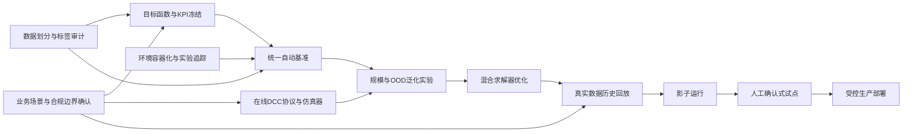

# MaskCO 动态冷链车辆路径项目优化分析报告

## 执行摘要

本次分析基于用户提供的 `CLAUDE.md` 项目说明，而非完整代码仓库、实验日志、原始数据、最终报告或业务需求文档。因此，结论能够较可靠地反映项目的技术架构、主要实验结果、已知有效与无效方案以及工程运行方式，但无法独立核验数据划分、结果统计口径、代码实现正确性、实验可复现性和真实业务适用性。文档同时指向 `00_最终报告.md`、消融矩阵、决策记录和完整执行计划等更详细资料，但这些文件未包含在本次输入中。fileciteturn0file0

项目已经完成了从 MaskCO 的标准 CVRP 向 CVRPTW、冷链和动态冷链 DCC 的较系统扩展，并建立了“神经生成模型＋时间窗过滤＋EDD 修复＋时间窗感知 2-opt”的混合求解链路。文档报告的核心优势包括：自训练使可行率提升约 20 个百分点、EDD 修复使违规数由 9 降至 2、时空掩码相对随机掩码提升约 10 个百分点，以及混合场景训练显著改善跨分布表现。项目目前的主要瓶颈已不再是单纯模型容量，而是评测可信度、推理流程、跨场景泛化、在线动态决策定义、工程复现和真实冷链约束建模。fileciteturn0file0

最优先需要处理的五项工作是：

| 优先事项 | 核心判断 | 建议完成时间 |
|---|---|---:|
| 统一 KPI、数据划分和基准口径 | 当前结果存在不同汇总数字、负 gap、速度指标含义不清等现象；在继续优化模型前必须先建立可信评测基线 | 0–3 个月 |
| 建立可复现、可回归的工程体系 | 当前依赖固定服务器路径、手工 SFTP、特定 GPU 和导入顺序，复现风险较高 | 0–3 个月 |
| 明确真实冷链业务与法规约束 | `temp_class=[0,1,2]` 尚不足以表示具体商品温区、温度偏离、装卸开门、车型和追溯要求 | 0–3 个月启动 |
| 扩展规模与分布外验证 | 当前主要是 50 节点、Solomon 派生的合成数据；不足以支持工业化或广泛学术结论 | 3–12 个月 |
| 将 DCC 从“带 reveal_time 的静态求解”升级为正式在线决策协议 | 必须定义订单释放、冻结区间、重规划触发、延迟预算和降级策略 | 3–12 个月 |

在上述基础没有补齐前，不建议把“94.5% 可行率”“-8.0% gap”或“工业场景 76.6%”直接解释为已达到可部署水平。负 gap 可能意味着模型确实优于标签解，也可能意味着 `opt_costs` 并非最优值、可行性与成本统计采用了不同样本集合、惩罚项口径不同，或标签生成方法与模型目标不一致；这些都需要用统一评测协议重新验证。fileciteturn0file0

**关键假设：**以下优先级按“面向论文成果并逐步走向真实冷链调度应用”的双重目标制定。项目领域、预算、正式交付日期、业务方、可访问的真实订单及温度数据均未指定，因此资源数量和里程碑属于建议性规划，需由项目负责人进一步确认。

## 项目内容提取与信息缺口

### 项目目标与范围

| 维度 | 从文档提取的内容 | 完整性与分析影响 |
|---|---|---|
| 核心技术目标 | 将 MaskCO 从标准 CVRP 扩展到 CVRPTW、带温度类别的冷链路径规划，以及包含 `reveal_time` 和 EDoD 的动态冷链路径规划；通过掩码生成、迭代重构和局部搜索获得高质量解。fileciteturn0file0 | 较明确，但没有正式写出多目标函数、成本构成和业务验收门槛 |
| 研究范围 | 模型链为 `TSPModel → CVRPModel → CVRPTWModel → ColdChainModel → DynamicColdChainModel`，覆盖 5D、6D 和 7D 输入。fileciteturn0file0 | 技术范围明确；真实道路、异构车辆、装卸、司机工时、多仓、交通预测等范围未定义 |
| 架构原则 | 所有扩展均应位于 `C-VRP_Cold-chainVehicleRoutingProblem/`，不得修改原 MaskCO 源码。fileciteturn0file0 | 明确，有利于隔离上游变更；但基于 `sys.path.insert` 和无 `__init__.py` 的导入模式会增加维护复杂度 |
| 性能目标 | 文档重点追踪时间窗可行率、成本或 gap、运行时间、修复效果和加速比，并报告多个最终结果。fileciteturn0file0 | 有指标但无正式 KPI 词典、置信区间和验收阈值 |
| 研究成果目标 | 文档存在最终报告、Benchmark 参考、决策记录和论文计划，说明项目很可能包含论文产出目标。fileciteturn0file0 | **推断项**；没有明确投稿日期、目标会议、作者分工和论文贡献边界 |
| 工业应用目标 | 文档报告“Industry（asymmetric+perturb）76.6%”，表明已经尝试更接近工业条件的扰动测试。fileciteturn0file0 | 场景生成方式、扰动分布、样本数、道路与车辆约束均缺失，不能据此判断真实部署成熟度 |

MaskCO 官方 ICLR 2026 说明将组合优化重构为解级别的掩码自监督学习：从一个“实例—解”对产生大量局部恢复任务，并在推理时反复掩码和重构，以获得类似局部搜索的改进过程。这与本项目的核心技术路线一致。citeturn0search0

### 已完成里程碑

文档没有正式的带日期项目计划，但可以从组件和实验记录中还原出以下事实性里程碑：

| 推定阶段 | 已完成成果 | 尚缺的完成证据 |
|---|---|---|
| 基础架构扩展 | 已建立 CVRPTW、ColdChain、DynamicColdChain 三层模型，以及 5D/6D/7D 数据加载链路。fileciteturn0file0 | 单元测试、接口契约、模型结构图和版本标签未提供 |
| 数据与训练链路 | 已提供 Solomon 类型数据生成、冷链与 DCC 数据生成、CVRPTW/冷链/DCC 训练脚本及自动训练脚本。fileciteturn0file0 | 数据生成公式、随机种子清单、训练/验证/测试划分和数据哈希未提供 |
| 约束求解链路 | 已实现时间窗过滤、EDD 修复、时间窗感知 2-opt，并提供 C++ 扩展。fileciteturn0file0 | Python/C++ 一致性验证、边界条件测试和回退机制未提供 |
| 算法消融 | 已比较自训练、时空掩码、温度约束、混合训练、温度嵌入、spo­ilage bias、TW attention bias、TW penalty 等方案。fileciteturn0file0 | 各实验样本数、重复次数、方差和统计显著性未提供 |
| 动态性评估 | 已建立 R1/C1/RC1 与 EDoD 0.2/0.5/0.8 的九组评测矩阵。fileciteturn0file0 | 订单释放过程、在线决策过程和信息可见性规则未完整定义 |
| 最终结果整理 | 已形成最终报告、阶段总结、决策记录、Benchmark 参考和论文计划。fileciteturn0file0 | 本次未收到这些文件，因此无法审计结论之间的一致性 |

**缺失项及影响：**

1. **缺少明确日期、负责人和验收标准。** 无法判断项目是否按计划推进，也无法区分“技术原型完成”“实验完成”“论文结果冻结”和“生产可用”。
2. **缺少目标函数定义。** 文档同时使用可行率、gap、cost、违规数和温度相关损失，但没有说明最终是字典序优化、加权和，还是先保可行再最小化成本。
3. **缺少数据划分与标签来源审计。** 自训练提升显著，但若伪标签生成和评测数据之间存在实例复用、生成参数复用或调参反馈，就可能造成过度乐观。
4. **缺少线上业务输入输出契约。** 无法判断 DCC 是实时派单、周期性重规划、插单优化，还是仅在静态实例中对未来订单做遮蔽。
5. **缺少真实冷链产品定义。** 不同食品、药品和生物制品对应不同温控、追溯及运输要求；项目当前的离散温度类别只是一种算法特征表示。

### 现有问题清单

文档已经明确记录了一部分算法问题：Arrhenius 式 `spoilage_bias` 降低约 6 个百分点可行率；TW attention bias 与保持可行性的 2-opt 冲突并出现数值溢出；预测式掩码过于激进；窄时间窗实例上的 LKH3 标签难以获得可行解；训练超过约 5K 步后收益有限，主要瓶颈转向推理链路。fileciteturn0file0

在此基础上，本次审查识别出更多项目级问题：

| 类别 | 识别出的问题 | 直接后果 |
|---|---|---|
| 评测 | 94.5% 和 93.8% 等最终可行率数字的场景口径未在当前文档中统一说明 | 对外报告容易出现结论不一致 |
| 评测 | `gap=-8.0%` 未解释参考解是否为最优解、启发式标签或带不同惩罚的目标值 | 无法判断负 gap 是算法突破还是指标不可比 |
| 评测 | 仅看到固定 `seed=42` 的示例命令，没有多随机种子汇总和置信区间 | 结果可能受随机采样和解码随机性影响 |
| 数据 | 主要使用 50 节点、Solomon 类型合成实例 | 难以证明大规模、真实路网与真实动态订单泛化 |
| 动态调度 | `reveal_time` 与 EDoD 已入模，但在线事件循环、冻结已执行路线及重规划规则未定义 | 可能把动态问题简化成一次性离线预测 |
| 冷链建模 | 温度通过 `temp_class` 和嵌入表示，但温度轨迹、开门、装卸、环境温度和累计暴露未显式表示 | 难以对接真实品质损耗或法规指标 |
| 工程 | 固定绝对路径、指定 GPU 0、手工 SFTP 和多处导入顺序约束 | 环境迁移、多人协作和自动化回归困难 |
| 工程 | 标志名称如 `enable_tw_aware_2opt_py` 与“自动调用 C++”语义可能不直观 | 配置误用和结果不可解释风险 |
| 运营 | 没有定义模型不可行、超时或依赖故障时的确定性回退算法 | 不适合直接承担实时调度职责 |
| 治理 | 未列出项目负责人、算法负责人、业务方、合规方和最终审批人 | 决策与风险责任不清晰 |

### 关键利益相关者

当前文档未显式列出任何利益相关者。以下均为根据项目性质推断的角色：

| 利益相关者 | 主要关注点 | 当前状态 |
|---|---|---|
| 研究负责人或论文作者 | 创新性、消融完整性、结果可复现、与 MaskCO 的贡献边界 | **未命名、未定义责任** |
| 算法与机器学习工程师 | 模型训练、掩码策略、伪标签、约束学习 | 技术任务较明确，人员和所有权缺失 |
| 运筹优化工程师 | ALNS、EDD、2-opt、可行性检查、目标函数一致性 | C++ 修复组件已存在，但角色未定义 |
| MLOps/平台工程师 | 环境、GPU、实验追踪、部署和监控 | 当前流程仍以单机路径和手工传输为主 |
| 冷链业务专家 | 产品温区、服务规则、车辆与仓库操作、异常处理 | **材料中缺失** |
| 法规、食品安全或药品质量负责人 | 温控记录、追溯、审计、合规边界 | **材料中缺失** |
| 调度员或运营人员 | 方案可解释性、锁定订单、人工干预、降级处理 | **材料中缺失** |
| 客户或项目出资方 | 成本、准时率、货损、车辆利用率和投资回报 | **材料中缺失** |

利益相关者缺失会直接影响 KPI 权重。例如，学术目标可能强调最优性 gap 和计算速度，而冷链运营会首先要求硬可行、温度不越界、订单不漏配、方案可回退和审计可追溯。

### KPI 现状与建议口径

| KPI | 当前材料中的表现 | 主要缺口 | 建议正式定义 |
|---|---|---|---|
| 时间窗可行率 | R1 EDoD=0.5 报告 94.5%；另有最终报告摘要 93.8%；C1 84.4%、RC1 76.6%。fileciteturn0file0 | 场景、分母、路线级还是实例级、是否经过修复均不明确 | 完全满足容量、时间窗、访问唯一性、仓库返回等全部硬约束的实例比例 |
| 最优性 gap | 报告 -8.0%。fileciteturn0file0 | 参考值真实性、不可行解处理、惩罚项和车辆数优先级不明 | 仅在共同可行样本上，与同目标函数参考解比较；同时单列覆盖率 |
| 成本 | ALNS 基线成本 9.62。fileciteturn0file0 | 成本单位、归一化、车辆数、距离和损耗权重不明 | 距离、时间、车辆、温控能耗、货损和迟到惩罚分别报告 |
| 运行时间 | ALNS 48.9 秒，C++ EDD 和 2-opt 报告亚毫秒级操作时间。fileciteturn0file0 | 端到端与算子级混合，硬件和批量不同 | 报告端到端 p50/p95、吞吐、预处理、模型、修复及传输时间 |
| 加速比 | 文档报告 TW-aware 2-opt 约 30,000 倍加速，并出现“EDD GPU 12.3x vs C++”表述。fileciteturn0file0 | 比较对象、实现语言、硬件和输入规模缺失 | 在相同数据、硬件、精度与线程数下进行配对比较 |
| 违规数 | EDD 修复使违规由 9 降至 2。fileciteturn0file0 | 是均值、中位数还是单实例；违规严重程度未区分 | 每实例违规客户数、总迟到时间、最大迟到、容量超限和未服务订单 |
| 动态鲁棒性 | 已评估 EDoD 0.2、0.5、0.8，并观察到非单调表现。fileciteturn0file0 | EDoD 不能单独描述订单释放时间结构和响应策略 | 同时报告服务率、接受率、重规划次数、方案扰动和在线延迟 |
| 冷链质量 | 有 `temp_class`、温度嵌入和 `spoilage_lambda` | 没有温度越界或货损结果 | 温度越界分钟、越界幅度积分、预计货损率和追溯完整率 |
| 稳定性 | 未正式报告 | 无多种子、置信区间和失败率 | 至少多随机种子均值、标准差和置信区间 |
| 工业 KPI | 报告扰动场景可行率 76.6%。fileciteturn0file0 | 未包含准时交付、司机/车辆利用和异常率 | 准时率、每单成本、空驶率、车辆利用率、人工改派率、回退率 |

行业通行的公平基准做法要求固定系统和框架、公开实现、控制随机性，并把质量门槛与性能测试分开；MLCommons 的推理规则即采用固定随机源、统一系统和独立质量验证等机制。citeturn3search1turn3search6

## 问题优先级排序

### 评分方法

**关键假设：**高、中、低分别映射为 3、2、1。实施难度反向计入，即低难度更容易获得近期收益。

优先级总分计算方式为：

\[
\text{总分}=100\times
\frac{0.45\times影响力+0.35\times紧急性+0.20\times(4-实施难度)}
{3}
\]

其中，影响力权重最高，因为项目当前同时面向研究成果可信度与潜在生产使用；紧急性次之；实施便利性用于区分快速治理事项和长期研究事项。

优先级定义为：P0 ≥ 85，P1 为 75–84，P2 为 60–74，P3 ＜ 60。

### 优先级排序表

| 排名 | 问题方向 | 影响力 | 紧急性 | 实施难度 | 得分 | 优先级 | 判断依据 |
|---:|---|:---:|:---:|:---:|---:|:---:|---|
| 1 | KPI、基准、数据划分与结果口径未冻结 | 高 | 高 | 中 | 93 | P0 | 最终结果存在多个汇总数字、负 gap 和不同层级速度指标；继续调参可能放大错误结论。fileciteturn0file0 |
| 2 | 工程环境和实验流程不可充分复现 | 高 | 高 | 中 | 93 | P0 | 固定服务器路径、手工 SFTP、指定 GPU、JAX 导入顺序及 shell 差异均是脆弱依赖。fileciteturn0file0 |
| 3 | 真实冷链场景、目标函数与合规边界缺失 | 高 | 高 | 高 | 87 | P0 | 当前温度仅用类别特征表示，未明确产品、温区、车辆、法规和追溯要求 |
| 4 | 规模和分布外泛化验证不足 | 高 | 高 | 高 | 87 | P0 | 核心命令与主要结果集中于 50 节点 Solomon 派生实例。fileciteturn0file0 |
| 5 | DCC 在线决策协议与安全回退缺失 | 高 | 高 | 高 | 87 | P0 | 已建模 `reveal_time`，但没有正式重规划事件循环、冻结策略或超时回退 |
| 6 | 推理链路计算量和端到端延迟偏高 | 高 | 中 | 中 | 82 | P1 | 文档明确指出训练不是主要瓶颈；最佳解码包含多次 run、cycle 和修复，自训练标签甚至使用 320 cycles。fileciteturn0file0 |
| 7 | 自训练伪标签质量与确认偏差风险 | 中 | 高 | 中 | 78 | P1 | 最大性能增益来自同类模型生成的伪标签，但未提供标签筛选、置信度和独立验证机制。fileciteturn0file0 |
| 8 | 项目治理、负责人和阶段验收缺失 | 中 | 中 | 低 | 70 | P2 | 有 Phase 和决策记录目录，但当前说明无日期、Owner、预算和验收门槛 |
| 9 | 导入、配置标志和废弃功能形成技术债 | 中 | 中 | 中 | 67 | P2 | 无 `__init__.py`、依赖 `sys.path`、GPU 必须先于 JAX 解析、部分标志已废弃。fileciteturn0file0 |
| 10 | 温度损耗机理尚未完成业务或物理验证 | 中 | 中 | 高 | 60 | P2 | Arrhenius bias 已证明对当前可行率有害，但温度嵌入并不等同于真实货损建模。fileciteturn0file0 |
| 11 | 单服务器和单 GPU 默认流程带来资源集中风险 | 中 | 低 | 中 | 55 | P3 | 文档默认 GPU 0 “always free”，缺少调度和资源隔离。fileciteturn0file0 |

P0 问题并非都需要先后串行完成。KPI 冻结、工程复现和业务需求澄清应同时启动；大规模泛化实验和正式在线 DCC 研究则应在三者建立稳定基础后推进。

## 高优先级实施计划

### 统一评测、KPI 与基准口径

| 时间范围 | 可执行行动 | 资源类型 | 关键里程碑 |
|---|---|---|---|
| 短期，0–3 个月 | 编写唯一的 `evaluation_contract.md`，定义每个 KPI 的公式、分母、可行性判定、成本构成、gap 参考值和不可行实例处理方式；冻结 train/validation/test 文件清单和哈希；对所有主要结论使用至少多个随机种子重跑；分别报告模型原始解、EDD 后、2-opt 后结果；核查 94.5% 与 93.8% 的场景差异；解释负 gap；把 ALNS、模型和混合方法放在同一硬件与时间预算下比较 | 1 名运筹研究员、1 名 ML 工程师、CPU 服务器、GPU、约 4–8 人周 | KPI 字典 v1；冻结测试集；统一结果表；差异审计报告 |
| 中期，3–12 个月 | 建立自动基准流水线，覆盖 R/C/RC、1/2 类、不同 EDoD、不同节点规模和扰动强度；对小规模实例加入精确求解或高质量下界；使用 bootstrap 或配对统计方法报告区间；每次代码合并执行性能与可行性回归 | 1 名 ML/MLOps 工程师、1 名运筹工程师、持续计算预算 | Benchmark Suite v2；回归阈值；版本化排行榜 |
| 长期，12+ 个月 | 发布可复现 artifact、数据生成配置和完整消融；邀请独立团队或合作方复现；将学术评测与运营 SLA 评测分开 | 研究负责人、外部合作方、发布与维护预算 | 第三方复现；正式论文 artifact；外部基准报告 |

**建议验收门槛：**任何“新最优”结论必须同时满足目标函数一致、共同可行样本可比、端到端时间预算一致、数据无泄漏和多次运行区间不重叠或具备明确效应量。NeurIPS 的复现清单强调透明报告实验细节、限制、代码和统计信息；MLCommons 则强调系统一致、固定随机性和独立质量验证，可直接转化为本项目的评测治理模板。citeturn3search4turn3search1

### 建立可复现工程与实验管理体系

| 时间范围 | 可执行行动 | 资源类型 | 关键里程碑 |
|---|---|---|---|
| 短期，0–3 个月 | 建立容器或可锁定环境文件；记录 Python、CUDA、JAX、Flax、Triton、编译器和驱动版本；将服务器绝对路径改为配置或环境变量；提供一键 `make setup/test/smoke/benchmark`；为 EDD、TW 2-opt、`tw_max`、特征维度、随机种子、数据加载和 C++/Python 一致性添加测试；在每个实验输出 Git commit、配置、数据哈希和硬件信息 | 1 名 MLOps/平台工程师、1 名 ML 工程师、约 6–10 人周 | 可重复构建环境；最小 CI；实验 manifest |
| 中期，3–12 个月 | 引入实验追踪与模型注册；将手工 SFTP 改为 Git、制品仓库和远程作业提交；配置 CPU CI、GPU nightly tests 和基准回归；统一标志命名，封装 Python/C++ 后端；为上游 MaskCO 版本建立固定 commit 或子模块 | MLOps、DevOps、GPU 调度资源、制品存储 | 训练与评测可追踪；GPU 回归；版本发布流程 |
| 长期，12+ 个月 | 建立服务化推理或可嵌入调度系统的软件包；提供灰度、回滚、故障注入和容量评估；将研发环境与生产环境隔离 | 平台团队、后端工程师、安全与运维资源 | 候选发布版；灾备与回滚演练；SLA 报告 |

当前“本地编写—MobaXterm SFTP—SSH 运行”的流程适合单人原型，但无法稳定支撑多人协作、结果审计和持续集成。fileciteturn0file0

### 明确真实冷链业务和法规约束

| 时间范围 | 可执行行动 | 资源类型 | 关键里程碑 |
|---|---|---|---|
| 短期，0–3 个月 | 选择首个明确场景，例如生鲜食品城市配送、冷冻食品干线或医药冷链；确认适用国家/地区；定义产品温区、车辆类型、箱体分区、服务时间、装卸开门、司机工时、仓库、客户优先级和订单取消规则；将目标函数拆成硬约束和软成本；建立业务专家审核的场景数据字典 | 冷链业务专家、法规/质量人员、产品负责人、运筹研究员，约 4–6 次工作坊 | 场景说明书；约束矩阵；目标函数 v1；合规清单 |
| 中期，3–12 个月 | 接入匿名真实订单、路网时间、车辆状态和温度传感器数据；把 `temp_class` 扩展为温区、初始温度、环境温度、暴露时间和箱体能力；建立全过程追溯事件模型；由业务人员审核模型方案和异常处理 | 数据工程师、业务合作方、合规人员、传感器与数据预算 | 真实数据沙盒；数字孪生或回放系统；追溯字段覆盖 |
| 长期，12+ 个月 | 在一个区域或车队中开展影子运行；经安全评审后逐步进行人工确认式派单；根据产品类别完成质量体系或审计接口 | 运营团队、司机/调度员、质量负责人、部署预算 | 影子运行报告；业务验收；合规审计记录 |

中国冷链政策要求冷链产品在加工、储存、运输、配送等全过程保持规定温度环境，并强调全链条、可视化和可追溯。国家标准 GB/T 28843-2024 的官方解读尤其强调全过程温度信息采集、监测和追溯闭环。因此，项目中的“温度类别”应视为算法原型特征，而不能替代真实温度监控和追溯体系。citeturn2search6turn2search17

具体适用标准仍取决于货物类别。道路运输冷藏车辆本身还可能涉及 GB 29753-2023 等安全与试验要求；食品、电商冷链和医药冷链的业务规则并不完全相同。citeturn2search11turn2search13

### 扩展规模、分布和真实条件泛化

| 时间范围 | 可执行行动 | 资源类型 | 关键里程碑 |
|---|---|---|---|
| 短期，0–3 个月 | 补齐 R1/R2/C1/C2/RC1/RC2；增加 100 节点评测；建立空间分布、时间窗宽度、容量紧张程度、EDoD、非对称距离、旅行时间噪声和服务时间扰动的分层测试；测试训练类型与测试类型完全隔离的 OOD 组合 | 1 名数据/算法工程师、GPU 和 CPU 预算 | 六类完整矩阵；100 节点结果；OOD 报告 |
| 中期，3–12 个月 | 引入 Homberger 风格 200、400、600、800、1000 客户规模；采用课程学习、混合训练和尺寸泛化；测试跨城市、跨需求密度和跨时间窗宽度迁移；分别分析模型生成、修复器和搜索预算对性能的贡献 | 2 名算法工程师、较高 GPU/CPU 预算、存储 | 规模曲线；性能—时间 Pareto 曲线；泛化模型 |
| 长期，12+ 个月 | 使用真实道路网络和时变旅行时间；在不同区域或客户数据上外部验证；建立持续数据漂移检测和重训练策略 | 数据合作方、GIS/交通数据预算、MLOps | 跨区域验证；漂移基线；再训练治理流程 |

Solomon 基准的经典六类分别覆盖随机、聚类和混合客户分布，以及不同时间窗/调度范围，是 VRPTW 最常用的标准化测试体系之一；其经典实例通常为 100 客户。Homberger 扩展进一步覆盖 200 至 1000 客户，可用于检验大规模泛化。citeturn0search6turn1search12turn1search15

不过，Solomon/Homberger 仍主要基于欧氏距离和合成时窗。即使在这些基准上取得好结果，也不能自动证明能够处理拥堵、单行道、时变旅行时间、临时禁行、车辆异构和真实订单相关性。因此必须同时保留“标准基准”和“真实回放”两条评测线。

### 建立正式在线 DCC 协议与回退机制

| 时间范围 | 可执行行动 | 资源类型 | 关键里程碑 |
|---|---|---|---|
| 短期，0–3 个月 | 定义在线事件：新订单释放、车辆到站、延误、取消、温度异常；规定当前时间之前信息不可泄漏；确定路线冻结区间和已承诺订单；为每次事件设置重规划时间预算；构建滚动仿真器；设置确定性 EDD/插入/ALNS 回退；增加方案扰动成本，避免每次重规划大幅改派 | 运筹研究员、仿真工程师、CPU/GPU 资源 | 在线协议 v1；无未来信息泄漏测试；回退器 |
| 中期，3–12 个月 | 使用 warm start、缓存编码、动态批处理和分阶段解码降低延迟；对不同负载和 EDoD 使用自适应搜索预算；建立“神经候选＋可行性投影＋ALNS 局部修复”架构；测试订单峰值和连续事件 | ML 工程师、C++ 工程师、性能测试资源 | p95 延迟曲线；峰值压力测试；混合在线求解器 |
| 长期，12+ 个月 | 进行历史订单回放和影子运行；逐步从建议模式过渡到人工确认模式；建立故障、超时、传感器异常和模型漂移处置流程 | 运营、平台、调度员、质量团队 | 影子运行；事件响应演练；有限生产试点 |

动态车辆路径研究通常不仅用“动态订单比例”描述问题，还需要明确订单何时到达、何时必须决策，以及动态信息如何影响路线质量。早期 EDoD 框架即强调按动态程度区分系统及相应算法政策；针对硬时间窗的动态 ALNS 研究则采用专门的插入可行性检查和实时扰动机制。citeturn0search12turn0search13

**重要判断：**仅在一次推理调用中把 `reveal_time` 作为输入特征，并不足以证明系统执行了严格的在线动态调度。必须通过仿真器保证模型在任一时刻看不到未来订单，并冻结已经执行或不可变更的决策。

### 实施依赖关系

## 行业最佳实践与可借鉴模式

| 案例或模式 | 核心做法 | 对本项目的适用性 | 主要风险 |
|---|---|---|---|
| Solomon/Homberger 分层 Benchmark | 按随机、聚类、混合分布以及不同时间窗宽度划分类别，并扩展到更大客户规模；确保不同算法在同一实例和目标下比较。citeturn0search6turn1search12turn1search15 | **高。** 可直接补齐当前 50 节点结果的规模和场景覆盖，并定位 R、C、RC 差异来源 | 合成欧氏数据不能代表真实交通；容易形成对 Benchmark 的过拟合 |
| MaskCO 式掩码生成与迭代重构 | 将高质量解切分成大量局部恢复训练样本，推理时反复掩码和重建，实现类似局部搜索的改进。citeturn0search0 | **高。** 已是本项目主干；自训练、ST-mask 和迭代解码与此高度一致 | 对硬时间窗和动态约束，纯生成步骤可能产生不可行解；需要严格的可行性投影 |
| 生成模型＋可行性投影 | ICLR 2026 的 NEXCO 将候选扩展与可行性投影直接放入生成过程，避免只在最终阶段处理约束冲突。citeturn0search17 | **中高。** 可将 TW filter、EDD 和 2-opt 从外部修补进一步整合到解码策略 | 需要重新设计训练目标和中间状态；可能增加解码复杂度，且外部论文结果不能直接迁移 |
| ALNS 混合求解与安全回退 | ALNS 根据历史表现自适应选择移除和插入算子；经典工作表明该框架可统一处理多个 VRP 变体，并适合紧约束问题。citeturn1search0turn1search2turn1search9 | **高。** 可作为比较基线、伪标签生成器、不可行解修复器和在线超时回退 | 高质量 ALNS 仍可能较慢；如果预算不统一，无法公平比较神经方法与启发式方法 |
| 动态调度的滚动时域模式 | 按订单释放事件或固定周期重规划，锁定已执行部分，并用 EDoD、响应延迟、方案扰动和服务率共同评估。citeturn0search12turn0search13 | **高。** 是把 DCC 从研究特征扩展为真实在线调度系统的关键 | 重规划过频会引起路线震荡；过度预测未来订单可能损害当前可行性 |
| 冷链全过程温控与追溯 | 中国政策和国家标准强调全过程温度可控、过程可视、源头可溯，并要求形成责任主体清晰的追溯闭环。citeturn2search6turn2search14turn2search17 | **高，但属于业务系统层。** 模型需要输出与追溯系统兼容的路线、温区和事件数据 | 标准因产品和地区不同；算法满足抽象温度类别并不等于满足法规 |

最适合本项目的总体模式不是“用神经网络完全替代运筹优化”，而是：

> **神经模型产生高质量候选与搜索先验，确定性约束模块保证硬可行，ALNS 或插入启发式承担超时回退和局部修复，统一评测系统负责证明质量与延迟。**

这与项目当前“MaskCO＋EDD＋TW-aware 2-opt”的方向一致，但需要将外部修复从实验性技巧升级为正式的分层求解架构，并对各层的收益、成本和失败条件单独报告。

## 约束、风险与监控体系

### 主要约束与缓解措施

| 风险类别 | 潜在风险 | 触发或证据 | 缓解措施 | 建议监控指标 |
|---|---|---|---|---|
| 技术 | 生成解违反硬时间窗或容量约束 | 当前可行率尚未达到完全可行，且需 EDD/2-opt 修复。fileciteturn0file0 | 解码阶段加入增量可行性掩码；最终强制验证；确定性修复与回退 | 原始可行率、修复后可行率、修复失败率、最大违规 |
| 技术 | TW attention 或其他 bias 引发数值溢出 | 文档已记录 TW attention bias 冲突和溢出。fileciteturn0file0 | 删除废弃组合；加入 finite-check、梯度/激活监控和配置互斥校验 | NaN/Inf 次数、溢出批次数、配置拒绝次数 |
| 技术 | 端到端推理时间超过动态调度窗口 | 最佳配置需多 runs/cycles；自训练标签使用 320 cycles。fileciteturn0file0 | 自适应计算预算、early stop、warm start、批处理、缓存编码和 CPU 回退 | p50/p95/p99 延迟、超时率、每实例 cycles |
| 技术 | 规模扩展后内存或搜索复杂度激增 | 当前主流程以 50 节点和固定 32GB GPU 为中心。fileciteturn0file0 | 分块、稀疏候选图、邻域限制、尺寸课程训练和性能剖析 | 峰值显存、复杂度曲线、吞吐/节点数 |
| 数据 | 自训练确认偏差 | 最显著收益来自当前模型生成的伪标签。fileciteturn0file0 | 仅保留严格可行且优于基线的标签；多求解器交叉验证；独立 holdout | 伪标签接受率、标签可行率、相对基线改善、分布熵 |
| 数据 | 训练、调参和测试泄漏 | 当前材料未给出数据划分 | 数据哈希、不可变测试集、调参记录、实例族级隔离 | 重复实例率、参数重合率、测试访问审计 |
| 数据 | 合成数据与真实订单分布不一致 | 数据由 Solomon 派生生成器产生。fileciteturn0file0 | 真实回放、OOD 测试、时间与空间相关性建模 | OOD 可行率下降、成本恶化、分布距离 |
| 数据 | 参考 `opt_costs` 并非真最优或目标不一致 | 出现负 gap，但口径未说明。fileciteturn0file0 | 核验标签来源；小规模精确解；将“参考解 gap”与“最优 gap”分开 | 参考解来源覆盖率、下界 gap、负 gap 比例 |
| 组织 | 单人知识和固定服务器路径集中 | 当前流程依赖具体目录、conda 环境和手工操作。fileciteturn0file0 | 文档化、代码评审、环境自动化、双人维护和恢复演练 | Bus factor、构建成功率、环境恢复时间 |
| 组织 | 研究目标与业务目标冲突 | 当前没有利益相关者和 KPI 权重 | 建立项目章程、RACI 和阶段 Go/No-Go 评审 | 需求变更数、未决决策、验收延期 |
| 法规 | 温区、追溯或车辆条件不符 | 中国冷链政策强调全过程温控与追溯。citeturn2search6turn2search17 | 场景化合规矩阵；质量负责人签字；保留不可篡改温度与调度记录 | 温度越界分钟、追溯完整率、审计缺陷数 |
| 隐私与安全 | 真实订单、客户位置和车辆轨迹泄露 | 真实部署会涉及位置和运营数据，当前未说明权限机制 | 去标识化、最小权限、加密、访问日志和数据保留策略 | 未授权访问、数据导出、保留超期 |
| 运营 | 模型超时、服务异常时无安全降级 | 当前未定义生产 fallback | 预先计算启发式方案；EDD/ALNS 回退；人工接管 | 回退率、人工改派率、恢复时间 |
| 运营 | 频繁重规划导致司机与客户方案震荡 | DCC 重规划规则缺失 | 冻结时域、变更惩罚、最大改派次数和人工确认 | 路线变更数、已承诺订单改派率、司机拒绝率 |

NIST AI RMF 建议按 Govern、Map、Measure、Manage 四类活动管理 AI 生命周期风险，并强调部署前后测试、持续监控、漂移识别、事件响应和在超出风险容忍度时停用系统。该结构可用于本项目的模型与调度系统治理，但不能替代具体的冷链法规与运营制度。citeturn4search0turn4search3turn4search16

### 推荐监控看板

建议建立四层监控，而不是只保留平均可行率：

| 监控层 | 核心指标 | 建议告警逻辑 |
|---|---|---|
| 硬安全层 | 完全可行率、未服务订单、容量超限、最大迟到、温度越界、回退失败 | 任一硬约束失败立即触发回退；生产中不得仅靠平均值掩盖个体失败 |
| 优化质量层 | 可行样本成本 gap、车辆数、距离、空驶率、温控能耗、方案扰动 | 与当前稳定版本配对比较；连续多个窗口恶化则暂停升级 |
| 系统性能层 | p50/p95/p99 重规划延迟、吞吐、GPU/CPU 利用、显存、超时率 | p95 超过业务决策窗口的预设比例时降级搜索预算 |
| 数据与模型层 | 输入分布漂移、OOD 可行率、伪标签接受率、不同场景性能差、种子方差 | 某类场景下降超过批准阈值时触发人工审查和再训练 |

**建议性门槛，需业务确认：**

- 生产候选版本应以接近完全的硬约束可行性为前置条件，而非只追求平均成本。
- 回退算法必须独立于神经模型工作，并具备明确的最大运行时间。
- 所有性能指标均应报告场景分层值和尾部值，不能只报告总体均值。
- 任何数据或模型更新都应保留可回滚版本、数据哈希和完整实验清单。
- 温度和追溯指标应由质量或合规负责人批准，而不是仅由算法团队设定。

## 结论与决策门槛

MaskCO 冷链扩展项目已经具备较好的研究原型基础：模型层次清楚、数据和训练链路基本完整、约束修复模块有效、实验中也识别出了多个失败方向。自训练、EDD 修复、时空掩码、混合训练和温度嵌入构成了当前最有价值的技术资产。fileciteturn0file0

但从项目治理和可信度角度看，当前最大风险不是缺少更多模型结构，而是**在评测口径和真实问题定义尚未冻结的情况下继续扩大算法实验**。文档本身已经指出训练超过约 5K 步后瓶颈主要位于推理链路，这进一步说明未来投入应从“增加训练量”转向“统一评测、优化在线解码、建立可行性保障和扩展真实验证”。fileciteturn0file0

建议采用以下阶段决策门槛：

| 决策阶段 | 必须满足的条件 | 未满足时的处理 |
|---|---|---|
| 进入新一轮算法优化 | KPI 词典、冻结测试集、参考解来源、多种子基线和端到端计时全部完成 | 暂停宣称新 SOTA，仅进行诊断实验 |
| 进入论文结果冻结 | 六类 Solomon 完整矩阵、规模实验、消融、统计区间、代码与配置可复现 | 不冻结论文主表，补充评测 |
| 进入真实数据试验 | 明确商品类别、地区、硬约束、数据权限和异常处理；真实数据完成去标识化 | 仅在合成沙盒中继续 |
| 进入影子运行 | 在线协议、冻结策略、p95 延迟、确定性回退和审计日志通过测试 | 不接入实时运营 |
| 进入人工确认式试点 | 硬可行性达到业务批准门槛，回退和人工接管演练成功，质量/合规签字 | 继续影子运行 |
| 进入自动化生产 | 跨周期稳定性、漂移监控、事故响应、版本回滚和业务 ROI 均满足要求 | 保留人工确认，不自动派单 |

综合优先级判断，未来三个月最值得投入的不是重新设计更大的网络，而是完成三项基础工程：**评测重构、工程复现、业务约束定义**。完成后，再以标准 Benchmark、大规模场景和严格在线 DCC 仿真检验现有技术资产。只有在这些基础上，94% 以上可行率、自训练增益和 C++ 修复速度才可以转化为可信论文结论或实际冷链调度能力。