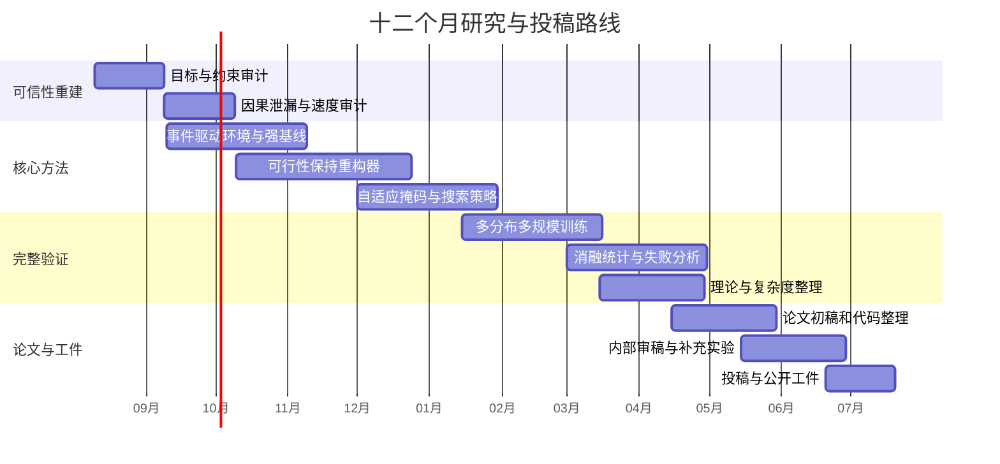

# MaskCO动态冷链车辆路径项目：顶刊顶会级问题诊断、优化清单与研究路线

## 执行摘要

项目已形成从MaskCO到CVRPTW、冷链与动态冷链的完整求解链，并通过时空掩码、自训练、EDD修复和TW-aware 2-opt取得较高可行率。但负“最优差距”、动态信息泄漏、冷链物理语义不足、基线和统计不完整是发表前的致命缺口。建议以“因果、可行性保持的动态掩码生成”为主线，先重建可信评测，再扩展自适应搜索与物理冷链模型。fileciteturn0file0

## 项目画像与发表门槛

本报告以项目提供的 `CLAUDE.md` 为主要内部证据，并结合近五年神经组合优化、动态车辆路径、随机VRPTW和冷链路径优化文献进行定位。由于当前材料未包含逐文件源码、完整实验日志、全部配置文件和原始预测结果，下述代码级判断中涉及数据泄漏、目标函数一致性和基线实现公平性的部分，应在正式研究开始时通过代码审计确认。fileciteturn0file0

### 项目背景、目标与当前成熟度

| 维度 | 当前状态 | 顶刊顶会评价 |
|---|---|---|
| 项目背景 | 以ICLR 2026 MaskCO为基础，将标准CVRP扩展到CVRPTW、温度类别冷链和带订单揭示时间的动态冷链；模型采用掩码边恢复和迭代mask-and-reconstruct。fileciteturn0file0 MaskCO原论文将参考解局部掩码并恢复，以一个实例—解对产生大量局部训练信号，并在推理时迭代重构解。citeturn18view3 | 背景明确，属于NCO与动态/富约束VRP交叉方向，选题具有发表潜力。 |
| 明确科学目标 | **未指定。** 当前材料给出了工程扩展、运行命令和结果，但没有正式研究问题、数学问题定义、信息结构、假设或待验证理论命题。fileciteturn0file0 | 顶会不能仅表述为“把MaskCO增加三个输入维度并配合修复算子”；必须形成可迁移的方法论问题。 |
| 工程目标 | 提升动态冷链CVRPTW的时间窗可行率、解质量和推理速度；当前报告给出R1、EDoD=0.5条件下约94.5%可行率，以及C1、RC1和工业扰动场景结果。fileciteturn0file0 | 已达到较强原型水平，但尚不足以证明方法优于强OR与NCO基线。 |
| 当前模型 | 5维CVRPTW输入、6维冷链输入、7维动态冷链输入；温度使用类别嵌入，动态订单使用`reveal_time`；推理结合TW过滤、EDD和TW-aware 2-opt。fileciteturn0file0 | 核心创新目前可能被审稿人概括为“特征拼接、掩码策略与手工修复”。 |
| 当前证据 | 自训练约提升20个百分点，时空掩码约提升10个百分点，EDD使违约数由9降至2，混合分布训练显著改善C1泛化。fileciteturn0file0 | 有较好的消融雏形，但需统一实验协议、多随机种子、置信区间、强基线和严格目标审计。 |
| 冷链问题定义 | 目前主要通过`temp_class`表达温度差异；材料提到曾尝试Arrhenius式spoilage bias，但性能下降后改用温度嵌入。fileciteturn0file0 | 尚不能充分支撑“冷链优化”主张。冷链文献通常显式处理质量衰减、制冷能耗、温度、停靠次数、载重或货物不相容。citeturn16search3turn16search16turn16search1 |
| 动态问题定义 | 通过订单`reveal_time`和EDoD生成动态实例，但材料未正式定义每个决策时刻模型可观测的信息、已承诺路线、是否允许撤销决策和未来订单字段是否被屏蔽。fileciteturn0file0 | 这是最高风险项。动态VRP的核心不是增加时间特征，而是建立非预知、事件驱动的决策协议。动态VRPTW代表工作通常显式采用多阶段或派车波次设置。citeturn13search1 |
| 目标投稿 | **未指定。** | 建议拆分为一篇通用ML方法论文和一篇动态冷链/随机优化OR论文。 |

### 必须重新定义的正式问题

建议将主问题定义为**部分可观测、事件驱动的动态冷链车辆路径问题**。在决策时刻 \(t_k\)，算法只能访问

\[
\mathcal O_{t_k}
=\{i\mid r_i\le t_k\},
\]

其中 \(r_i\) 是订单揭示时间。对于 \(r_i>t_k\) 的未来订单，其坐标、需求、时间窗、温度属性和服务时长必须全部不可见；仅允许使用通过历史数据训练得到的分布模型或上下文预测，而不能读取该实例的真实未来字段。

状态至少应包含当前车辆位置、剩余容量、时间、车内温区或温度状态、已承诺客户、已服务客户和当前已知未服务客户。动作应定义为派车、插入、等待、重规划或冻结前缀；转移由车辆运动、服务完成和新订单揭示共同触发。动态VRPTW已有顶级OR工作采用组合优化增强的机器学习管线处理在线决策，并强调对未见实例和情景的稳健性，这比“将reveal time作为静态节点特征”更接近领域认可的问题设置。citeturn13search1

建议采用词典序目标，而不是先将所有约束混成一个未经校准的罚函数：

\[
\min_{\pi}
\left(
N_{\mathrm{unserved}},
N_{\mathrm{hard\ TW\ violation}},
L_{\mathrm{total}},
Q_{\mathrm{loss}},
C_{\mathrm{travel}},
C_{\mathrm{replan}}
\right),
\]

其中首先保证服务和硬约束，再优化迟到量、质量损失、路程与重规划稳定性。若业务允许软时间窗，也应明确硬时间窗与软时间窗的客户比例和罚则。

### 当前最危险的结果表述

项目材料报告了约 \(-8\%\) 的“gap”。若参考值确实是同一目标、同一约束下的数学最优值 \(C^\star\)，且当前解严格可行，则

\[
\mathrm{Gap}_{\mathrm{opt}}
=100\frac{C-C^\star}{C^\star}\ge 0
\]

不可能为负。因此，当前情况至少存在以下一种可能：`opt_costs`是启发式标签而非最优值；评价目标与标签目标不同；低成本解存在未计入的约束违反；车辆数、等待时间、罚项或返回仓库规则不一致；或归一化分母错误。fileciteturn0file0

在完成审计前，论文中必须将其改称为：

\[
\mathrm{Gap}_{\mathrm{ref}}
=100\frac{C-C_{\mathrm{reference}}}{C_{\mathrm{reference}}},
\]

即“相对参考解差距”，不能称“最优差距”。这是**P0级阻断问题**：若不解决，其他提升几乎没有投稿意义。

## 相关领域与代表性工作

近五年最相关的研究可以分成四条主线：掩码或生成式NCO、跨任务与跨分布泛化、大规模与混合搜索，以及动态/随机/冷链VRP。当前项目最有价值的定位不是再做一个单一CVRPTW模型，而是连接MaskCO的局部生成学习与动态VRP的因果决策、可行性保证和冷链资源状态。

| 工作与代码 | 作者、年份、发表 | 核心贡献 | 局限及对本项目的启示 |
|---|---|---|---|
| **MaskCO**；当前用户仓库，公开官方会议页未直接列出独立代码仓库 | Lvda Chen、Yang Li、Junchi Yan，ICLR 2026 | 以掩码恢复作为组合优化学习目标，将一个高质量解转换为大量局部监督信号；推理时反复mask-and-reconstruct，形成局部搜索式改进。官方摘要报告在TSP上实现超过99%的gap reduction和约10倍加速。citeturn18view3 | 原论文主要证明通用CO掩码学习价值，并不自动解决动态可观测性、时间窗可行性和冷链状态演化。本项目需要提出超出“新问题适配”的新机制。 |
| **NExCO: Native Adaptive Solution Expansion for Diffusion-based CO**；作者页提供代码入口 | Yu Wang、Yang Li、Jiale Ma等，ICLR 2026 | 将自适应解扩展内生到掩码扩散过程，通过置信度候选和可行性投影逐步扩展部分解，直接回应全局预测的约束冲突问题。citeturn15search1turn15search18 | 与“可行性保持的掩码生成”高度接近。新方法必须在动态因果状态、资源可行自动机或严格保证方面形成明显区别。 |
| **SHIELD**；论文页与补充材料 | Yong Liang Goh、Zhiguang Cao、Yining Ma等，ICML 2025 | 面向多任务、多分布VRP，使用Mixture-of-Depths和层次聚类，在9张真实地图、每张16种VRP变体上评估泛化。citeturn18view4 | 重点是静态多任务、多分布泛化，不处理在线订单揭示和冷链物理状态。它应成为跨分布实验和真实道路评测的重要基线。 |
| **MVMoE / Routing-MVMoE** | Jianan Zhou、Zhiguang Cao、Yaoxin Wu等，ICML 2024 | 以混合专家构建统一多任务VRP求解器，在多个训练变体上学习并对10种未见变体进行零样本泛化；官方实现同时覆盖包括VRPTW在内的多种变体。citeturn13search3turn19search2 | 未针对真正动态决策、温度资源或硬约束保证。可用于验证“单模型跨R/C/RC、EDoD与规模”的价值。 |
| **INViT**；代码与数据在补充材料 | Han Fang、Zhihao Song、Paul Weng、Yutong Ban，ICML 2024 | 通过不变嵌套视图Transformer与数据增强，提高TSP/CVRP跨规模、跨分布泛化。citeturn18view5 | 主要覆盖TSP/CVRP，未涉及丰富约束；但其局部视图思想可用于动态局部重规划和规模泛化对照。 |
| **BQ-NCO**；NeurIPS论文页提供代码入口 | Darko Drakulic、Sofia Michel、Florian Mai等，NeurIPS 2023 | 通过bisimulation quotient压缩具有对称性的MDP状态空间，并证明约化MDP的最优策略可求解原组合优化问题；在多类问题上展示跨规模与OOD泛化。citeturn17view6 | 未覆盖动态VRPTW；但它代表顶会对“形式化状态约化和理论保证”的期待。项目可借鉴其形式化强度，而不是只做结构模块。 |
| **LEHD / CIAM-Group/NCO_code** | Fu Luo、Xi Lin、Fei Liu、Qingfu Zhang、Zhenkun Wang，NeurIPS 2023 | 采用轻编码器、重解码器和数据高效训练，从小规模训练泛化到最高1000节点TSP/CVRP。citeturn14search1turn19academia48 | 主要为静态构造式求解，富约束场景未充分验证。它说明仅在50节点报告结果已低于当前NCO规模评测预期。 |
| **DeepACO / henry-yeh/DeepACO** | Haoran Ye、Jiarui Wang、Zhiguang Cao等，NeurIPS 2023 | 使用深度强化学习自动学习ACO启发信息，在八类组合优化问题上以统一架构增强传统蚁群算法。citeturn17view8turn19academia51 | 不提供动态冷链专用机制，但非常适合作为“神经模型指导传统搜索”路线的比较对象。 |
| **Combinatorial Optimization-Enriched ML for Dynamic VRPTW** | Léo Baty、Kai Jungel、Patrick Klein、Axel Parmentier、Maximilian Schiffer，Transportation Science 2024 | 将机器学习与组合优化层结合处理动态VRPTW派车波次，在EURO Meets NeurIPS动态车辆路径竞赛中排名第一，并评估对未见实例和情景的稳健性。citeturn13search1 | 其在线协议和强竞争结果会成为审稿人判断本项目“是否真正动态”的直接参照。 |
| **PyVRP / PyVRP** | Niels Wouda、Leon Lan、Wouter Kool，INFORMS Journal on Computing 2024 | 高性能开源VRP求解器，支持时间窗、服务时长、release time、多仓、异构车辆等，并提供成熟测试和基准设施。citeturn17view0 | 它是必须加入的强非学习基线。只与自制ALNS或弱配置求解器比较，难以通过审稿。 |
| **Contextual Stochastic VRPTW / INFORMSJoC/2025.1189** | Breno Serrano、Alexandre Florio、Stefan Minner、Maximilian Schiffer、Thibaut Vidal，INFORMS Journal on Computing 2026 | 将上下文特征与随机行程时间结合，提出点估计、样本平均和罚函数式数据驱动处方模型，并用branch-price-and-cut在最高100客户实例上比较样本外成本。citeturn18view0 | 说明仅处理订单揭示还不够；真实动态冷链论文还应讨论行程时间和温度的不确定性及样本外性能。 |
| **Exact VRPTW with Perishable Products** | Selin Hülagü、Claudio Ciancio、Said Dabia、Wout Dullaert，Transportation Science 2026 | 显式建模温度、路线时长、停靠次数和载重对质量衰减与制冷成本的影响，并以定制精确算法求解最高100客户实例。citeturn16search16turn17view1 | 这使“温度类别嵌入即冷链模型”的主张很难成立。它可作为小规模标签生成器、最优性验证器和冷链建模参照。 |
| **Cold-chain PDPTW with incompatibility constraints** | Transportation Science 2022 | 同时考虑不同商品温度要求、货物不相容、制冷成本和质量衰减，并采用定制branch-and-price。citeturn16search3 | 项目若不建模温区相容、质量或能耗，应更谨慎地称为“temperature-class VRPTW”，而非完整冷链优化。 |

### 文献定位结论

现有NCO前沿已经从“在单一均匀分布的TSP/CVRP上缩小gap”转向以下要求：统一求解多个VRP变体、跨分布和真实地图泛化、大规模求解、可行性投影、混合神经—组合优化，以及严格可复现实验。MVMoE、SHIELD、INViT、LEHD和NExCO分别覆盖这些方向。citeturn13search3turn18view4turn18view5turn14search1turn15search1

因此，本项目最有竞争力、且与现有工作差异最大的论文命题应为：

> **Causal and Feasibility-Preserving Masked Generation for Dynamic Cold-Chain Vehicle Routing**

中文可表述为：**面向动态冷链车辆路径的因果与可行性保持掩码生成**。

其核心不是单纯增加温度和揭示时间特征，而是回答三个通用问题：在未来不可见时如何进行掩码重构；如何让每个中间解满足资源约束；如何在有限在线延迟下自适应选择破坏—修复区域。

## 瓶颈、未解决问题与量化指标

优先级定义如下：**P0**为不解决就不能可信投稿；**P1**为主论文核心创新或必要实验；**P2**为强化论文竞争力和期刊扩展的工作。

| 优先级 | 关键瓶颈 | 当前证据与风险 | 必须新增的量化指标 | 完成标准 |
|---|---|---|---|---|
| P0 | 目标函数与“负gap”不可信 | 当前材料报告约\(-8\%\) gap，但没有证明参考成本为真实最优值，也未展示目标和约束完全一致。fileciteturn0file0 | `Gap_ref`、对已知最优值的`Gap_opt`、最好下界差距、车辆数、距离、等待、迟到、罚项分别报告 | 对小实例由精确算法验证；对大实例称“best-known/reference gap”；任一负值可追溯到更优参考解并更新基准库 |
| P0 | 动态信息泄漏或“伪动态” | 7维输入含`reveal_time`，但未说明未来订单的其他字段是否仍进入编码器。fileciteturn0file0 | 未来特征访问次数、clairvoyant/non-clairvoyant差距、在线regret、每事件决策延迟 | 单元测试证明任何 \(r_i>t\) 的真实字段均不可访问；随机置换未来订单不改变当前动作分布 |
| P0 | 可行率依赖后处理而非模型 | EDD使违约数9→2，自训练和2-opt贡献很大，说明完整性能可能主要来自手工修复。fileciteturn0file0 | 模型原始可行率、每种修复后的可行率、修复调用率、平均改动边数、修复成本和时间 | 分离“model only / repair only / model+repair”；主方法在修复前达到至少98%–99%硬可行率，或给出严格可行性保证 |
| P0 | 冷链语义不足 | 当前主要是`temp_class`嵌入；没有明确温度轨迹、品质衰减、制冷能耗和相容性约束。fileciteturn0file0 近期冷链VRP已显式建模这些因素。citeturn16search3turn16search16turn16search1 | 品质损失、温度越界时间、制冷能耗、商品不相容违反、总运营成本 | 至少引入一种可验证的质量衰减或能耗模型；否则缩窄论文命名和主张 |
| P1 | 基线不够强且预算可能不公平 | 当前材料仅突出ALNS与内部C++操作，没有展示PyVRP、动态竞赛方法及最新NCO模型的同预算比较。fileciteturn0file0 | 固定时间下成本、达到固定成本所需时间、anytime curve、CPU/GPU硬件、批处理与单实例延迟 | 对PyVRP、ALNS、OR-Tools、当前MaskCO、至少两种NCO泛化模型执行统一时间和硬件协议 |
| P1 | 规模与分布覆盖窄 | 主要实验为50节点和Solomon式R/C/RC生成场景。fileciteturn0file0 LEHD已测试到1000节点，SHIELD已使用真实地图和多变体。citeturn14search1turn18view4 | \(n=50/100/200/400\)的质量、显存、p95延迟；跨分布最坏组可行率；真实路网结果 | 至少覆盖100和200节点；主表含ID、OOD规模、OOD分布、非对称真实距离矩阵 |
| P1 | 统计可靠性不足 | 当前推荐命令固定`seed=42`，未见多训练种子和置信区间。fileciteturn0file0 | 均值、标准差、95%置信区间、效应量、配对检验、最坏种子结果 | 关键模型至少5个训练种子；随机推理至少10–30个种子；实例级配对bootstrap或Wilcoxon检验 |
| P1 | 自训练可能放大伪标签偏差 | 自训练是最大单一提升来源，但教师也是当前模型；如果标签不可靠，错误可能被反复强化。fileciteturn0file0 | 伪标签可行率、相对强求解器质量、置信度校准ECE、接受率、教师—学生一致性 | 只接受经精确约束检查的标签；按质量和置信度加权；与PyVRP/精确标签混合 |
| P1 | EDoD定义不足以完整描述动态难度 | 当前使用EDoD=0.2/0.5/0.8，且观察到0.5最难、0.8反而恢复。fileciteturn0file0 | 揭示时间分布、预告时间、动态强度、空间相关性、请求突发度、时间窗紧度分别控制 | 进行多因素设计，而非只按EDoD单轴比较；解释非单调性并给出置信区间 |
| P1 | 在线服务质量指标缺失 | 当前重点是最终TW可行率和成本，未见拒单、路线稳定性和事件响应时间。fileciteturn0file0 | 服务率、拒单率、平均/最大迟到、重规划边变化率、司机路线稳定性、p95决策时延 | 形成完整动态指标面板，并与clairvoyant上界及非预知基线比较 |
| P2 | 速度结论存在命名或测量矛盾 | 材料一方面称C++ EDD约0.3 ms，另一方面记录“EDD GPU 12.3× vs C++”，需要澄清比较对象。fileciteturn0file0 | 单操作耗时、端到端耗时、同步开销、编译时间、batch size、预热后中位数 | 使用统一计时脚本，区分内核、设备同步、端到端和吞吐量，不混用GPU/CPU/C++标签 |
| P2 | 训练收益早饱和 | 材料认为超过约5K步收益有限，瓶颈在推理管线而非模型容量。fileciteturn0file0 | 学习曲线、验证可行率、校准误差、搜索周期收益曲线、每单位计算改进 | 停止盲目扩大模型，转向可行解码、自适应搜索和训练—推理一致性 |

### P0级审计清单

| 工作项 | 可执行动作 | 验收产物 |
|---|---|---|
| 目标一致性审计 | 为数据生成、训练损失、C++修复、Python评价分别输出距离、车辆数、等待、迟到、容量、温度/质量、罚项；在同一实例上逐项对账 | `objective_audit.csv`、10个手工可验证实例、自动回归测试 |
| 可行性审计 | 建立唯一的`validate_solution()`，禁止训练脚本、解码脚本和C++扩展各自定义不同规则 | Python/C++双实现一致率100%的测试报告 |
| 因果性审计 | 在时间 \(t\) 将未来客户所有字段替换为随机噪声，验证当前决策不变；通过接口设计禁止传入未揭示节点 | `test_no_future_leakage.py`，持续集成强制执行 |
| 参考解审计 | 小规模用精确方法或成熟求解器长时间求解；大规模存储best-known来源、时间预算和校验哈希 | 版本化`reference_solutions.json` |
| 速度审计 | 预热、显式设备同步、单实例和批吞吐分别计时；重复至少30次 | 端到端anytime曲线和原始计时日志 |
| 复现实验审计 | 每次运行记录代码提交、环境、数据哈希、seed、GPU、配置和输出 | 单命令复现实验包 |

## 创新方向与推荐主线

### 候选创新方向比较

| 优先级 | 候选方向 | 核心创新点 | 可行性 | 理论与实践价值 | 预期量化目标 |
|---|---|---|---|---|---|
| P0/P1 | **因果动态MaskCO** | 将静态7维编码改为事件驱动的因果状态编码；仅编码已揭示客户，加入车辆当前状态、冻结路线前缀、承诺约束和可等待动作；用事件级掩码模拟未来信息缺失 | 高。可复用现有DynamicColdChainModel、数据生成器和mask机制，但需重写环境与解码协议 | 将项目从“带reveal_time特征的静态求解”提升为真正在线NCO；方法可迁移到动态TSP、动态CVRP和即时配送 | 零未来信息访问；相对当前非预知版本可行率提高5–10个百分点；在线成本或regret降低10%–20%；100节点p95事件延迟低于100 ms |
| P0/P1 | **可行性保持的掩码重构** | 不再独立预测任意边，而是把重构约束到容量—时间窗—揭示时间资源状态自动机；可用资源可行beam、标签设置算法或可微近似投影 | 中高。现有EDD和TW-aware 2-opt可作为原型，但需把可行性前移到生成过程 | 可给出“输出始终满足硬约束”的命题；显著减少对后处理的依赖，直接回应NExCO等工作的可行性投影前沿。citeturn15search1 | 修复前硬可行率≥99%；修复调用率降低80%；在同一时间预算下成本恶化不超过1%，最好同时改善1%–3% |
| P1 | **学习型自适应破坏—修复策略** | 根据时间窗松弛量、预测不确定性、边置信度和动态事件，学习选择掩码位置、掩码比例、重构次数及修复算子，而非固定`keep_rate=0.3/cycles=40` | 高。现有推理循环已经具备可控操作，可先做contextual bandit，再扩展RL | 使搜索预算按实例难度分配；与COExpander、自适应扩展和DeepACO形成清晰对话。citeturn14search21turn17view8 | 同质量下循环数减少50%–75%，实现2–4倍端到端加速；或同时间预算成本改善1%–3% |
| P1 | **求解器蒸馏与有认证的自训练** | 由PyVRP、精确小规模求解器、长时间ALNS和MaskCO教师组成标签池；只接受严格可行标签，按参考差距、置信度和多教师一致性加权 | 高。当前自训练已有20个百分点收益，是最直接的升级路径。fileciteturn0file0 PyVRP支持时间窗和release time，可直接作为强教师。citeturn17view0 | 将经验性pseudo-labeling提升为可解释的solver-in-the-loop学习；可研究标签质量与泛化之间关系 | OOD可行率再提升3–5个百分点；伪标签不可行率降至0；相对单教师最坏组成本改善2%–4%；ECE下降30%以上 |
| P1/P2 | **物理约束的随机冷链模型** | 用温度轨迹、环境温度、开门停靠、载重和制冷功率建模质量衰减与能耗；在行程时间/气温不确定下优化期望、chance constraint或CVaR | 中。需要新模拟器、参数来源和校准数据；可先用文献参数构建可复现合成环境 | 使“冷链”成为真实科学贡献，而非类别嵌入。最新精确冷链VRPTW已同时考虑温度、时长、停靠和载重，构成高标准参照。citeturn16search16 | 在距离增加≤3%的条件下，期望品质损失或制冷成本降低15%–30%；95%场景满足品质阈值 |
| P2 | **多分布、多尺度动态路由基础模型** | 以R/C/RC、不同EDoD、规模、时间窗紧度、非对称真实路网和冷链类型作为任务；采用轻量专家、适配器或层次稀疏计算 | 中高。可借鉴MVMoE和SHIELD，但训练矩阵较大。citeturn13search3turn18view4 | 提高方法的通用性，满足ICML/NeurIPS对“超越单一问题”的期待 | 从50节点泛化到200节点时相对gap劣化≤2个百分点；未见分布可行率提升5–10个百分点 |
| P2 | **神经—OR混合搜索或列生成** | MaskCO不直接承担完整求解，而是提出高价值破坏区域、插入候选、路线列或分支变量，再由PyVRP/ALNS/列生成保证约束与改进 | 中。需要更深的OR算法开发，但适合Transportation Science、IJOC或Operations Research | 混合路线已在动态VRPTW中显示强竞争力，组合优化增强ML方法曾赢得相关竞赛。citeturn13search1 | 达到同一目标质量的搜索时间降低2倍；列生成迭代或候选数减少20%–40%；在强OR基线上仍有统计显著增益 |

### 推荐的论文主线

最推荐将前三项整合为一篇方法论文，但要控制贡献边界：

**主贡献一：因果动态掩码学习。** 定义事件驱动的非预知MDP或POMDP，使训练时的掩码过程与部署时的信息缺失一致。

**主贡献二：资源可行的局部重构。** 重构不再是独立边分类，而是受容量、时间窗、车辆状态和订单可见性约束的结构化预测。

**主贡献三：预算感知的自适应重构。** 根据当前解缺陷与不确定性动态决定破坏范围和计算量。

建议不要在同一篇ML论文里同时宣称“完整物理冷链、随机优化、多任务基础模型、列生成和所有动态机制”。这会使贡献松散、消融规模失控。更合理的拆分是：

| 论文 | 核心主题 | 适合投稿 |
|---|---|---|
| 论文A | 因果、可行性保持、预算自适应的动态掩码生成；冷链作为高难应用之一 | ICLR、ICML、NeurIPS |
| 论文B | 温度与品质动态、随机行程时间、风险规避和神经—OR混合求解 | Transportation Science、INFORMS Journal on Computing |
| 论文C或软件论文 | 动态冷链NCO基准、统一评测和可复现框架 | IJOC、TMLR、KDD数据集/基准方向 |

## 研究方法、实验设计与资源

### 总体技术路线

### 模型与算法设计

**状态编码器。** 对每辆车编码当前位置、当前时间、剩余容量、车内温区/温度、已冻结路线前缀和当前任务；对已揭示客户编码坐标、需求、时间窗、服务时长、温度参数和揭示时刻。未来客户不能作为带真实值的padding token进入模型，应从图结构中物理移除，或仅使用与具体未来实例无关的统计先验。

**动态部分解表示。** 当前MaskCO使用部分掩码邻接矩阵作为注意力偏置。建议改为三层状态：

\[
S_t=(G_t,\mathcal R_t^{\mathrm{fixed}},\mathcal R_t^{\mathrm{mutable}}),
\]

其中 \(G_t\) 是当前可见图，\(\mathcal R_t^{\mathrm{fixed}}\) 是已经执行或承诺、不可撤销的路线前缀，\(\mathcal R_t^{\mathrm{mutable}}\) 是允许破坏和重构的后缀。掩码操作只能作用于可变区域。

**可行重构器。** 可采用以下渐进实现：

1. 第一阶段使用硬候选掩码，剔除明显违反容量、揭示时间和局部时间窗兼容性的边。
2. 第二阶段采用资源状态beam search，每个beam记录当前时间、负载、车辆和累计品质状态。
3. 第三阶段将标签设置或动态规划投影嵌入重构过程，保证输出路径可行。
4. 保留EDD和2-opt作为独立后处理基线，而不是把它们隐藏在主模型结果中。

可证明的基本命题包括：

\[
\Pr_{\pi_\theta}
\left[
x_t\in\mathcal F(S_t)
\right]=1,
\]

即若候选扩展只从精确可行集合 \(\mathcal F(S_t)\) 中选择，则每一步部分解和最终解都保持容量、时间窗和可见性可行。

若推理采用“仅在新解严格可行且词典序目标不劣时接受”的策略，还可得到：

\[
J(x^{k+1})\preceq J(x^k),
\]

即接受序列在指定词典序下单调不劣。该结论本身不复杂，但可明确算法行为和失败边界。

**自适应策略。** 输入包括节点边置信度、时间窗slack、预测迟到风险、历史修复成功率和剩余在线预算；输出包括掩码比例、掩码区域、重构beam宽度、迭代次数以及选择EDD、insertion、2-opt或模型重构。早期可用监督学习模仿离线oracle选择，随后使用contextual bandit优化“质量改进/毫秒”。

**物理冷链扩展。** 可用简化温度动力学：

\[
T_{v,t+\Delta}
=T_{v,t}
+\alpha_v(T^{\mathrm{amb}}_t-T_{v,t})\Delta
-\beta_v P_{v,t}\Delta
+\gamma_v n^{\mathrm{door}}_t,
\]

并以累积品质损失

\[
Q_i=\int_{t_i^{\mathrm{load}}}^{t_i^{\mathrm{delivery}}}
k_i(T_{v,\tau},\ell_{v,\tau})\,d\tau
\]

作为约束或目标。近期冷链路径研究表明，忽略时变环境温度可能造成明显的制冷能耗估计误差；一项2025年研究报告时变温度模型与平均温度模型的估计差异最高约16%。citeturn16search1 这些参数必须来自公开文献、公开数据或明确的合成设定，不能将未经校准的Arrhenius偏置直接注入注意力后称为物理模型。

### 数据集与生成协议

| 数据层级 | 建议配置 | 目的 |
|---|---|---|
| 内部分布合成集 | R1、C1、RC1、R2、C2、RC2；EDoD为0、0.2、0.5、0.8；节点数50、100、200、400 | 与现有结果连续，分析规模、空间结构和动态强度 |
| 因果动态集 | 独立控制订单揭示分布、平均预告时间、请求突发度、时空相关性、时间窗紧度和取消率 | 避免把EDoD当作唯一动态难度变量 |
| 标准VRPTW集 | Solomon与Homberger实例；保留原始距离、车辆和时间窗协议 | 与经典VRPTW方法对齐 |
| 动态竞赛集 | EURO Meets NeurIPS动态车辆路径协议或可重建版本 | 与强动态方法直接比较；相关冠军方法已发表于Transportation Science。citeturn13search1 |
| 真实路网集 | 基于公开路网生成非对称距离和时长矩阵，覆盖不同城市和交通结构 | 缩小欧氏合成图与真实路由之间差距；SHIELD和RRNCO等研究已把真实地图、多城市非对称特征作为重要评测方向。citeturn18view4turn15search5 |
| 冷链物理集 | 环境温度曲线、温区、开门次数、货品品质阈值、制冷功率和载重参数 | 验证品质、能耗与路线之间的真实权衡 |
| 随机鲁棒集 | 行程时间、服务时间和气温扰动；训练与测试采用不同扰动族 | 评价样本外稳健性；上下文随机VRPTW研究强调样本外成本而非仅确定性测试。citeturn18view0 |

必须确保训练、验证和测试不仅实例随机种子不同，而且生成器参数和道路区域也隔离。伪标签生成器不得在测试集上选择超参数。所有实例应保存生成配置、随机种子和内容哈希。

### 评价指标

**硬约束指标**

\[
\mathrm{FeasRate}
=\frac{\#\{\text{完全满足容量、TW、release和冷链硬约束的实例}\}}{N}.
\]

除二元可行率外，还需报告平均违反客户数、总迟到、最大迟到、容量超限、未服务客户数和品质阈值违反量。仅报告“TW feasibility”会掩盖容量、服务率或冷链约束问题。

**解质量指标**

在已知最优时报告optimality gap；未知最优时报告best-known/reference gap，并分别报告距离、车辆数、等待、迟到、品质损失、能耗和重规划成本。多目标情况下报告Pareto前沿、hypervolume或固定服务约束下的成本，而不是仅使用一个任意权重和。

**动态指标**

\[
\mathrm{OnlineRegret}
=\frac{J(\pi)-J(\pi_{\mathrm{oracle}})}
{\max(|J(\pi_{\mathrm{oracle}})|,\epsilon)},
\]

其中oracle必须明确是“可见未来的clairvoyant离线上界”还是“不使用未来但计算预算更高的非预知基线”。两者意义不同，不应混称。

还应报告事件级p50/p95/p99延迟、订单服务率、重规划次数、路线边变化率、已承诺任务撤销率和每辆车工作量方差。

**计算效率指标**

同时给出单实例延迟、批吞吐、端到端时间、搜索anytime curve、峰值显存、CPU线程数和硬件。NCO的GPU批吞吐不能直接与单实例CPU延迟比较；应同时报告batch=1和高吞吐模式。

### 基线矩阵

| 类别 | 必须基线 | 公平比较要求 |
|---|---|---|
| 项目内部 | 原始MaskCO、当前CVRPTW模型、当前DCC模型、随机掩码、时空掩码、无自训练、无修复 | 使用相同训练数据、checkpoint选择规则和推理预算 |
| 强传统启发式 | PyVRP、精心调参ALNS、OR-Tools；可补充VROOM/jsprit | 固定单实例时间，报告CPU型号和线程；PyVRP原生支持时间窗和release time。citeturn17view0turn19search1turn19search7 |
| 动态方法 | 动态竞赛冠军管线或其可复现近似、rolling-horizon ALNS、myopic insertion | 所有方法使用相同信息集，禁止只有学习模型看不到未来而基线可看未来 |
| NCO模型 | MVMoE、SHIELD、INViT、LEHD、DeepACO；根据接口能力选择可合理扩展的子集 | 区分原版结果与自行扩展结果，公开适配代码和调参预算 |
| 精确/上界方法 | 小规模MILP、branch-price/labeling或长时间成熟求解器 | 用于验证目标、可行性、参考解和伪标签，不要求在大规模实时运行 |

### 消融、统计与失败分析

主论文至少需要以下消融矩阵：

| 因素 | 取值 |
|---|---|
| 动态观测 | 静态全知、仅加入reveal特征、严格因果观测 |
| 掩码 | random、spatio-temporal、violation-targeted、learned adaptive |
| 解码 | 无约束、硬候选过滤、资源beam、严格投影 |
| 后处理 | 无、EDD、2-opt、EDD+2-opt |
| 标签 | 原始参考、单模型自训练、强求解器、混合教师、质量加权 |
| 冷链 | 无温度、temp embedding、品质模型、品质+随机温度 |
| 泛化训练 | 单分布、R/C/RC混合、多任务/多尺度 |

先用分数因子设计筛选交互项，再对最重要模块做完整消融，避免所有组合导致不可承受的实验量。每个核心配置至少使用5个独立训练种子；实例级指标应用配对bootstrap得到95%置信区间。对多个数据组同时检验时，使用Holm等方法校正多重比较，并同时报告效应量。

失败分析应单列：窄时间窗、客户簇边界、集中揭示、车辆几乎满载、冷链温区冲突、长距离孤立客户和真实非对称路网。每类至少可视化20个失败实例，并区分“模型选错、可行投影无候选、搜索预算不足、教师标签错误、环境本身不可行”。

### 可重复性与实现细节

项目已有JAX、Flax、C++扩展和固定服务器环境，是良好基础。fileciteturn0file0 但顶级发表需要把服务器特定路径转换为可移植工件：

| 项目 | 要求 |
|---|---|
| 环境 | `environment.lock.yml`或`uv.lock`、CUDA/JAX兼容矩阵、Dockerfile |
| 数据 | 生成脚本、原始参数、实例哈希、标准格式说明、许可证 |
| 随机性 | Python、NumPy、JAX、C++ RNG统一seed树；记录每次调用seed |
| 配置 | 每张论文表对应独立配置文件，禁止依赖手工命令历史 |
| 测试 | 目标函数、约束校验、无未来泄漏、C++/Python一致性、解序列合法性 |
| 日志 | 原始逐实例结果，而非仅汇总；记录commit、设备、运行时间和异常 |
| 工件 | 训练checkpoint、最佳配置、推理脚本、表格生成脚本、失败案例 |
| 可移植性 | 除RTX 5090外，至少在一类常见数据中心GPU或CPU推理环境做复现 |

### 计算资源估计

项目当前拥有两张32 GB RTX 5090，现有训练配置以50节点、batch 64为主。fileciteturn0file0 以下是基于建议实验矩阵的规划估计，必须在首月通过实际profiling校正。

| 阶段 | 预计资源 |
|---|---|
| P0审计和小规模基线 | 100–200 GPU小时，500–1,000 CPU核小时 |
| 因果环境与可行解码原型 | 200–400 GPU小时，500–1,500 CPU核小时 |
| 主模型筛选实验 | 400–800 GPU小时 |
| 五种子核心实验与消融 | 1,000–2,000 GPU小时 |
| PyVRP、ALNS、精确小实例和长时参考解 | 2,000–5,000 CPU核小时 |
| 100–400节点扩展 | 300–700 GPU小时；可能需要batch 8–32、梯度累积和activation checkpointing |
| 存储 | 约0.5–1.5 TB，用于数据、伪标签、checkpoint、逐实例日志和搜索轨迹 |

两张GPU并行时，完整核心实验的纯计算量约相当于三至八周持续运行，但时间安排中还要为调试、失效实验和基线适配预留至少50%的缓冲。由于现有记录表明训练在较早阶段可能饱和，应优先建立早停和多保真筛选，避免对明显无效配置执行50K步。fileciteturn0file0

## 风险、里程碑与投稿策略

### 风险与应对

| 风险 | 发生可能性 | 影响 | 应对策略 |
|---|---:|---:|---|
| 负gap来自评价错误 | 高 | 致命 | 首月冻结新模型开发，优先统一目标函数和约束校验；重算全部历史结果 |
| 发现未来订单信息泄漏 | 中高 | 致命 | 重写事件驱动环境；保留原结果仅作为clairvoyant上界，不与在线结果混用 |
| 可行性主要来自EDD/2-opt | 高 | 高 | 把模型原始结果、每个算子增益和端到端结果拆开；开发可行性保持解码 |
| 新方法与NExCO/已有可行投影过近 | 中 | 高 | 将区别集中在动态因果观测、车辆资源自动机、冻结前缀和在线预算策略；提供理论命题 |
| 冷链参数缺少真实数据 | 高 | 中高 | 主ML论文将冷链作为富约束应用；OR扩展使用公开文献参数、敏感性分析和少量公开/合作传感数据 |
| 强基线PyVRP显著优于模型 | 高 | 高 | 将目标改为“接近强OR质量但在线延迟更低”或“神经模型增强PyVRP”，而非坚持纯端到端优越 |
| n=200以上显存或速度失控 | 中 | 中高 | 局部子图、层次聚类、稀疏注意力、动态候选和分块解码；报告质量—延迟Pareto而非只追求最大规模 |
| 自训练导致模式坍塌 | 中 | 中 | 多教师、可行性验证、质量阈值、数据去重、低置信样本回退到强求解器 |
| 多模块导致贡献不清晰 | 高 | 高 | ML论文限定三项核心贡献；物理冷链和随机优化拆分为期刊扩展 |
| 复现依赖服务器路径和C++环境 | 中 | 高 | 容器化、CI、CPU fallback、固定ABI测试和最小复现示例 |
| 工业数据无法公开 | 中 | 中 | 主结论必须在公开数据成立；工业结果仅作外部验证，并提供结构等价的合成替代集 |

### 建议十二个月主计划

### 分阶段工作清单与完成定义

| 时间 | 优先工作 | 必须完成的可执行项 | 阶段产出 |
|---|---|---|---|
| 第一个月 | P0可信性审计 | 统一目标；重算10–100个实例；检查负gap；建立唯一可行性验证器；审计未来信息访问；统一计时 | 审计报告、回归测试、修正后的基准结果、数据与目标规范 |
| 第二至第三个月 | 动态环境和强基线 | 实现事件队列、严格观测接口、车辆冻结前缀；接入PyVRP、rolling ALNS和myopic insertion；复现当前模型 | 动态环境v1、基线仓库、clairvoyant与非预知结果 |
| 第三至第五个月 | 可行性保持生成 | 实现硬候选、资源beam和可行投影；证明基本可行性；测试模型原始可行率 | 核心算法v1、理论命题、修复依赖消融 |
| 第五至第七个月 | 自适应搜索与蒸馏 | 学习mask位置和预算；建立混合教师伪标签；进行置信度和标签质量控制 | 主模型v2、伪标签数据、anytime曲线 |
| 第七至第九个月 | 全面实验 | 多规模、多分布、真实路网、不同动态因素；5种子；统计检验；失败分析 | 主结果表、消融表、显著性报告、失败案例集 |
| 第九至第十个月 | 冷链扩展或论文收敛 | ML主论文只做必要冷链验证；若资源允许，实现品质/能耗模型与随机场景 | 冷链模拟器v1、敏感性实验，或作为期刊扩展储备 |
| 第十至第十二个月 | 写作与开放 | 完成论文、补充材料、算法伪代码、模型卡、数据卡、Docker、checkpoint和一键复现 | 投稿稿、匿名代码、公开数据、补充材料、展示页 |
| 第十三至第十八个月 | 期刊扩展 | 增加物理冷链、随机行程时间、CVaR/机会约束、真实数据和混合OR算法 | Transportation Science或IJOC扩展稿 |

### 论文、代码与补充材料的最低产出

| 产出类型 | 最低要求 |
|---|---|
| 论文正文 | 正式问题定义、三项清晰贡献、算法框图、理论命题、主结果、强基线、消融、限制 |
| 补充材料 | 全部数学定义、伪代码、复杂度、超参数、训练预算、统计检验、更多失败案例 |
| 代码 | 环境、模型、训练、评价、强基线接口、C++扩展、表格绘制和CI |
| 数据 | 合成生成器、标准数据转换器、动态协议、实例哈希、参考解与来源 |
| 模型 | 至少ID最佳、OOD最佳和轻量实时版本三个checkpoint |
| 复现脚本 | 单元测试、快速smoke test、一张主表复现、完整实验调度 |
| 审计材料 | 无未来泄漏测试、目标一致性测试、Python/C++一致性、计时规范 |
| 透明度材料 | 计算资源、失败案例、已知局限、工业数据不可公开部分的替代集 |

### 投稿策略

| 目标 | 匹配条件 | 本项目需要达到的标准 | 不匹配时的风险 |
|---|---|---|---|
| **ICLR** | 新的学习范式、表示学习或生成式求解机制 | 因果动态掩码必须可泛化到不止一个冷链变体；可行性保持机制有清晰理论与广泛实验；公开代码 | 若只是MaskCO增加特征和repair，会被认为增量过小 |
| **ICML** | 通用ML方法、跨任务/跨分布实验和强实证 | 至少覆盖动态CVRP、CVRPTW和冷链变体，或多个动态CO问题；与MVMoE、SHIELD、INViT等公平比较。citeturn13search3turn18view4turn18view5 | 单一50节点场景、业务特定规则会被认为方法外推性不足 |
| **NeurIPS** | 方法新颖、理论与系统实验并重 | 需要因果信息结构、可行性保证、自适应搜索三者形成统一框架；提供大规模和真实图结果 | 仅以更高可行率为贡献，容易被质疑为调参或后处理收益 |
| **Transportation Science** | 动态路由、随机决策和高质量算法贡献 | 明确多阶段动态问题；与竞赛冠军、ALNS和强OR方法比较；提供业务洞察和样本外实验。动态VRPTW的CO增强ML已有成功范例。citeturn13search1 | 若缺乏正式动态协议、业务模型与OR基线，匹配度不足 |
| **INFORMS Journal on Computing** | 高质量算法、软件与可复现计算研究 | 强调可复现混合求解器、benchmark、软件工程和全面计算实验；PyVRP及上下文随机VRPTW体现了该刊对算法和软件工件的标准。citeturn17view0turn18view0 | 只有神经网络模块而缺少严谨计算研究，竞争力有限 |
| **Operations Research** | 显著方法学突破、严格理论或强精确/混合算法 | 需要列生成、分支定价、有效界或具有实质理论的新混合框架，而不只是启发式提升 | 当前工程形态距离该刊要求最远 |
| **TMLR** | 完整、透明、可复现且不受会议周期限制 | 适合作为多任务动态路由基础模型或大规模基准论文 | 学术影响上通常不等同于最顶级ML会议主会 |
| **EJOR / Computers & OR / TR Part E** | 富约束VRP、算法和应用结合 | 适合物理冷链、品质与能耗扩展，以及真实行业案例 | 若核心目标是顶级ML方法，应作为后备而非首选 |

### 审稿人最可能提出的问题

| 审稿问题 | 必须预先准备的回答 |
|---|---|
| “这是否只是MaskCO加了时间窗、温度和reveal time？” | 用正式算法说明因果掩码、资源可行重构和预算策略均无法由简单特征拼接得到；在多个问题上验证通用性 |
| “动态模型是否看到了未来客户？” | 给出信息集定义、接口约束、随机化未来字段不变性测试和代码单元测试 |
| “为什么gap是负数？” | 完成目标审计；只在有证明的最优解上使用optimality gap；其他结果明确称reference gap |
| “高可行率是否主要来自EDD和2-opt？” | 报告模型原始、单算子、组合算子和完整系统四组结果；给出修复调用率和修改幅度 |
| “为什么称为冷链？” | 显式定义温度或品质状态、相容性、制冷能耗或质量阈值；若做不到，收缩命名 |
| “与PyVRP或竞赛方法比较是否公平？” | 同信息、同单实例预算、同CPU线程和统一终止条件；提供anytime曲线而非单点 |
| “是否只在50节点合成数据有效？” | 加入100、200及更大规模，Homberger、真实非对称路网和跨分布测试 |
| “提升是否显著？” | 五训练种子、实例级配对检验、95%置信区间、效应量和多重比较校正 |
| “自训练是否只是把测试分布信息编码进标签？” | 严格隔离训练/验证/测试生成参数；公开伪标签生成配置；使用强求解器和可行性认证 |
| “理论保证是否只是硬mask的直接结果？” | 除基本可行性外，分析可行候选完整性、复杂度、搜索单调性和近似投影失败边界 |
| “工业结果能否复现？” | 主结论全部基于公开数据；工业数据只作外部验证，并发布同统计结构的替代数据 |
| “计算代价是否超过传统求解器？” | 同时展示离线训练成本、在线单实例延迟、批吞吐和质量—时间Pareto；明确适用部署场景 |

### 最终优先级结论

| 优先级 | 立即执行的工作 | 原因 |
|---|---|---|
| P0 | 审计负gap、目标函数和所有约束 | 决定现有结果是否有效 |
| P0 | 建立严格因果、事件驱动的动态环境 | 决定问题是否真正属于动态VRP |
| P0 | 分离模型与EDD/2-opt贡献 | 决定论文核心贡献是否成立 |
| P0 | 明确冷链定义，补充品质/能耗模型或收缩命名 | 决定“冷链”主张是否可信 |
| P1 | 接入PyVRP、强ALNS和动态竞赛基线 | 决定实验是否达到领域标准 |
| P1 | 开发资源可行掩码重构 | 最可能形成方法性、可证明创新 |
| P1 | 学习自适应破坏—修复预算 | 最可能同时改善速度与质量 |
| P1 | 将自训练升级为多教师、认证式蒸馏 | 利用当前最有效模块，同时降低伪标签风险 |
| P1 | 完成多规模、多分布、五种子统计实验 | 决定顶会实证强度 |
| P2 | 增加物理冷链与随机行程时间 | 形成Transportation Science或IJOC扩展 |
| P2 | 探索神经—OR混合、列生成或算子学习 | 冲击更高等级OR期刊，并提高产业可信度 |

综合判断，当前项目已经是一个**有较强工程积累和初步结果的研究原型**，但尚未达到顶刊顶会论文的证据标准。最关键的优化不是继续增加训练步数或注意力偏置，而是依次完成：**可信评价重建 → 真正因果的动态问题 → 可行性保持生成 → 强基线与统计 → 自适应搜索 → 物理冷链扩展**。完成前三层后，项目才会从“MaskCO的富约束适配”转变为具有独立方法贡献的研究工作。