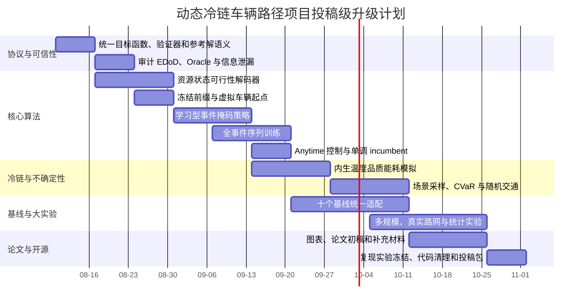

# 动态冷链车辆路径优化项目迈向顶刊顶会的研究升级报告

## 执行摘要

截至 **2026 年 8 月 7 日（America/Los_Angeles）**，我对当前项目的总体判断是：

> **项目已经具备投稿级工程框架，但尚未形成顶刊顶会所要求的完整科学证据链。**

当前工程已经完成了严格因果信息门控、未来订单特征屏蔽、事件驱动滚动时域仿真、品质与能耗特征、事件感知掩码、冻结前缀、动态约束过滤、自适应掩码比例、两时间点序列训练以及 anytime 调度等模块；项目文档还报告了信息泄漏测试通过、8D 品质感知模型平均时间窗可行率达到 77.9%、单实例推理约 0.03 秒等结果。这些工作说明我已经跨过了“简单将 MaskCO 迁移到冷链 VRP”的阶段，具备继续形成独立方法的基础。fileciteturn0file0 fileciteturn0file1 fileciteturn0file7

但目前存在五个会直接阻碍顶级发表的问题。

第一，**可行性仍主要来自 EDD 与 2-opt 后处理**。现有消融中，模型原始输出可行率曾为 0%，动态约束解码器的原始可行率提升仍然有限，而加入 EDD 后才出现大幅提升。这意味着审稿人很可能认为模型没有学会约束，只是生成了供传统启发式修复的候选解。fileciteturn0file0 fileciteturn0file1

第二，**当前“动态创新”虽然已经编码实现，但还没有证明它们带来了真实在线收益**。例如，事件掩码、冻结前缀和 anytime 调度已存在于代码中，但仍需要在相同计算预算、相同动态事件序列和相同冻结规则下，与固定掩码、全局重优化和强动态方法进行严格比较。fileciteturn0file2 fileciteturn0file3

第三，**实验协议尚不稳定**。当前不同文档中存在 77.9%、86.7%、63.3%、37.5% 等不同配置下的可行率结果；EDoD 为 0.8 时接近 100% 而 EDoD 为 0.2、0.5 时明显较低的非单调现象，也需要排查订单生成、决策时刻、可见节点数量、空实例比例和评价分母。所谓“Causal 超越 Oracle”也不能直接解释为非预知策略优于真正的全信息最优策略，因为两者训练数据、模型配置或评估协议可能并不匹配。fileciteturn0file0 fileciteturn0file4

第四，**冷链物理模型目前仍是简化的特征层模型**。现有品质损失和制冷能耗主要由预计算特征和简化代价函数表达，尚未形成由路线顺序、载重、开门次数、外界温度、车厢温度控制共同决定的内生状态转移。相比之下，最新冷链路径研究已经显式考虑温度、路线持续时间、停靠次数、载重、品质阈值和制冷能耗。fileciteturn0file7 citeturn13search1turn13search9

第五，**目前主要是 50 节点 Solomon 风格合成数据**，不足以支撑规模泛化、真实路网、非对称旅行时间、随机交通和真实在线决策的主张。Solomon 标准实例包含 100 客户问题，而 Gehring–Homberger 扩展基准覆盖 200 至 1,000 客户；EURO Meets NeurIPS 竞赛还提供了面向真实特征、非对称路网和动态 VRPTW 的评测体系。citeturn17search0turn17search3turn17search11turn8search14

因此，我建议采用**双轨但不同时投稿**的研究策略：

| 目标轨道 | 核心论文故事 | 必须形成的主要贡献 |
|---|---|---|
| ICLR / NeurIPS / ICML | 面向在线约束组合优化的因果、可行性保持、自适应掩码生成框架 | 通用方法创新、形式化性质、跨问题或跨分布泛化、强学习与非学习基线 |
| Transportation Science / TRC / COR | 动态冷链物流中的实时决策、品质—能耗—服务联合优化 | 严谨问题建模、可信冷链物理、强 OR 算法、真实或高保真数据、管理洞见 |

我的首要建议是把当前工作重构为：

> **Causal and Feasibility-Preserving Masked Generation for Online Constrained Routing**

冷链作为最重要、最复杂的验证应用，而不是把全部创新表述为“在 MaskCO 上增加冷链特征”。

在十二周内，只有达到以下四个硬门槛，我才建议启动正式投稿：

1. **修复前硬约束可行率在 50–200 节点达到至少 99%，400 节点达到至少 98%；**
2. **在相同 p95 延迟预算下，在线 regret 相比最强非预知基线下降至少 8%–10%；**
3. **在真实或非对称路网、未见规模和未见动态分布上仍保持显著优势；**
4. **所有主结论由不少于五个训练随机种子、实例配对检验、聚类 Bootstrap 置信区间和公开代码支撑。**

## 研究定位与投稿目标

当前项目不能同时用同一套叙事满足机器学习顶会和交通运输顶刊。两类 venue 都要求新颖、严谨和可复现，但评价重点明显不同。

ICLR 的公开评审指南要求工作清晰、技术正确、实验严谨、可复现，并能够向社区贡献新的知识；是否达到单纯的 SOTA 并不是唯一标准，但论文必须证明其科学价值。citeturn16view1turn16view3 NeurIPS 2026 的评审标准明确包括质量、清晰度、重要性和原创性；对于 use-inspired 工作，真实应用必须有意义，设计必须匹配物理和业务约束，而且需要同时比较常用的非机器学习方法。citeturn14view0 ICML 要求工作对机器学习社区具有显著兴趣，所有主张应由可复现实验或可靠理论分析支持。citeturn14view1

Transportation Science 强调交通与物流中的基础理论、数学模型、先进方法和新应用，其 Logistics & Routing 方向特别欢迎实时决策和数据驱动优化，但要求论文推进路径规划科学，而不只是展示一个应用。citeturn15view0turn15view1 TRC 的“知识核心在交通侧而不是技术侧”，重视实时运营、物流、系统效率、可靠性、资源消耗、开放科学和大规模数据。citeturn15view2 COR 则要求 OR 理论与先进计算方法结合、具有建设性的算法贡献、广泛数值实验和可复现代码，并明确表示仅提出一个问题变体再套用成熟启发式通常不够。citeturn7search0turn7search2

| 候选 venue | 我应采用的论文定位 | 主要评价侧重点 | 当前适配度 | 投稿前最低门槛 |
|---|---|---|---:|---|
| ICLR | 在线约束组合优化的新型 masked generation 范式 | 表示学习、生成机制、泛化、可行性、理论与消融 | 中 | 方法不能只是冷链特征扩展；至少跨 CVRPTW、动态 VRPTW、冷链 VRP 三种任务 |
| NeurIPS | Causal、use-inspired 的实时神经组合优化 | 科学严谨性、真实需求、非学习基线、系统影响、泛化 | 中 | 真实路网、强 OR 基线、完整统计检验和约束可信性 |
| ICML | 序列决策或在线学习中的可行性保持生成 | 原创且严谨的 ML 方法、理论分析、可复现实验 | 中偏低 | 需要更明确的学习理论、风险界或通用在线学习问题 |
| Transportation Science | 动态冷链 VRP 的新问题结构与实时算法 | 数学建模、算法贡献、强 OR 对比、管理洞见 | 高 | 内生冷链物理、强动态基线、较大规模实验和清晰业务洞见 |
| TRC | 面向实时冷链运营的 AI—优化融合系统 | 交通系统表现、真实数据、实时性、开放数据、可迁移性 | 高 | 至少一个真实城市路网与时变交通实验，展示系统层影响 |
| COR | 因果动态冷链 VRP 的计算方法与可复现框架 | 算法新颖性、复杂数值试验、计算效率、复现 | 高 | 构造性算法贡献、公开代码、200–1,000 节点压力测试 |

我会把 **Transportation Science 作为完整冷链版本的最匹配目标**，把 **ICLR 或 NeurIPS 作为通用 masked online optimization 版本的高风险高回报目标**。如果最终只有冷链单任务、简化物理模型和 50–100 节点实验，合理目标更接近 COR 或专业交通物流期刊，而不是 ICLR、NeurIPS 或 ICML。

研究问题应重新表述为：

\[
\min_{\pi\in\Pi_{\text{causal}}}
\mathbb{E}_{\omega}
\left[
C_{\text{travel}}
+\lambda_e C_{\text{energy}}
+\lambda_q C_{\text{quality}}
+\lambda_u C_{\text{unserved}}
+\lambda_l C_{\text{late}}
+\lambda_c C_{\text{change}}
\right],
\]

其中策略 \(\pi\) 在时刻 \(t\) 只能依赖历史信息 \(H_t\)，并且要在每个事件后，在给定计算预算 \(B_t\) 内生成满足容量、时间窗、冻结前缀、品质阈值和车辆状态约束的决策。

我会把以下四个科学问题作为论文主线：

- 在未知未来订单的条件下，如何使 masked generation 严格满足非预知性？
- 如何使模型原始生成过程保持资源可行，而不是依赖事后修复？
- 如何根据事件影响、路线风险和实时预算自适应选择重构区域？
- 如何把温度、品质和制冷能耗作为内生动态状态，而不是静态节点特征？

## 技术创新与验收门槛

### 当前工作必须先完成的协议审计

在继续增加模型模块之前，我会首先建立唯一、不可绕过的科学评价合同。当前项目已有 `evaluation_contract.md`，但目前主要使用三个训练种子和 Welch 检验；这不足以处理“同一实例—同一动态轨迹—多方法”的配对结构，也容易产生伪重复。fileciteturn0file4

统一合同应明确：

\[
J(\pi,\omega)
=
\begin{cases}
C_{\text{route}}+\lambda_e C_e+\lambda_q C_q+\lambda_c C_{\text{change}},
& \text{若全部硬约束满足};\\
+\infty\ \text{或预注册的业务罚值},
& \text{否则}.
\end{cases}
\]

必须同时维护三类参考：

- **静态最优或 best-known solution**：只衡量静态路由质量；
- **clairvoyant offline lower bound**：知道完整未来，只作为在线问题下界；
- **non-clairvoyant strong baseline**：用于判断在线策略的实际提升。

所谓负 gap 只能表示优于某个启发式参考解，不能写成“优于最优值”。如果参考值来自贪心标签，应使用 `gap_to_reference`，不得使用 `optimality_gap`。

### 核心创新优先级

| 优先级 | 必须实现的创新 | 具体实现要点 | 可证明性质或研究假设 | 量化验收标准 |
|---:|---|---|---|---|
| P0 | 可行性保持的资源状态解码器 | 解码状态显式维护时间、载重、车辆位置、已服务集合、冻结前缀、车厢温度与品质余量；非法动作直接移出候选集；加入有限回溯或标签支配 | 在资源转移准确、初始状态可行、每步只允许可行转移的假设下，生成解通过归纳保持可行 | 修复前 TW+容量可行率：50–200 节点 ≥99%，400 节点 ≥98%；修复调用率 ≤1%；冻结前缀违反为 0 |
| P0 | 可学习的事件感知掩码策略 | 输入边置信度、时间窗 slack、事件空间距离、品质风险、路线负载和剩余预算；学习节点/边级 mask probability；加入 mask budget 正则 | 冻结边被结构性排除时，承诺前缀保持不变；掩码规模受预算上界约束 | 同等 p95 延迟下，相比固定 `keep_rate` 在线 regret 降低 ≥10%；路线变更率降低 ≥30% |
| P0 | 全事件序列的非预知训练 | 不再只训练两个时间点；生成完整事件轨迹，使用轨迹级 imitation、DAgger、自训练或策略梯度；损失覆盖未来累计成本 | 对任何具有相同历史 \(H_t\) 的两条未来轨迹，当前动作分布必须一致，即未来信息非干扰 | 所有 future-perturbation、gradient isolation、attention leakage 测试 100% 通过；相对单时点训练 regret 降低 ≥8% |
| P0 | 冻结前缀下的局部可行重构 | 车辆已执行路径和已承诺服务作为 immutable prefix；只解码 mutable suffix；处理车辆不在 depot 的虚拟起点 | 对任意事件序列，已执行边和已承诺节点顺序保持不变 | Prefix violation = 0；同等成本下重规划 churn 降低 ≥40%；不增加未服务率 |
| P1 | 内生温度—品质—能耗动力学 | 车厢热平衡微分方程、Arrhenius 品质衰减、开门热冲击、载重热容、制冷功率和环境温度轨迹进入状态转移；必要时加入多温区兼容约束 | 品质状态满足时间递推；制冷功率和温度控制满足物理边界；可研究单调性和支配关系 | 相对高保真模拟器，温度/能耗累计误差 ≤5%；品质阈值违反率 ≤1%；多目标 Pareto hypervolume 提升 ≥10% |
| P1 | 面向随机性的场景预测与风险优化 | 订单到达、交通时间和服务时间使用条件场景采样；模型预测未来负载或 marginal value；使用 CVaR 或 chance constraint | 在场景独立同分布或指定混合过程假设下，给出样本平均近似与置信界；至少提供经验校准 | 在未见交通扰动下，CVaR\(_{0.95}\) 总成本降低 ≥10%；最坏分布组 regret 降低 ≥8%；服务率 ≥99.5% |
| P1 | 有单调性质的 anytime 自适应计算 | 学习 mask ratio、beam width、cycle 数与早停；任何新解只有在可行且目标不劣时更新 incumbent | 采用 accept-if-feasible-and-improve 时，incumbent objective 随计算时间单调不增 | 10/25/50/100/250 ms 五个预算点均优于固定循环；至少 99% 事件满足预算；报告 p99 |
| P2 | 跨规模、跨分布与跨任务泛化 | 多规模训练、分布 token、真实路网 edge encoder；从 CVRPTW 预训练并迁移到 DCC-VRP；可引入条件适配器 | 假设共享局部路线结构可迁移；通过 OOD 实验而非口头主张验证 | 未见规模 400 节点的 regret 相对同规模训练模型劣化 ≤5%；未见城市性能保持 ≥90% |

### 可行性保持解码器

这是最关键的算法升级。当前动态约束过滤更接近局部边合法性判断，但“边合法”不等于“完整路线可行”。我会让每个候选扩展携带资源标签：

\[
z_i=(\tau_i,\ell_i,T_i,Q_i,\mathcal{V}_i),
\]

其中 \(\tau_i\) 是服务开始时间，\(\ell_i\) 是累计载重，\(T_i\) 是车厢温度，\(Q_i\) 是剩余品质预算，\(\mathcal V_i\) 是已访问集合。由节点 \(i\) 扩展到 \(j\) 时执行：

\[
\tau_j=\max\{a_j,\tau_i+s_i+t_{ij}\},
\]

\[
\ell_j=\ell_i+d_j,
\]

\[
T_j=\Phi_T(T_i,T_{\text{amb}},P_{\text{cool}},\Delta t,n_{\text{door}},\ell_i),
\]

\[
Q_j=Q_i-\int_{\tau_i}^{\tau_j}
k_0\exp\left(-\frac{E_a}{RT(\tau)}\right)d\tau.
\]

只有同时满足

\[
\tau_j\le b_j,\quad
\ell_j\le C,\quad
Q_j\ge0,\quad
j\text{ 与当前温区兼容}
\]

的动作才进入 softmax。对于单步贪心无法找到动作的情况，采用有限宽度 beam、标签支配或深度受限回溯，而不是直接输出非法路线后交给 EDD。

在这些条件下，可以给出一个简单但重要的命题：

> 若初始车辆状态可行，所有解码转移都满足资源递推与约束检查，并且 depot closure 经过同样检查，则解码器输出的每条完成路线都是可行的。

这类保证本身不是深奥理论，但对当前项目至关重要，因为它能把“修复器负责可行性”的框架改为“模型负责生成可行解，修复器仅负责微小优化”。

### 学习型事件掩码

当前事件感知掩码已经是很好的原型，但顶会版本应将其由规则升级为策略：

\[
p_e^{\text{mask}}
=
\sigma\left(
f_\theta(
\text{confidence}_e,
\text{slack}_e,
\text{event-distance}_e,
\text{quality-risk}_e,
\text{route-load}_e,
B_t
)
\right).
\]

我会区分三类边：

\[
E=E^{\text{executed}}\cup E^{\text{committed}}\cup E^{\text{mutable}}.
\]

前两类掩码概率严格为零；只有 \(E^{\text{mutable}}\) 可以重构。训练可采用 Gumbel-Top-\(k\)、straight-through estimator 或 policy gradient，同时加入：

\[
\mathcal L_{\text{budget}}
=
\left|
\sum_e m_e-K(B_t)
\right|,
\]

以及路线扰动惩罚：

\[
\mathcal L_{\text{stability}}
=
\sum_{e\in E_{t-1}}
\mathbb{1}[e\notin E_t].
\]

这将使论文核心从“增加动态节点特征”变成：

> **模型学习何时、在哪里、以多大范围重新打开组合决策。**

MaskCO 的原始贡献是通过掩码恢复学习局部决策模式，并在推理时迭代 mask-and-reconstruct；因此，学习型事件掩码是与父方法结构直接相关、而不是外围附加的创新。citeturn7search3turn11view0turn12search6

### 全轨迹在线训练

当前两个时间点的 sequential training 只能证明模型接触了动态状态，尚不能充分学习长期代价。我会生成完整 episode：

\[
H_0 \rightarrow e_1 \rightarrow H_1
\rightarrow e_2 \rightarrow \cdots \rightarrow H_T,
\]

并最小化：

\[
\mathcal L=
\sum_{t=0}^{T}
\gamma^t
\left[
\mathcal L_{\text{reconstruct},t}
+\lambda_v\mathcal L_{\text{value},t}
+\lambda_f\mathcal L_{\text{feas},t}
+\lambda_c\mathcal L_{\text{change},t}
\right].
\]

训练分三阶段更稳妥：

1. 用 clairvoyant 或强场景求解器产生教师轨迹；
2. 使用行为克隆学习合法重构和 dispatch/postpone 决策；
3. 使用 DAgger、自训练或 actor-critic 修正分布偏移。

CO-enriched ML 已经证明，预测订单奖赏并调用组合优化层能够在动态 VRPTW 中形成很强的在线策略；ICD 则通过迭代场景采样决定订单应立即派发、延迟还是暂缓。这两类方法都表明，真正动态求解不仅是“新订单到来后重算路线”，还必须处理现在服务还是等待未来合并的价值。citeturn8search12turn9view2turn18search1

### 冷链物理升级

我会把当前预计算 `quality_loss` 升级为在线状态。建议使用最小但可解释的热动力学模型：

\[
C_{\text{eff}}(\ell_t)\frac{dT_t}{dt}
=
UA(T^{\text{amb}}_t-T_t)
-\eta P_t
+Q_t^{\text{door}}
+Q_t^{\text{load}},
\]

品质保留率可写为：

\[
S_i(t)=
\exp\left[
-\int_{t_i^{\text{load}}}^{t}
k_{0,i}
\exp\left(-\frac{E_{a,i}}{RT(\tau)}\right)
d\tau
\right].
\]

能耗为：

\[
E_{\text{cool}}=
\int_0^H P_t\,dt.
\]

路线顺序由此同时影响车厢温度、开门次数、产品暴露时间、品质和制冷能耗。Transportation Science 的冷链研究已经联合考虑运输成本、制冷成本、品质衰减和温区不兼容；2026 年的精确算法工作进一步将温度、路线时长、停靠次数和载重加入品质函数，并求解到 100 客户规模。citeturn13search1turn13search9

对机器学习版本，我不一定要学习制冷控制本身，但必须让模型看见当前温度、外界温度、载重和品质余量。对 Transportation Science 版本，可以进一步把设定温度或多温区分配作为决策变量。

## 实验体系、评价与基线

### 数据与随机性设计

我会把实验分成合成控制层、标准基准层、真实路网层和高保真冷链层。只使用 50 节点 R1/C1/RC1 无法支撑顶级结论。

| 实验维度 | 训练设置 | 测试设置 | 研究目的 |
|---|---|---|---|
| 规模 | 50、100、200 混合训练 | 50、100、200、400；600/1,000 压力测试 | 检验规模泛化和计算复杂度 |
| 空间分布 | R、C、RC；R1/R2、C1/C2、RC1/RC2 | 未见空间密度、未见聚类数、边界外坐标尺度 | 防止只记忆 Solomon 生成器 |
| 动态程度 | EDoD 0.2、0.5、0.8 混合 | 0、0.1–0.9 连续网格 | 检验动态敏感性和非单调异常 |
| 到达过程 | 均匀、非齐次 Poisson、批量到达 | Hawkes 式突发、时空相关到达 | 检验突发订单适应能力 |
| 时间窗 | 宽、中、窄三档 | 未见紧度和服务时长分布 | 检验硬约束稳定性 |
| 路网 | 欧氏对称距离 | 非对称矩阵、OSM/OSRM 城市路网、时变路网 | 检验真实交通适用性 |
| 交通随机性 | 分时段速度乘数、对数正态残差 | 事故冲击、重尾延迟、区域相关拥堵 | 检验风险鲁棒性 |
| 服务随机性 | 确定或轻微随机 | Lognormal/Gamma 服务时长 | 检验执行偏差 |
| 冷链类型 | 常温、冷藏、冷冻 | 多温区兼容、不同品质阈值 | 检验冷链结构 |
| 环境温度 | 平稳与日间正弦轨迹 | 热浪、昼夜突变、城市间迁移 | 检验能耗和品质泛化 |
| 车辆 | 同质车辆 | 异质容量、制冷功率和温区 | 检验工业扩展能力 |

标准数据应包括：

- Solomon 100 客户 VRPTW 全套实例；
- Gehring–Homberger 200、400、600、800、1,000 客户实例；
- EURO Meets NeurIPS 2022 静态和动态 VRPTW 实例；
- DIMACS VRPTW 规范和结果；
- 至少五个 OpenStreetMap 城市路网，通过 OSRM 生成非对称旅行时间矩阵。

Solomon 和 Homberger 的公开基准、目标定义和 best-known solutions 可从 SINTEF 获取；DIMACS 的目标之一就是形成可复现的 VRP 算法比较图景；OSM 数据采用 ODbL，使用时必须保留署名。citeturn17search0turn17search3turn17search13turn17search16turn17search7

建议的样本量为：

- 训练：在线生成不少于 500,000 条混合 episode；
- 验证：至少 5,000 条固定 episode；
- 合成主测试：每个主要规模—动态程度组合至少 300 个基础实例，每个实例 10 个事件/交通随机轨迹；
- Solomon、Homberger 和 ORTEC 实例：每个静态实例生成 20 个动态揭示与交通随机版本；
- 真实路网：至少五个城市，每城 200 个基础日，每日 10 个随机实现；
- 训练随机种子：不少于五个；
- 每个基础测试实例使用 common random numbers，确保所有方法面对同一订单和交通轨迹。

### 冷链实验参数

冷链实验至少应包含以下状态和事件：

| 模块 | 状态或参数 | 必须进行的敏感性分析 |
|---|---|---|
| 环境 | \(T_t^{amb}\)、湿度可选 | 常温、炎热、极端热浪 |
| 车辆热状态 | 车厢温度、热容量、传热系数 | 不同保温性能 |
| 制冷系统 | 最大功率、效率、设定温度 | 功率受限和高能效车辆 |
| 货物 | 活化能、品质阈值、温区 | 高敏感与低敏感食品 |
| 操作 | 开门次数、开门时长、装载量 | 高频小单与低频大单 |
| 业务约束 | 时间窗、拒单成本、服务优先级 | 服务与品质冲突 |
| 目标权重 | \(\lambda_d,\lambda_e,\lambda_q\) | Pareto 前沿而非单一权重 |

所有物理参数应来自公开文献、实验数据或明确标注的合成参数区间，不能只给出一个任意常数。论文需要区分：

- **参数校准实验**：验证温度和能耗模型；
- **算法比较实验**：固定参数比较方法；
- **敏感性实验**：改变品质、能源和服务权重；
- **管理实验**：研究何时值得使用更强制冷、更多车辆或更频繁重规划。

### 对照组与消融结构

| 组别 | 因果门控 | 事件掩码 | 冻结前缀 | 可行性解码 | 序列训练 | 冷链动力学 | 风险/场景 | 自适应预算 |
|---|:---:|:---:|:---:|:---:|:---:|:---:|:---:|:---:|
| A0 原始 MaskCO 适配 |  |  |  |  |  |  |  |  |
| A1 Causal MaskCO | ✓ |  |  |  |  |  |  |  |
| A2 Event Mask | ✓ | ✓ |  |  |  |  |  |  |
| A3 Frozen Prefix | ✓ | ✓ | ✓ |  |  |  |  |  |
| A4 Feasible Decoder | ✓ | ✓ | ✓ | ✓ |  |  |  |  |
| A5 Sequential Policy | ✓ | ✓ | ✓ | ✓ | ✓ |  |  |  |
| A6 Physical Cold Chain | ✓ | ✓ | ✓ | ✓ | ✓ | ✓ |  |  |
| A7 Risk-Aware | ✓ | ✓ | ✓ | ✓ | ✓ | ✓ | ✓ |  |
| A8 Full Method | ✓ | ✓ | ✓ | ✓ | ✓ | ✓ | ✓ | ✓ |

每一层还应有内部消融，例如：

- 规则事件掩码 vs 学习事件掩码；
- 节点掩码 vs 边掩码；
- 无回溯 vs beam vs 标签投影；
- 一步训练 vs 两步训练 vs 全 episode；
- 固定 cycles vs confidence early stop；
- 预计算品质特征 vs 内生温度状态；
- 期望成本 vs CVaR；
- 模型原始解 vs 模型加 EDD vs 模型加 2-opt。

所有方法都必须在相同 wall-clock budget 下比较，不能让神经方法运行 30 ms 而 PyVRP 或 ALNS运行 55 秒后直接比较成本；应同时给出 10、25、50、100、250、1,000 ms 和较长离线预算的 anytime 曲线。

### 评价指标

主表应采用硬约束优先的分层指标。

| 类别 | 指标 | 定义或报告方式 |
|---|---|---|
| 可行性 | Raw feasibility | 不调用 EDD、2-opt 或外部求解器时，完整解满足全部硬约束的比例 |
| 可行性 | Post-repair feasibility | 所有允许后处理后的可行率 |
| 服务 | Service rate | 已按时服务订单数 / 必须服务订单数 |
| 在线性能 | Clairvoyant-normalized regret | \((J_\pi-J_{\text{offline}}^\star)/\max(|J_{\text{offline}}^\star|,\epsilon)\) |
| 在线性能 | Baseline-relative improvement | 相对最强 non-clairvoyant baseline 的配对改善比例 |
| 路由质量 | Distance / travel cost | 只对可行解报告，并同时报告不可行数量 |
| 冷链 | Quality violation rate | 到货品质低于阈值的订单比例 |
| 冷链 | Quality loss / TTI | 平均、p95 和最坏值 |
| 冷链 | Refrigeration energy | 每日、每订单和每公里能耗 |
| 稳定性 | Route churn | 相邻重规划之间改变的未执行边比例 |
| 承诺 | Prefix violations | 必须严格为零 |
| 实时性 | p50 / p95 / p99 latency | 从事件进入到新决策可执行的端到端时间 |
| Anytime | AUC 与 Pareto frontier | 时间—目标值曲线下面积和非支配前沿 |
| 资源 | GPU memory、CPU、energy | 明确硬件、批量和并行设置 |
| 鲁棒性 | Worst-group regret | 在规模、分布、动态程度和城市组中的最差表现 |
| 校准 | Risk calibration | 预测迟到/品质风险与真实发生率的 ECE、Brier score |

主结果表可以采用以下模板：

| Method | Raw Feas ↑ | Service ↑ | Online Regret ↓ | Total Cost ↓ | Quality Viol ↓ | Energy ↓ | Churn ↓ | p95 ms ↓ | p99 ms ↓ |
|---|---:|---:|---:|---:|---:|---:|---:|---:|---:|
| Myopic |  |  |  |  |  |  |  |  |  |
| RH-ALNS |  |  |  |  |  |  |  |  |  |
| PyVRP-RH |  |  |  |  |  |  |  |  |  |
| CO-ML |  |  |  |  |  |  |  |  |  |
| ICD |  |  |  |  |  |  |  |  |  |
| MaskCO |  |  |  |  |  |  |  |  |  |
| Proposed |  |  |  |  |  |  |  |  |  |

### 统计检验

我不会继续只使用三个训练种子和非配对 Welch t-test。新的统计方案如下：

1. **采用配对设计。** 每个方法在同一个基础实例、订单揭示轨迹、交通轨迹和环境温度轨迹上运行。
2. **连续成本指标**使用配对置换检验或 Wilcoxon signed-rank；同时报告配对均值差、配对中位数差和 95% 置信区间。
3. **二元可行性指标**使用 McNemar 检验，而不是把每个方法的可行率当作两个独立比例。
4. **多个方法跨多个数据组比较**，先使用 Friedman 或重复测量模型，再采用 Holm 校正进行事后比较。
5. **置信区间使用 cluster bootstrap**，以基础实例为聚类单位；同一实例的多个交通随机轨迹不能被视为完全独立样本。
6. **训练随机性和环境随机性分层报告。** 至少五个训练种子；每个种子下包含多个环境轨迹。主结论不能只建立在“全部 episode 混在一起”形成的巨大伪样本上。
7. **报告效应量。** 除 \(p\)-value 外，报告相对改善、Cliff’s delta 或标准化配对效应量。
8. **多重比较采用 Holm–Bonferroni，显著性水平预注册为 \(\alpha=0.05\)。**
9. 对“性能基本不下降但速度更快”等主张，使用**非劣效或等价检验**，而不是看到 \(p>0.05\) 就声称两者相同。
10. 对 anytime 曲线，比较配对 AUC，并对每个预算点给出置信区间，避免只选择对本方法最有利的时间点。

### 十个核心基线

| 优先顺序 | 方法 | 年份 | 开源状态与链接 | 适配方式 |
|---:|---|---:|---|---|
| 1 | MaskCO | 2026 | [官方代码](https://github.com/Thinklab-SJTU/MaskCO)，开源 citeturn7search3turn12search6 | 直接父方法；使用相同模型规模、标签和推理预算，分别比较原始随机掩码、现有规则掩码和新学习掩码 |
| 2 | PyVRP / Hybrid Genetic Search | 2024 | [PyVRP](https://github.com/PyVRP/PyVRP)，MIT citeturn8search0turn8academia50 | 每个事件在冻结前缀和当前车辆状态下求解剩余 VRPTW；按 10–1,000 ms 多预算运行；扩展冷链成本 |
| 3 | CO-Enriched ML | 2024 | [复现仓库](https://github.com/tumBAIS/euro-meets-neurips-2022)，开源 citeturn8search12turn9view2 | 使用其 prize-prediction + CO layer；统一决策 epoch、订单状态和时间预算；是最重要的动态学习基线 |
| 4 | Iterative Conditional Dispatch | 2024 | [原始论文](https://doi.org/10.1287/trsc.2023.0111)；未确认独立完整官方仓库，可基于公开竞赛环境与 PyVRP 复现 citeturn18search1 | 采样未来场景，比较 dispatch/postpone 决策；使用完全相同的到达分布信息 |
| 5 | Rolling-Horizon ALNS | 2006；开源包持续维护 | [ALNS Python](https://github.com/N-Wouda/ALNS)，开源 | 传统动态强基线；加入时间窗、冻结前缀、品质和能耗算子；在各 wall-clock budget 下运行 |
| 6 | DR-ALNS | 2024 | [官方代码](https://github.com/RobbertReijnen/DR-ALNS)，开源 citeturn20search0turn20search1 | 让 RL 控制 destroy/repair、破坏比例和接受温度；适配动态冷链状态，检验学习掩码是否优于学习型 LNS |
| 7 | Attention Model | 2019 | [官方代码](https://github.com/wouterkool/attention-learn-to-route)，MIT citeturn19search0 | 增加时间窗、reveal mask 和车辆状态；作为经典 constructive NCO 基线 |
| 8 | POMO | 2020 | [官方代码](https://github.com/yd-kwon/POMO)，开源 citeturn19search1 | 适配 CVRPTW 动态状态，使用多起点采样；与本方法在相同采样数和时间预算下比较 |
| 9 | DACT | 2021 | [官方代码](https://github.com/yining043/VRP-DACT)，MIT citeturn20search7 | 改造其 iterative improvement，使其只修改 mutable suffix；比较双向局部改进与 mask-reconstruct |
| 10 | NeuOpt | 2023 | [官方代码](https://github.com/yining043/NeuOpt)，开源 citeturn8academia49 | 加入时间窗和冻结前缀状态；比较其 flexible neural k-opt、可行/不可行区域搜索和本方法的硬可行生成 |

补充基线可以包括 NLNS、Sym-NCO、DPDP、VROOM、OR-Tools 和 NVIDIA cuOpt。NLNS 是学习修复器与大邻域搜索结合的经典工作；Sym-NCO 可检验几何对称正则；DPDP 可作为神经策略指导组合搜索的混合基线。citeturn20search2turn8search9turn8search7

所有学习方法要区分：

- **Original**：原论文直接能力；
- **Adapted**：由我加入 DCC-VRP 输入、约束和在线环境；
- **Retrained**：是否在同一训练分布上重新训练；
- **Oracle-assisted**：是否使用未来分布或教师数据。

不能把我高度调优的模型与未经适配的原始基线直接比较。

## 工程复现与实施时间表

### 在线仿真框架

当前项目已有 rolling-horizon 状态机和事件仿真基础，但正式版本应将其提升为独立 benchmark 包。fileciteturn0file6 fileciteturn0file7

统一系统状态建议定义为：

\[
S_t=
\left(
t,
\mathcal O_t^{known},
\mathcal O_t^{assigned},
\mathcal O_t^{served},
\mathcal V_t,
R_t^{frozen},
R_t^{mutable},
\Theta_t
\right),
\]

其中 \(\Theta_t\) 包含交通、外界温度、车厢温度和品质状态。

事件队列至少支持：

| 事件 | 状态更新 | 是否触发重规划 |
|---|---|---:|
| OrderReveal | unknown → known | 是 |
| OrderCancel | known/assigned → cancelled | 通常是 |
| VehicleDepart | 路线前缀冻结 | 是 |
| VehicleArrive | 更新位置、载重、时间和温度 | 可选 |
| ServiceStart/End | 更新时间和品质状态 | 可选 |
| TrafficUpdate | 更新可变旅行时间矩阵 | 是 |
| TemperatureUpdate | 更新环境温度和热状态 | 视风险阈值 |
| DecisionDeadline | 强制输出当前 incumbent | 是 |

在线环境必须支持三类策略：

- `static_commit`：日初一次规划；
- `full_reopt`：每次事件对全部未执行部分重优化；
- `local_reconstruct`：只重构事件相关的 mutable suffix。

当前文档中 `full_reopt` 与 `maskco_event` 曾出现完全相同结果，这意味着模型策略可能尚未在仿真中真正区别于全量重优化，必须通过事件级日志验证被掩码区域、实际调用模型次数和路线差异。fileciteturn0file0

### 复现标准

我会建立以下工程规范：

- 一个唯一的 `validate_solution()`，由所有模型和基线共同调用；
- 一个唯一的 `objective.py`，Python、JAX、C++ 与基线只允许通过该定义计算成本；
- 所有实验配置保存为 YAML 或 JSON manifest；
- 每次运行记录 Git commit、依赖锁文件、GPU/CPU 型号、CUDA、JAX、Flax、编译器和环境变量；
- 至少五个训练种子，以及由 `hash(instance_id, scenario_id)` 确定的场景种子；
- 原始数据、动态化脚本和生成器全部版本化；
- 保存每个事件的输入状态、可见订单、冻结前缀、掩码、候选解、最终决策和运行时间；
- 使用 Docker 或 Apptainer 发布可执行环境；
- 发布预训练模型、完整测试实例、基线配置和一键复现实验脚本；
- 代码仓库发布 tagged release，并将数据与模型归档到 Zenodo 获取 DOI；
- OSM 数据注明 ODbL 和 attribution；第三方基准保留各自许可证。

最重要的自动化测试包括：

1. 修改所有未揭示订单的坐标、需求、时间窗和温区，当前动作分布不变；
2. 未揭示节点梯度为零或不进入当前决策图；
3. 任意重规划后冻结前缀完全一致；
4. JAX、Python 和 C++ 成本误差低于 \(10^{-6}\) 或预注册容差；
5. 所有基线输出均通过同一 validator；
6. 相同种子和确定性模式下结果一致；
7. 违反时间预算时必须返回已有可行 incumbent，而不是非法或空解；
8. 任何负 `optimality_gap` 自动触发测试失败，除非参考被明确标记为 heuristic reference。

### 十二周实施路线

| 周次 | 可交付成果 | 验收标准 |
|---:|---|---|
| W1 | 统一 validator、objective、reference 语义 | Python/JAX/C++ 成本一致；负 gap 和不可行处理测试通过 |
| W2 | EDoD、Oracle、动态事件审计报告 | 解释 EDoD=0.8 异常；matched oracle 与 causal 配置完全一致 |
| W3 | 第一版资源可行解码器 | 50 节点 raw feasibility ≥95% |
| W4 | Beam/标签支配和冻结前缀 | 50–100 节点 raw feasibility ≥99%；prefix violation=0 |
| W5 | 学习型 event mask | 相同 mask budget 下优于随机与规则 mask |
| W6 | 全轨迹数据与序列训练 | 至少 10 个事件/episode；所有泄漏测试通过 |
| W7 | Anytime 控制器 | 五个预算点均生成可行解；99% 事件不超时 |
| W8 | 内生温度—品质—能耗模拟器 | 与数值积分或高保真模拟误差 ≤5% |
| W9 | PyVRP、ALNS、CO-ML、ICD 等核心基线 | 所有基线通过统一 validator，支持统一预算 |
| W10 | 大规模、OOD、真实路网实验 | 400 节点和至少三个城市完成；主优势在五种子下稳定 |
| W11 | 完整统计分析、图表和初稿 | 所有主表含 CI、效应量和显著性；无选择性报告 |
| W12 | 复现冻结和投稿包 | 一键复现主表；匿名代码包、数据说明和补充材料完成 |

实际 go/no-go 节点设置为 W4、W8 和 W10：

- W4 若 raw feasibility 仍低于 95%，停止扩展物理模型，集中攻约束生成；
- W8 若冷链模型无法校准，将其降级为敏感性应用，不主张物理真实性；
- W10 若相对 PyVRP-RH、CO-ML 或 ICD 没有显著在线优势，放弃 ML 顶会叙事，转向 OR/交通期刊并强化模型和管理洞见。

## 风险控制与论文投稿策略

### 主要风险与缓解措施

| 风险 | 可能的审稿意见 | 缓解措施 |
|---|---|---|
| 模型原始可行率低 | “全部性能来自 EDD/2-opt，不是神经模型” | 将 raw feasibility 设为主表第一列；可行性解码器必须达到 ≥99%；后处理只作为次级增强 |
| 创新被视为 MaskCO 加特征 | “只是加入 reveal time、temperature 和 rule mask” | 让 mask policy 可学习；给出因果、前缀保持和可行性命题；跨多个在线约束问题验证 |
| Oracle 比较不公平 | “所谓 causal 超越 oracle 是协议错误” | 使用相同数据、模型容量、预算和目标；clairvoyant 只作为 lower bound，不作为普通 baseline |
| EDoD 结果异常 | “高动态反而更容易，可能有生成器漏洞” | 报告初始可见节点数、事件数、必须服务订单数和空事件比例；使用连续 EDoD sweep |
| 冷链物理不可信 | “Arrhenius 参数和能耗模型是任意设定” | 公开参数来源；与高保真模拟校准；进行区间敏感性和参数不确定性分析 |
| 传统基线不公平 | “ALNS 不处理动态或运行时间不同” | 适配 rolling horizon、prefix freezing 和冷链成本；绘制同预算 anytime 曲线 |
| 数据规模过小 | “只在 50 节点合成数据有效” | 100、200、400 为主；600/1,000 压力测试；真实路网和非对称矩阵 |
| 统计显著性不足 | “三个种子不足，episode 不独立” | 五个以上训练种子；实例配对；cluster bootstrap；Holm 校正和效应量 |
| 模型延迟均值好但尾延迟差 | “在线系统不能接受偶发超时” | 报告 p95/p99、超时率和硬 deadline；超时返回 incumbent |
| 全轨迹训练不稳定 | “序列训练没有优于单步训练” | 采用课程学习：2→4→8→完整事件；教师轨迹预训练后再策略优化 |
| 物理模型使问题过于复杂 | “无法判断提升来自何处” | 分阶段消融：路由、动态、品质、风险逐层加入；先保证基础 VRPTW 结论 |
| 真实数据无法公开 | “结果不可复现” | 使用 OSM、公开竞赛数据和可发布合成器；商业数据只做外部验证，不承担主结论 |
| 计算成本过高 | “十个基线和五种子难以完成” | 预先定义主基线五个和扩展基线五个；先小样本筛参数，最终只跑冻结配置 |
| 多目标权重被质疑 | “结论依赖任意 \(\lambda\)” | 报告 Pareto frontier、hypervolume 和多个业务场景，不只给单权重点 |

### 论文核心叙事

机器学习版本应避免标题中首先出现 Cold Chain，因为这样容易被视为领域应用。候选标题包括：

- **CausalMask: Feasibility-Preserving Masked Generation for Online Constrained Routing**
- **EventMaskCO: Adaptive Local Reconstruction for Dynamic Combinatorial Optimization**
- **Learning What to Replan: Causal Masked Generation under Hard Routing Constraints**
- **Budgeted Feasible Generation for Online Vehicle Routing**

Transportation Science 或 COR 版本可采用：

- **Real-Time Dynamic Cold-Chain Routing with Endogenous Product Quality and Adaptive Local Reoptimization**
- **Dynamic Cold-Chain Vehicle Routing under Stochastic Demand, Travel Times, and Temperature-Dependent Quality**
- **A Causal Learning-and-Optimization Framework for Dynamic Cold-Chain Distribution**

论文摘要中必须清晰区分三类贡献：

1. **问题贡献**：严格非预知、冻结前缀、温度品质状态和实时预算下的 DCC-VRP；
2. **方法贡献**：事件条件掩码、资源可行生成、全轨迹学习和 anytime 控制；
3. **经验贡献**：标准基准、真实路网、强 OR/ML 基线和公开动态冷链 benchmark。

### 图表与可视化建议

正文最重要的图应包括：

- **问题时间线图**：展示未知订单、揭示事件、已执行前缀和可变后缀；
- **方法总图**：事件编码器、掩码策略、资源可行解码器、物理状态模拟器和 incumbent；
- **因果性反事实图**：改变未揭示未来后当前动作完全不变；
- **Anytime Pareto 图**：横轴 p95 时间，纵轴 online regret 或成本；
- **可行率分解图**：raw、candidate filter、EDD、2-opt 各阶段；
- **EDoD 连续曲线**：同时画事件数、初始可见比例和 regret；
- **真实城市路线图**：突出 frozen prefix、event-affected region 和实际重构区域；
- **温度—品质轨迹图**：比较静态规划、全量重优化和所提方法；
- **三目标 Pareto 图**：距离、能耗、品质损失；
- **最坏组热力图**：规模 × 城市 × 动态程度 × 时间窗紧度。

正文表格建议限制为：

- 主结果表；
- 核心消融表；
- OOD 与真实路网表；
- 冷链管理洞见表；
- 运行时间与系统资源表。

其余放入补充材料，包括每个实例族完整结果、超参数、种子、完整统计检验和失败案例。

### 补充材料必须包含

- 完整问题定义和符号表；
- 因果非干扰、前缀保持、可行性保持和 incumbent 单调性的证明；
- 所有数据生成算法；
- 所有动态到达与交通随机过程；
- 物理参数来源及校准；
- 基线适配细节和超参数搜索空间；
- 每个随机种子的完整结果；
- 所有 p95/p99 和超时信息；
- 失败实例和不可行案例；
- 计算资源与碳/能耗说明；
- 代码、数据和模型下载说明；
- 匿名复现脚本和 expected output hashes。

### 预期审稿质疑与答辩重点

| 可能质疑 | 我必须提前准备的证据 |
|---|---|
| “这只是 MaskCO 的工程扩展。” | 学习型事件掩码、资源状态生成、全轨迹目标、形式化性质，以及在非冷链在线 CVRPTW 上同样有效 |
| “修复器才是核心算法。” | 修复前 ≥99% 可行率；禁用修复时仍优于基线；报告修复调用率和贡献 |
| “未来信息可能泄漏。” | 特征反事实、梯度隔离、注意力测试和完整 history-only API |
| “所谓 oracle 并不是 oracle。” | 明确 offline clairvoyant、heuristic reference 和 non-clairvoyant baseline 三个概念 |
| “为什么 EDoD=0.8 更容易？” | 连续 sweep、事件数量与可见订单统计、控制初始可见比例的再实验 |
| “冷链模型过度简化。” | 内生热动力学、参数校准、敏感性分析和精确冷链文献对照 |
| “只在小规模欧氏图有效。” | Homberger 400–1,000、ORTEC 非对称实例和 OSM 城市测试 |
| “PyVRP 运行时间不公平。” | 完整 anytime 曲线、相同 CPU/GPU 资源和严格 wall-clock deadline |
| “统计结果由大量相关 episode 夸大。” | 按基础实例聚类的 CI、五训练种子和配对检验 |
| “真实部署时尾延迟不可接受。” | p99、超时率、deadline-safe incumbent 和单事件日志 |

对机器学习顶会，我还必须说明为什么这个问题对更广泛的 ML 社区重要：事件条件局部生成、硬约束生成、非预知序列决策和预算自适应并不限于车辆路径，也可推广到动态调度、在线装箱、生产排程和网络重配置。

对 Transportation Science，我则必须回答：该方法带来了什么新的交通物流知识，例如：

- 动态程度达到什么范围时局部重构优于全量重优化；
- 时间窗紧度与品质敏感性如何决定是否提前派车；
- 更强制冷设备与更智能路线优化之间是否存在替代关系；
- 何时推迟订单能降低总里程但增加品质风险；
- 重规划频率与路线稳定性的最优平衡点在哪里。

## 关键文献与结论

### 优先查阅的论文、代码与数据源

| 文献或资源 | 年份 | 作用 | 开源状态 |
|---|---:|---|---|
| [MaskCO: Masked Generation Drives Effective Representation Learning and Exploiting for CO](https://github.com/Thinklab-SJTU/MaskCO) | 2026 | 当前项目直接父方法，必须逐项区分方法创新 | 官方代码开源 citeturn7search3turn12search6 |
| [Attention, Learn to Solve Routing Problems](https://github.com/wouterkool/attention-learn-to-route) | 2019 | 经典 attention-based constructive NCO | 官方代码、MIT citeturn19search0 |
| [POMO](https://github.com/yd-kwon/POMO) | 2020 | 多起点策略优化经典基线 | 官方代码开源 citeturn19search1 |
| [Neural Large Neighborhood Search](https://github.com/ahottung/NLNS) | 2020 | 学习修复与 LNS 结合，和 mask-reconstruct 高度相关 | 官方代码开源 citeturn20search2 |
| [DACT](https://github.com/yining043/VRP-DACT) | 2021 | 神经迭代改进模型 | 官方代码、MIT citeturn20search7 |
| [Sym-NCO](https://github.com/alstn12088/Sym-NCO) | 2022 | 几何与解对称性泛化 | 官方代码开源 citeturn8search9 |
| [Deep Policy Dynamic Programming](https://github.com/wouterkool/dpdp) | 2022 | 神经策略引导受限动态规划 | 官方代码开源 citeturn8search3turn8search7 |
| [NeuOpt](https://github.com/yining043/NeuOpt) | 2023 | Flexible neural k-opt 与约束区域搜索 | 官方代码开源 citeturn8academia49 |
| [PyVRP](https://github.com/PyVRP/PyVRP) | 2024 | 当前最关键的开源 VRPTW 强求解器 | MIT，支持时间窗与 release times citeturn8search0turn8academia50 |
| [CO-Enriched ML for Dynamic VRPTW](https://github.com/tumBAIS/euro-meets-neurips-2022) | 2024 | 动态 VRPTW 学习—优化融合最重要基线之一 | 论文给出复现仓库 citeturn8search12turn9view2 |
| [Iterative Conditional Dispatch](https://doi.org/10.1287/trsc.2023.0111) | 2024 | 场景采样、dispatch/postpone 决策强基线 | 论文公开，需基于竞赛环境复现 citeturn18search1 |
| [DR-ALNS](https://github.com/RobbertReijnen/DR-ALNS) | 2024 | 学习型 destroy/repair 和搜索控制 | 官方代码开源 citeturn20search0turn20search1 |
| [Recent Dynamic Vehicle Routing Problems: A Survey](https://doi.org/10.1016/j.cie.2021.107604) | 2021 | 动态 VRP 问题与方法分类 | 原始综述 citeturn13search0 |
| [Stochastic Dynamic Vehicle Routing in the Light of Prescriptive Analytics](https://doi.org/10.1016/j.ejor.2021.07.014) | 2022 | 随机动态路由、信息模型与决策模型 | 原始综述 citeturn13search11 |
| [dvrpsim](https://sztaki-hu.github.io/dvrpsim/) | 2025 | 通用动态 VRP 仿真框架，可用于校验事件设计 | Python 包开源 citeturn8search11 |
| [Cold-Chain PDPTW with Quality and Incompatibility](https://doi.org/10.1287/trsc.2022.1167) | 2022 | 制冷成本、品质衰减和温区不兼容的权威模型 | 论文与补充材料 citeturn13search1 |
| [Exact Algorithm for VRPTW with Perishable Products](https://doi.org/10.1287/trsc.2025.0262) | 2026 | 最新品质函数、载重、停靠和能耗精确模型 | 论文与在线附录 citeturn13search9 |
| [EURO Meets NeurIPS VRP Competition](https://euro-neurips-vrp-2022.challenges.ortec.com/) | 2022–2023 | 静态与动态 VRPTW 的统一公开比较环境 | 公开数据、基线与竞赛材料 citeturn9view1turn8search14 |
| [Solomon VRPTW Benchmark](https://www.sintef.no/projectweb/top/vrptw/solomon-benchmark/) | 1987 / 在线归档 | 经典 25、50、100 客户 VRPTW | 实例和 BKS 公开 citeturn17search3turn17search8 |
| [Gehring–Homberger Benchmark](https://www.sintef.no/projectweb/top/vrptw/homberger-benchmark/) | 1999 / 在线归档 | 200–1,000 客户规模泛化测试 | 实例和 BKS 公开 citeturn17search0 |
| [DIMACS VRPTW Challenge](https://dimacs.rutgers.edu/index.php/programs/challenge/vrp/vrptw/) | 2021–2022 | 标准化目标、距离规则和强求解器比较 | 规则、实例与结果公开 citeturn17search13turn17search16 |
| [OpenStreetMap](https://www.openstreetmap.org/) 与 [OSRM](https://github.com/Project-OSRM/osrm-backend) | 持续更新 | 真实城市路网与旅行时间矩阵 | OSM 为 ODbL，OSRM 开源 citeturn17search2turn17search7 |
| [ORTEC 2022 VRPTW Benchmark Curation](https://mamut-routing.univ-ubs.fr/benchmarks/vrptw/ortec2022/index.html) | 2022 | 非对称、200–800 节点真实特征实例 | 实例与 BKS 公开 citeturn17search11 |
| [SVRPBench](https://arxiv.org/abs/2505.21887) | 2025 | 时变拥堵、事故和分布偏移下的随机 VRP | 论文声称发布数据与评测套件 citeturn17academia50 |

### 最终结论

我认为当前项目距离顶刊顶会并不是“再调几个超参数”或“再增加天气、区域密度和温度 embedding”的距离，而是以下四个科学闭环尚未完成：

\[
\boxed{
\text{模型原生可行}
+
\text{真实在线有效}
+
\text{冷链物理可信}
+
\text{实验协议无争议}
}
\]

现有项目最有价值的资产是：

- 已有严格因果可见性设计和信息泄漏测试；
- 已有 MaskCO 的局部重构基础；
- 已有事件驱动仿真、C++ 修复和完整工程管线；
- 已有事件掩码、前缀冻结和 anytime 的原型；
- 已有品质和能耗方向的初步建模。fileciteturn0file0 fileciteturn0file2 fileciteturn0file7

最需要改变的是：**不能再把 EDD 修复后的可行率当作模型学会约束的主要证据，也不能再把静态 ALNS 与动态神经方法的单点运行时间直接比较。**

我会将接下来的工作优先级固定为：

\[
\boxed{
\text{统一评价协议}
\rightarrow
\text{资源可行解码}
\rightarrow
\text{学习型事件掩码}
\rightarrow
\text{全轨迹在线训练}
\rightarrow
\text{内生冷链物理}
\rightarrow
\text{随机性与真实路网}
}
\]

达到这些要求后，项目可以形成两种有竞争力的成果：

- 对机器学习社区，贡献一种**面向动态约束组合优化的因果、可行性保持、预算自适应 masked generation 方法**；
- 对交通与 OR 社区，贡献一种**联合订单动态性、交通随机性、温度演化、品质损失和实时重规划的动态冷链路由框架**。

其中最关键、最能决定论文层级的验收指标不是修复后的 90% 或 95% 可行率，而是：

> **在不读取未来、不修改冻结前缀、不依赖外部修复的前提下，模型能否以 p95/p99 可控延迟持续输出接近 100% 可行、在线 regret 显著更低的路线。**

这将决定当前项目最终是一个完善的工程扩展，还是一个能够被 ICLR、NeurIPS、ICML、Transportation Science、TRC 或 COR 认可的独立研究贡献。