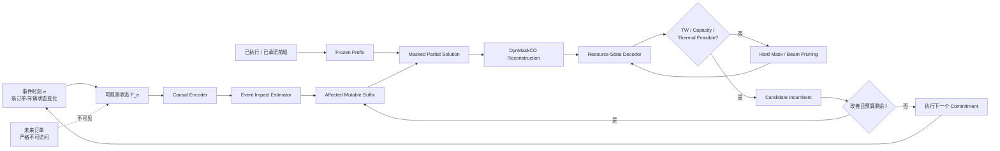
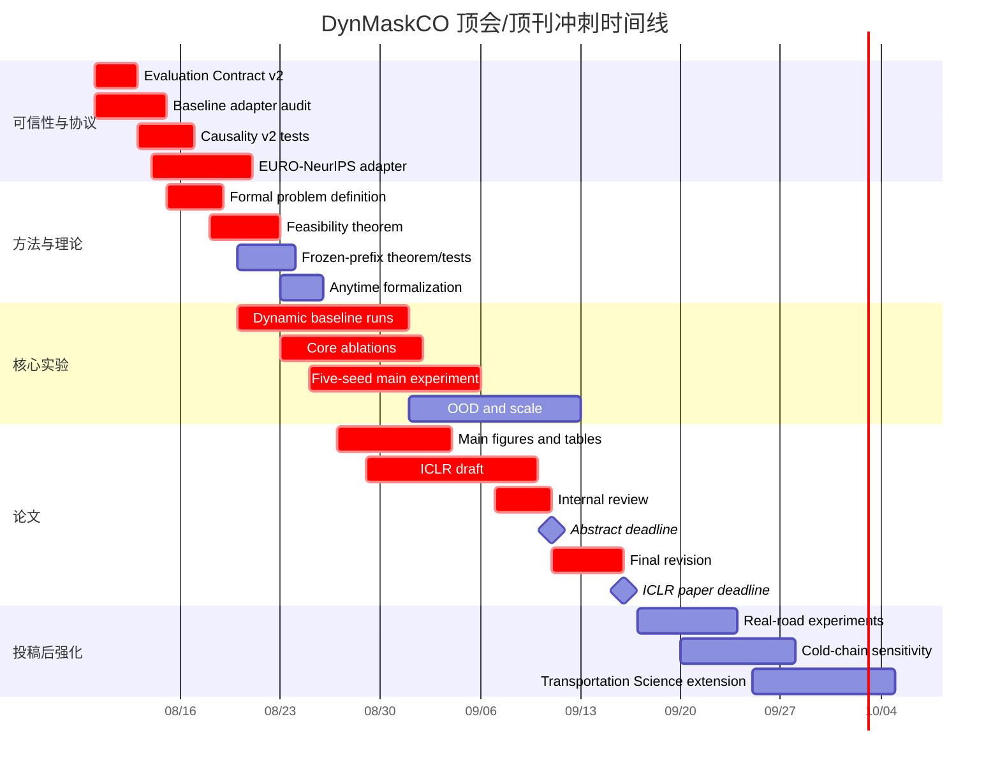

# DynMaskCO 动态冷链车辆路径优化：顶刊顶会冲刺优化与执行计划

## 执行摘要

当前项目已具备投稿级原型，但要达到顶会/顶刊强竞争力，下一阶段必须停止堆功能，转向“协议可信性—方法形式化—强动态基线—OOD泛化—统计闭环”。核心目标是把 DynMaskCO 定位为**严格非预知、可行性保持、事件驱动的在线约束组合优化框架**，冷链作为高难度应用验证。

## 研究定位与成功标准

### 当前项目处于什么水平

基于当前最新项目归档，我认为项目已经跨过了早期最危险的几个问题：未来信息可见性门控已经进入训练、解码和 rolling-horizon 仿真；Phase 3c 已加入资源状态 Beam Decoder 与 online sequential training；D1–D6 中 event mask、frozen prefix、constraint decoder、adaptive mask 和 anytime solver 已经进入代码；当前记录中 50 节点与 100 节点资源解码实验达到很高的时间窗可行性，冷链侧也已经从 `temp_class` 推进到了温度—品质—能耗递推。fileciteturn0file0

因此，**下一步不应继续做“再加一个模块”式优化**。

当前最需要解决的是下面四个审稿层面的问题：

| 当前优势 | 顶级审稿人接下来会追问什么 | 严重度 |
|---|---|---:|
| Resource Beam 达到很高 TW feasibility | 可行性是不是 Decoder 硬编码得到的？方法本身有什么新理论？ | 极高 |
| 已做 future feature masking | 是否仍泄漏未来订单数量、padding 结构、reveal schedule 或 target adjacency？ | 极高 |
| PyVRP/LKH3 在自建窄 TW 数据上表现差 | 是你的问题真的难，还是 baseline adapter/单位/车辆数/时间窗定义有误？ | 极高 |
| 有动态模拟 | 是否与真正的 Dynamic VRPTW SOTA 在**同一 non-anticipatory protocol**下比较？ | 极高 |
| 有 cold-chain physics | 参数是否有现实依据？是否真正改变决策，而非只是额外指标？ | 中高 |
| 有 100 节点实验 | 50→100 是否足够支持 scale/generalization 主张？ | 高 |
| 已实现 D1–D6 | 每个组件是否有独立、统计显著、可解释的收益？ | 高 |

尤其要重视 PyVRP 的结果。PyVRP 本身是专门面向 VRP/VRPTW 的高性能 HGS 求解器，其前身赢得过 DIMACS VRPTW track，后续又在 EURO Meets NeurIPS 静态赛道取得第一；因此，**“PyVRP 在我们的实例上 0% feasible”不能直接作为我们的优势，反而首先应该作为 baseline adapter 审计警报**。citeturn8search3turn10academia37

同样，当前项目记录中的“Causal 超越 Oracle”建议立即停止使用“upper bound / 上界”叙事。一个旧版、存在未来信息访问但没有使用相同强 Decoder、训练方案和搜索预算的模型，并不是数学意义上的 clairvoyant upper bound。以后建议统一称为：

> **Anticipatory / leaky baseline**

真正的 clairvoyant comparator 应该是在**同一个 realized episode 上看到全部未来请求，并使用相同问题定义和足够强优化器求解**得到的离线比较器。

### 推荐的论文最终定位

我建议冻结下面这个主线，不再继续扩展研究问题：

> **DynMaskCO: Causal and Feasibility-Preserving Masked Reconstruction for Online Constrained Vehicle Routing**

核心科学问题：

> **在未来请求不可见、已执行路径不可修改、硬资源约束必须满足的在线车辆路径问题中，如何利用 masked reconstruction 进行快速、局部且严格非预知的重优化？**

这样可以把工作从：

> “MaskCO applied to dynamic cold-chain VRP”

提升到：

> **“一种用于 Online Constrained Combinatorial Optimization 的 masked reconstruction paradigm。”**

这是重要区别。MaskCO 本身把 masked generation 作为组合优化的学习范式，并通过 mask-and-reconstruct 做迭代 refinement；而 ICLR 2026 的 NEXCO 已进一步研究原生 adaptive expansion 与 feasibility projection，LMask 则明确解决 constrained routing 中的动态 feasibility masking 和 backtracking。因此你的工作不能停留在“动态 mask + constraint mask”，必须突出**在线非预知状态、不可逆执行前缀和事件局部重构**这三项 MaskCO/NEXCO/LMask 没有同时解决的问题。citeturn13view0turn13view1turn13view2

### 最终只保留三个核心贡献

**贡献 A：Causal Event-Conditioned Masked Reconstruction**

在事件时刻 \(e\)，只能依赖 filtration \(\mathcal F_e\) 中已经揭示的信息；新订单到来后，不重新生成全部路线，只定位受事件影响的 mutable suffix。

**贡献 B：Feasibility-Preserving Resource-State Decoding**

将时间、容量、车辆状态以及可选的冷链热状态作为显式资源状态，在 mask reconstruction 的生成过程中直接剪除非法动作，而不是生成后再 EDD 修复。

**贡献 C：Commitment-Aware Anytime Reoptimization**

已经执行或进入 commitment horizon 的路线严格冻结；未执行部分根据事件强度、slack、置信度和计算预算进行局部重构，并形成明确的 quality–latency Pareto frontier。

冷链贡献降一级，定义为：

> **A multi-resource, physically grounded stress-test application.**

而不是再将“更多温度特征”列为第四个主算法贡献。

### 投稿路线必须现在决定

当前日期为 **2026 年 8 月 9 日**。ICLR 2027 官方 abstract deadline 为 **2026 年 9 月 11 日 AoE**，full-paper deadline 为 **2026 年 9 月 16 日 AoE**，提交版本正文上限为 9 页。也就是说，你实际上只有约五周半，而不是完整八周。citeturn16search0turn16search1

因此采用双轨策略：

| 路线 | 建议 | Go 条件 |
|---|---|---|
| **ICLR 2027** | 第一优先冲刺 | 8 月底前完成 P0、动态强基线、核心消融和主结果 |
| **NeurIPS / ICML 下一周期** | 若 ML 方法贡献需要继续强化 | 可增加跨规模、跨任务、real-road benchmark |
| **Transportation Science** | 非常合适的 OR 主线 | 强化动态决策、冷链物理、clairvoyance gap、运营洞见 |
| **不建议** | 为赶 ICLR 在 9 月中旬前堆出未经验证的新架构 | 宁可推迟，不牺牲实验可信性 |

**强制 Go/No-Go 日期建议设为 2026 年 8 月 31 日。**

到当天，如果以下四项缺一项，我不建议为了 ICLR 2027 硬投：

\[
\boxed{
\text{Protocol Audit}
+
\text{Strong Dynamic Baselines}
+
\text{Theory}
+
\text{Main Ablation}
}
\]

### 最终方法图应当长这样



这张图要替代当前“模型 + EDD + 2-opt + 很多 flags”的工程化叙事。

## 优先级任务与理论闭环

### 整体任务预算

按照完整顶级投稿标准，本计划约需要 **55–65 人·天**。如果只有一名研究生全职执行，ICLR 2027 前只能完成核心路径约 **35–42 人·天**，因此必须严格控制 scope，并让实验并行运行。

负责人均未指定，因此以下统一记为“**未指定**”。当前项目文档记录的硬件为 2×RTX 5090 32GB，但**本次投稿可使用的总训练预算未指定**。fileciteturn0file0

### 必做任务矩阵

| 优先级 | 任务 | 目的 | 具体技术工作 | 产出 | 验收标准 | 工时 |
|---|---|---|---|---|---|---:|
| **P0** | Evaluation Contract v2 | 消灭审稿致命漏洞 | 重定义 dynamic objective、infeasible reporting、clairvoyant comparator、统一 vehicle/TW/time units | `evaluation_contract_v2.md` | 所有 solver 同一 validator、同一 objective；不再使用错误“Oracle upper bound” | 2 人·天 |
| **P0** | Baseline Adapter Audit | 解释 PyVRP/LKH 异常 | Solomon/CVRPLIB sanity check；逐项核对 vehicle count、capacity、service time、distance/time scaling、depot、TW waiting | adapter test suite | PyVRP 在标准 Solomon 上能得到正常可行解；自建实例失败时能给出确定原因 | 3 |
| **P0** | Causality Audit v2 | 排除隐蔽未来泄漏 | future attribute perturbation、future cardinality perturbation、padding permutation、future target-label perturbation | `test_behavioral_causality.py` | 当前 action/logit 对不可观测未来变化在数值误差内完全不变 | 3 |
| **P0** | 标准动态 Benchmark | 避免只在自建环境成立 | 接入 EURO Meets NeurIPS D-VRPTW protocol | benchmark adapter | 能复现 quickstart dynamic baseline 合理结果 | 4 |
| **P0** | Method Freeze | 防止功能漂移 | 冻结 DynMaskCO-v1；固定配置、commit hash、seed、环境 | release candidate | 所有主实验能一键复现 | 1 |
| **P1** | Resource Decoder 形式化 | 将工程提升为方法贡献 | formal state、transition、admissible set、beam pruning、terminal feasibility | 方法章节+定理 | 完成至少 3 个正式命题与证明 | 4 |
| **P1** | Frozen Prefix 形式化 | 建立真正 online routing 语义 | commitment horizon、immutable edge set、mutable suffix | 定义+证明+测试 | 执行前缀 100% 不被任何 reconstruct 修改 | 2 |
| **P1** | Dynamic 强基线 | 建立真正竞争力 | Rolling-HGS/PyVRP、competition baseline、dynamic HGS、CO-enriched ML 能复现则加入 | 主结果表 | 至少 4 个真正 dynamic/non-anticipatory baseline | 6 |
| **P1** | Anytime / Event Mask 验证 | 将 D1–D6 从代码变贡献 | 事件影响范围、mask ratio、budget scheduler sweep | Pareto 图 | 同预算下优于 random/full remask；或同质量显著更快 | 4 |
| **P1** | 主实验多 Seed | 统计可信 | 5 training seeds；固定 paired test episodes | 主结果 | 核心增益 CI 不跨 0 或效应量有实际意义 | 5 |
| **P2** | Cross-scale OOD | 回答 does it scale | train 50/100，test 100/200/500 | Scale 表/图 | 200 节点无灾难性崩溃；延迟可解释 | 4 |
| **P2** | Distribution OOD | 回答 does it generalize | R/C/RC、EDoD、TW tightness、arrival pattern | OOD heatmap | 最坏组明确报告；方法优于 MaskCO | 3 |
| **P2** | Real-road | 消除 Euclidean toy criticism | OSRM/OSM 非对称 distance/duration matrix | real-road test | 至少 5 地图 × 3 seeds | 3 |
| **P2** | ML 学习基线 | 与 ML reviewer 对齐 | LMask、RouteFinder、AM/POMO 等可适配方法 | appendix/main | 至少 3 个现代 learning baseline | 4 |
| **P2** | 完整 Ablation | 证明贡献归因 | causal/event/prefix/resource/adaptive/thermal 分层消融 | Ablation 表 | 每个 claim 都对应至少一个实验 | 3 |
| **P3** | Cold-chain sensitivity | TS 强化 | ambient T、quality threshold、energy weight、door shock 等 | sensitivity plots | 得出稳定、可解释运营结论 | 3 |
| **P3** | Paper + release | 形成提交物 | LaTeX、figure、README、configs、artifact | submission | 主文、附录、代码可独立复现 | 7 |

### 必须先解决的隐藏 P0：未来订单数量泄漏

当前项目已经用 `visible_mask` 将 future nodes 的特征置为常数，并阻断 attention。fileciteturn0file0

但顶级审稿还会进一步问：

> **模型是否知道未来一共有多少订单？**

如果真实在线环境中未来订单数量未知，而网络输入始终保留 \(N=50\) 个节点槽，那么即使节点特征全部屏蔽，模型仍可能通过：

- tensor shape；
- hidden-node count；
- padding pattern；
- adjacency dimension；
- target solution；
- future reveal-time placeholder；

获得真实环境不允许的信息。

因此需要定义在线信息结构：

\[
\mathcal F_e =
\sigma(
\text{orders revealed by }e,
\text{vehicle states},
\text{executed actions},
\text{known exogenous information}
).
\]

策略必须满足：

\[
a_e \sim
\pi_\theta(\cdot\mid \mathcal F_e).
\]

对于任意两个 episode \(\omega,\omega'\)，只要：

\[
\omega|_{\mathcal F_e}
=
\omega'|_{\mathcal F_e},
\]

就要求：

\[
\pi_\theta(a_e\mid\omega)
=
\pi_\theta(a_e\mid\omega').
\]

这应成为论文中的**Non-anticipativity Definition**，而不是只写“future features are masked”。

### 理论命题与证明任务

#### 非预知不变性命题

**命题。** 假设：

1. 所有未揭示请求的属性不进入 encoder/decoder；
2. padding/dummy encoding 与真实未来请求数量无关；
3. attention、candidate generation、resource transition 仅依赖 \(\mathcal F_e\)；
4. random seed 固定。

则任意两个在 \(\mathcal F_e\) 上相同的未来 realization \(\omega,\omega'\) 满足：

\[
p_\theta(a_e\mid\omega)
=
p_\theta(a_e\mid\omega').
\]

**证明思路：**

从计算图出发。首先证明 encoder output 是 \(\mathcal F_e\)-measurable；然后证明 masked adjacency 和 resource state 也是 \(\mathcal F_e\)-measurable；最后 decoder 的 deterministic/stochastic kernel 只依赖这些变量，因此输出 distribution 与 \(\mathcal F_e\) 之外的变量条件独立。

该证明不复杂，但对于你的论文极有价值，因为它会把“future leakage test”提升为**architecture-level causal guarantee**。

#### Frozen Prefix 保持命题

定义当前执行前缀：

\[
P_e=
(v_0,v_1,\ldots,v_{k_e}).
\]

可修改后缀：

\[
S_e=
(v_{k_e+1},\ldots).
\]

mask support 强制满足：

\[
M_e\cap E(P_e)=\varnothing.
\]

**命题。**

若 reconstruction operator 只能修改 \(M_e\) 中的边，则任意数量的 mask-and-reconstruct cycles 后：

\[
P_e^{(k)}=P_e^{(0)},
\qquad \forall k.
\]

证明直接由 induction 得到。

工程上必须加入 property-based test，而不只是人工看路线。

#### Resource-State Feasibility 定理

定义 Beam State：

\[
z=
(i,t,q,\Theta,\mathcal V,c),
\]

其中：

- \(i\)：当前节点；
- \(t\)：当前时间；
- \(q\)：当前车辆载荷；
- \(\Theta\)：冷链/热状态；
- \(\mathcal V\)：已服务客户集；
- \(c\)：累计目标值。

状态转移：

\[
z'=\mathcal T(z,j).
\]

定义 admissible action set：

\[
\mathcal A(z)=
\left\{
j:
\begin{array}{l}
j\text{ 已揭示且未服务}\\
q+d_j\le Q\\
t'_j\le b_j\\
\text{return-to-depot feasible}\\
g_{\mathrm{thermal}}(\Theta',j)\le0
\end{array}
\right\}.
\]

如果不开启 thermal hard constraint，就删除最后一项，**不能在定理里声称 thermal feasibility**。

**定理。**

若初始 depot 状态可行、每一次扩展均选择 \(j\in\mathcal A(z)\)，depot reset 正确，且 terminal state 满足返回 depot 条件，则生成的完整路线满足所有被 admissible operator 显式检查的硬约束。

**证明思路：**

对 route length 做归纳。

Base case：depot feasible。

Induction step：假设前 \(k\) 步的 state 与真实资源递推一致，第 \(k+1\) 个动作仅在 admissibility 条件满足时允许，因此容量、TW 和其他资源约束继续成立。

Terminal：完整覆盖 + depot return check 保证整条路线可行。

这里必须加一个重要限定：

> 若 thermal dynamics 是近似模型，则只有当 \(\mathcal T_{\mathrm{thermal}}\) 是真实动力学的保守界时，才能声称真实 thermal feasibility；否则只能声称“under the adopted thermal model”。

这会让论文严谨很多。

#### Anytime Incumbent 单调性命题

若每轮 reconstruction 只有在：

\[
J(x')<J(x)
\quad\land\quad
x'\in\mathcal X_{\rm feasible}
\]

时才替换 incumbent，则：

\[
J(x^{(k+1)})\le J(x^{(k)}).
\]

因此随着时间预算增加，best-so-far solution quality 不会恶化。

这可以支持你的 anytime narrative，但注意：

> **只能证明 incumbent objective 单调，不能证明期望解必然趋向全局最优。**

### 理论工作的最低验收线

顶会版本建议至少出现：

- Definition：Non-anticipatory online masked reconstruction；
- Proposition：Future-invariance；
- Proposition：Frozen-prefix invariance；
- Theorem：Resource-state feasibility preservation；
- Proposition：Anytime incumbent monotonicity。

LMask 已经明确把 theoretical guarantees for validity 纳入其 constrained routing 贡献，因此如果你的主张也围绕 feasibility-preserving generation，仅有实验上的 100% feasibility 会显得偏弱。citeturn13view1turn14view0

## 实验体系、基线与评价协议

### 数据集必须升级成四层体系

只使用自己生成的 50/100 节点 Solomon-like 数据不足以支撑顶会泛化主张。近期 VRP learning 工作已经越来越强调跨任务、跨分布和真实地图：例如 SHIELD 在多种 VRP 变体和 9 个真实地图上系统评估泛化，而 ICLR 2026 的 RRNCO 更直接针对 Euclidean-to-real-road sim-to-real gap，研究非对称距离/时间矩阵。citeturn13view3turn11search6

建议构造以下矩阵。

| 层级 | 数据 | 规模 | 动态程度 | 用途 |
|---|---|---|---|---|
| Synthetic-ID | 当前 R1/C1/RC1 | 50、100 | EDoD 0.2/0.5/0.8 | 核心复现 |
| Synthetic-OOD | R/C/RC + R2/C2/RC2 | 100、200、500 | 0.1–0.95 | 分布/规模泛化 |
| Standard VRPTW | Solomon + Gehring-Homberger | 100、200、400 | 静态+人为 reveal | solver sanity + scale |
| External Dynamic | EURO Meets NeurIPS D-VRPTW | 原 benchmark | 原协议 | **动态主表** |
| Real-road | OSM + OSRM | 50、100、200 | 多 arrival pattern | 非对称路网 |
| Cold-chain | 上述实例加 thermal attributes | 50–200 | 多动态程度 | TS / 应用 stress test |

CVRPLIB 提供标准 Solomon VRPTW 实例和已知解信息，可用于 baseline adapter 的 sanity check。citeturn15search14

EURO Meets NeurIPS 2022 则非常关键：它本身包含静态 VRPTW 与“订单在一天中逐步到达”的 dynamic VRPTW，并使用真实世界数据；竞赛专门提供了强静态 VRPTW solver 和动态策略作为 baseline，最终吸引了 50 多个团队提交。这是当前项目最应该接入的外部动态 benchmark。citeturn10search7turn10search11

### Synthetic generator 的固定规格

训练集不要再只固定一个 EDoD。

建议：

\[
N_{\rm train}\in\{50,100\},
\]

\[
N_{\rm test}\in\{50,100,200,500\},
\]

\[
\mathrm{EDoD}_{train}\sim U(0.1,0.9),
\]

而测试固定：

\[
\{0.2,0.5,0.8,0.95\}.
\]

空间模式：

\[
\{\mathrm R,\mathrm C,\mathrm{RC}\}.
\]

TW tightness：

\[
\{\mathrm{loose},\mathrm{medium},\mathrm{tight}\}.
\]

arrival process 至少包括：

- Uniform arrival；
- Poisson-like arrival；
- Burst arrival；
- spatially correlated arrival。

最后一类尤其重要，例如“同一城区晚高峰集中出现新订单”。

### 真实路网

OSRM 是基于 OpenStreetMap 的开源 routing engine，其 Table service 可以生成节点两两间真实道路的 distance/duration matrix，因此非常适合将当前 Euclidean `dist_mat` 替换成非对称真实路网矩阵。citeturn15search0turn15search6

推荐固定五张地图，例如：

> Berlin、Amsterdam、Paris、Chicago、Singapore。

不需要声称这些是“真实企业配送数据”；准确表述应为：

> **real-road-network stress tests based on OSM routing matrices.**

### 必须比较的核心方法

以下不是要求你把所有方法硬改成 DCC-VRP。必须区分：

- **D：可直接动态比较**
- **A：需要适配**
- **S：静态/诊断 baseline**
- **C：component-level 对照**

| 方法 | 年份/定位 | 类型 | 与你的关系 | 开源状态与优先来源 |
|---|---|---|---|---|
| **MaskCO** | ICLR 2026 | C/A | 直接父方法，必做 | 当前父工程；论文：`https://iclr.cc/virtual/2026/poster/10007300` citeturn13view0 |
| **LMask** | ICLR 2026 | A/C | 最重要 constrained masking 对手 | `https://github.com/optsuite/LMask`，官方代码含 TSPTW 与 backtracking。citeturn14view0 |
| **NEXCO** | ICLR 2026 | C | adaptive expansion + feasibility projection | 论文优先：`https://iclr.cc/virtual/2026/poster/10011968`；若官方代码可取得再运行。citeturn13view2 |
| **RouteFinder** | TMLR 2025 | A | multi-variant VRP、含 VRPTW 相关框架 | `https://github.com/ai4co/routefinder`。citeturn11search12 |
| **Attention Model** | ICLR 2019 | A/S | 经典 neural routing | `https://github.com/wouterkool/attention-learn-to-route`。citeturn4search0 |
| **POMO** | NeurIPS 2020 | A/S | 经典强 neural constructive | `https://github.com/yd-kwon/POMO`。citeturn4search5turn5search0 |
| **DPDP** | CPAIOR 2022 | A/S | learned policy + dynamic programming，支持 TW 类问题 | `https://github.com/wouterkool/dpdp`。citeturn9search14 |
| **NLNS** | ECAI 2020 | A/C | neural destroy-and-repair，与 mask reconstruction 很相关 | `https://github.com/ahottung/NLNS`。citeturn9search3 |
| **DACT** | NeurIPS 2021 | A/S | neural improvement baseline | `https://github.com/yining043/VRP-DACT`。citeturn4search2 |
| **PyVRP / HGS** | 强 OR solver | D/S | 必做；Rolling Horizon 主 OR baseline | `https://github.com/PyVRP/PyVRP`。PyVRP 是 VRPTW 的重要强基线。citeturn8search3turn10academia37 |
| **EURO-NeurIPS OptiML** | 2022 | D | **外部动态 baseline** | `https://github.com/N-Wouda/Euro-NeurIPS-2022`；该方案公开了 competition solver。citeturn10search9 |
| **Dynamic HGS** | 2023 | D | 最重要无训练 dynamic OR baseline 之一 | Ghannam & Gleixner，专门适配 HGS 到 DVRPTW，并在 EURO-NeurIPS 数据上优于 competition baseline。citeturn10academia39 |
| **CO-enriched ML** | Transportation Science | D | 最重要 learning+OR 动态 baseline | Baty et al. 方法赢得 EURO-NeurIPS dynamic competition，并验证 unseen instances/scenarios。代码若无法获得，至少严格按论文复现 policy 层。citeturn8academia47 |
| **OR-Tools VRPTW** | 经典开源 | D/S | solver sanity + rolling horizon | `https://github.com/google/or-tools`；官方提供 VRPTW 模型。citeturn8search0turn8search2 |
| **VROOM** | 开源工业 solver | D/S | latency-oriented OR baseline | `https://github.com/VROOM-Project/vroom`，支持 VRPTW 和自定义 routing 场景。citeturn8search6 |
| **DR-ALNS** | ICAPS 2024 | A/C | learned adaptive neighborhood control | `https://github.com/RobbertReijnen/DR-ALNS`。citeturn9search0 |

主文不需要放十六个。

**主结果表建议只保留十个：**

> MaskCO、LMask、RouteFinder、PyVRP-RH、EURO-NeurIPS baseline、OptiML、Dynamic HGS、CO-enriched ML、OR-Tools-RH、DynMaskCO。

其余放 Appendix。

这比用十个静态 NCO 方法堆表格更加科学，因为真正的问题是**online dynamic routing**。

### 公平比较原则

所有动态方法必须共享完全相同的：

\[
\text{event sequence},
\quad
\text{vehicle states},
\quad
\text{commitment horizon},
\quad
\text{available information},
\quad
\text{wall-clock budget}.
\]

禁止再出现：

> DynMaskCO 是动态 causal，ALNS/PyVRP 却直接看到全部实例，然后直接把最终 cost 放同一列比较。

静态 clairvoyant solver 只能作为 **lower-bound-like comparator / clairvoyant benchmark**，不能进入 online method ranking。

### Online regret 应如何定义

这是下一版 evaluation contract 最重要的修改。

设 realization 为：

\[
\omega=(\xi_1,\ldots,\xi_E),
\]

在线策略为 \(\pi\)，最终 operational objective：

\[
J(\pi,\omega).
\]

如果能够得到真正离线最优解：

\[
J^*(\omega),
\]

则 episode-level clairvoyant regret：

\[
R_{\mathrm{clair}}(\pi,\omega)
=
J(\pi,\omega)-J^*(\omega).
\]

归一化形式：

\[
NR_{\mathrm{clair}}
=
\frac{
J(\pi,\omega)-J^*(\omega)
}{
|J^*(\omega)|+\epsilon
}.
\]

但是，**只有当 \(J^*\) 真的是最优值时才能称 regret-to-optimum。**

对于 \(N=50/100/200\)，如果只得到 PyVRP/HGS/ALNS 长预算下的最好已知解，应命名为：

\[
\mathrm{Gap}_{clair\_best},
\]

不要写 optimal regret。

更推荐再加入一个特别适合你的指标：

### Conditional Recourse Regret

在事件 \(e\)，所有方法都已经执行相同意义上的 committed prefix：

\[
P_e.
\]

令 clairvoyant solver 在**不允许修改 \(P_e\)** 的条件下看到剩余真实未来，则：

\[
J_e^*
=
\min_{x\in\mathcal X(P_e)}
J(x\mid\omega_{e:E}).
\]

DynMaskCO 当前方案成本为：

\[
J_e^\pi.
\]

定义：

\[
R_e^{rec}
=
J_e^\pi-J_e^*.
\]

这个指标非常漂亮，因为它回答：

> **既然过去已经不可改变，从当前时刻开始，我的在线重规划距离“知道未来的最好补救方案”还有多远？**

最终画：

\[
R_e^{rec}
\quad\text{vs}\quad
e.
\]

这会比单纯 `Gap_ref` 强很多。

### 动态 objective 要避免任意排除 infeasible instance

建议 Evaluation Contract v2 使用 service-first 评价：

第一层：

\[
N_{\mathrm{unserved}},
\quad
N_{\mathrm{late}},
\quad
\mathrm{Feasibility}.
\]

第二层，仅在服务质量相同条件下比较：

\[
C_{\rm dist},
\quad
Q_{\rm loss},
\quad
E_{\rm refrigeration}.
\]

如必须产生单一 scalar：

\[
J=
C_{\rm dist}
+
\lambda_q Q
+
\lambda_e E
+
M_uN_{\rm unserved}
+
M_tN_{\rm late},
\]

其中 \(M_u,M_t\) 必须在 benchmark 前固定，且足够大以体现 service-first preference。

当前 evaluation contract 已经正确地区分 `Gap_ref` 和真正 optimum；下一版要继续解决 infeasible filtering 与动态 comparator 问题。fileciteturn0file3

### 评价指标最终版

| 类别 | 指标 |
|---|---|
| Hard feasibility | TW Feas、Capacity Feas、Thermal Feas、Route Completion |
| Service | Service rate、Unserved requests、Late requests |
| Dynamic quality | \(R^{rec}_e\)、Episode clairvoyance gap、replan frequency |
| Routing | distance、vehicles used |
| Cold chain | quality loss、TTI、energy、thermal violations |
| Stability | route edit distance、committed-prefix violations |
| Efficiency | p50/p95/p99 event latency、GPU peak memory、CPU time |
| Anytime | objective vs 50/100/250/500/1000 ms |
| Generalization | cross-scale、cross-distribution、cross-EDoD、real-road |
| Reliability | failure rate、worst-10% CVaR / tail performance |

### 随机种子与统计检验必须升级

当前项目合同规定 ≥3 seeds 和 Welch t-test。fileciteturn0file3

顶会终版建议提高为：

**神经模型：5 个独立 training seeds。**

例如：

\[
\{42,123,999,2025,2026\}.
\]

每个 seed 固定同一组测试 episodes。

由于所有方法是在**相同实例上配对比较**，主检验不应优先使用 unpaired Welch t-test。

建议：

- continuous cost/regret：**paired permutation test 或 Wilcoxon signed-rank**；
- feasibility yes/no：**McNemar test**；
- 主效果：报告 **paired bootstrap 95% CI**；
- 多 baseline 同时检验：Holm–Bonferroni correction；
- 除 \(p\)-value 外报告 effect size；
- 所有主表均报告 mean ± std 或 median + IQR，并明确统计单位。

最重要的是不要把同一个 training seed 下的 1000 个 instance 当成 1000 次“独立训练重复”，否则会产生 pseudoreplication。

### 消融设计

| ID | Causal | Event Mask | Frozen Prefix | Resource Decoder | Adaptive Mask | Anytime | Thermal State | 目的 | 预期 |
|---|---:|---:|---:|---:|---:|---:|---:|---|---|
| A | ✗ | ✗ | ✗ | ✗ | ✗ | ✗ | ✗ | 原始 MaskCO | 动态协议下明显较弱 |
| B | ✓ | ✗ | ✗ | ✗ | ✗ | ✗ | ✗ | 仅 causal | 证明去泄漏代价 |
| C | ✓ | ✓ | ✗ | ✗ | ✗ | ✗ | ✗ | Event locality | 相同预算质量提高或更快 |
| D | ✓ | ✓ | ✓ | ✗ | ✗ | ✗ | ✗ | Commitment | Prefix violation → 0 |
| E | ✓ | ✓ | ✓ | ✓ | ✗ | ✗ | ✗ | 核心 feasibility | Hard violation 显著下降 |
| F | ✓ | ✓ | ✓ | ✓ | ✓ | ✗ | ✗ | Adaptive mask | 同预算降低 regret |
| G | ✓ | ✓ | ✓ | ✓ | ✓ | ✓ | ✗ | Anytime | 形成更优 Pareto curve |
| H | ✓ | ✓ | ✓ | ✓ | ✓ | ✓ | ✓ | Full DCC | 降低 thermal/quality cost |
| I | ✓ | Random | ✓ | ✓ | Fixed | Fixed | ✓ | 与 event/adaptive 对照 | 证明不是计算量增加造成 |
| J | ✓ | Full-remask | ✓ | ✓ | Fixed | Fixed | ✓ | 全局重算对照 | DynMaskCO 更快且稳定 |
| K | ✓ | Event | ✓ | Greedy feasible | ✓ | ✓ | ✓ | Beam contribution | 分离 neural vs beam gain |
| L | ✓ | Event | ✓ | K=4/8/16/32 | ✓ | ✓ | ✓ | Beam width sweep | quality–latency 曲线 |

最关键的不是 H 一定最好，而是：

> **C→D→E→F 每一项都必须回答一个清晰的 scientific question。**

否则 D1–D6 会被 reviewer 看成 kitchen-sink engineering。

## 工程实施、接口规范与测试体系

### 建议重新组织代码边界

当前工程已经有 `maskco_dynamic.py`、`rolling_horizon.py`、resource decoder 与 C++ operators，因此不是重写，而是重构 API。fileciteturn0file0turn0file4

建议最终形成以下结构：

```text
dynmaskco/
├── problem/
│   ├── state.py
│   ├── resources.py
│   ├── objective.py
│   └── validator.py
│
├── online/
│   ├── event_stream.py
│   ├── filtration.py
│   ├── commitment.py
│   └── simulator.py
│
├── model/
│   ├── causal_encoder.py
│   └── maskco_adapter.py
│
├── decoding/
│   ├── event_mask.py
│   ├── adaptive_mask.py
│   ├── resource_beam.py
│   ├── frozen_prefix.py
│   └── anytime.py
│
├── baselines/
│   ├── pyvrp_rh.py
│   ├── ortools_rh.py
│   ├── competition_baseline.py
│   └── dynamic_hgs.py
│
├── evaluation/
│   ├── metrics.py
│   ├── regret.py
│   ├── statistics.py
│   └── profiler.py
│
└── tests/
    ├── test_causality.py
    ├── test_future_cardinality.py
    ├── test_resource_equivalence.py
    ├── test_prefix_invariance.py
    ├── test_solver_adapters.py
    └── test_reproducibility.py
```

### Online state 接口

推荐统一成：

```python
@dataclass(frozen=True)
class OnlineState:
    epoch: int
    current_time: float

    revealed_orders: Array
    active_orders: Array

    vehicle_positions: Array
    vehicle_loads: Array
    thermal_states: Array

    committed_prefixes: tuple
    mutable_suffixes: tuple
```

最重要的一条：

> **`OnlineState` 内绝不允许包含 unrevealed ground-truth order attributes。**

完整 episode ground truth 只能存在于 simulator 内部。

### Decoder 接口

```python
def replan(
    state: OnlineState,
    incumbent: Solution,
    *,
    time_budget_ms: float,
    beam_width: int,
    rng_key,
) -> ReplanResult:
    ...
```

返回：

```python
@dataclass
class ReplanResult:
    solution: Solution
    feasible: bool

    objective: float
    distance: float
    quality_loss: float
    energy: float

    num_expansions: int
    num_pruned: int

    latency_ms: float
    peak_memory_mb: float
```

这会让所有 baseline 统一使用同一个 simulator 和 evaluator。

### Validator 必须只有一个 source of truth

最危险的情况是：

> Python 认为 feasible，C++ 认为 infeasible，PyVRP 又使用第三套单位。

因此必须构建：

\[
\texttt{validate\_solution(solution, instance, state)}
\]

并保证：

\[
\text{Python validator}
=
\text{C++ resource decoder}
=
\text{baseline adapter semantics}.
\]

至少随机生成 \(10^4\) 条路线进行 differential testing。

### Baseline sanity test

在碰自建 cold-chain 数据之前：

1. 加载标准 Solomon；
2. PyVRP；
3. OR-Tools；
4. 你的 validator；
5. 比较 objective 和 feasibility。

只有标准实例正确后，才能相信“PyVRP 在自建 narrow TW 上失败”。

### Future Perturbation Test 升级版

这是必须写进论文 Appendix 的测试。

固定：

\[
\mathcal F_e.
\]

创建四个 future worlds：

**World A**

原未来订单。

**World B**

随机打乱未来坐标。

**World C**

随机重采样未来 demand/TW/temp。

**World D**

改变未来订单数量和 dummy slots，但保证当前可观察历史一致。

然后比较：

\[
\Delta_{\rm logits}
=
\max_a
\left|
\ell_a^{A}-\ell_a^{B}
\right|.
\]

要求：

\[
\Delta_{\rm logits}<10^{-6}
\]

或使用对应 dtype 下合理的数值容差。

同时检查：

\[
a_e^A=a_e^B=a_e^C=a_e^D
\]

在 deterministic decoding 下必须成立。

### Target-label leakage test

训练阶段尤其容易泄漏。

如果 masked target adjacency 中包含未来客户的真实 route relationship，即使 encoder 不看未来节点，也可能通过 decoder target 或 corruption process 间接知道未来结构。

因此：

> 对不可见 future nodes 的 target edge、route labels、pseudo-labels 全部随机置换。

当前可见节点的 loss/logits 必须不变。

这是现有三项 leakage test 之外非常重要的新测试。

### Prefix invariance test

随机生成：

\[
P_e=[0,7,11,4].
\]

执行 100 次：

- event reconstruction；
- adaptive mask；
- beam；
- 2-opt；
- quality 2-opt。

始终检查：

\[
P_e^{after}=P_e^{before}.
\]

任何一个 operator 能修改 executed prefix，整个 dynamic claim 都应该判定失败。

### 性能目标

不要只报平均 latency。

主文统一报告 steady-state：

\[
p50,\quad p95,\quad p99.
\]

并单独报告 JAX compile/warm-up time。

建议验收线：

| 规模 | Fast mode p95 | Quality mode p95 | Peak GPU Memory |
|---|---:|---:|---:|
| 50 | ≤500 ms | ≤1.5 s | ≤8 GB |
| 100 | ≤1 s | ≤2.5 s | ≤12 GB |
| 200 | ≤2.5 s | ≤5 s | ≤20 GB |
| 500 | Stretch goal | ≤15 s | ≤30 GB |

同时必须报告固定 wall-clock budgets：

\[
50,\ 100,\ 250,\ 500,\ 1000,\ 5000\ \text{ms}.
\]

**任何 solver 超时即停止，比较 best incumbent。**

这种比较比“MaskCO 跑一次，ALNS 跑 55 秒”强得多。

### Real-road 工程实现

OSRM 官方实现能够直接生成 pairwise distance/duration tables，因此建议提前生成 matrices 固化进 benchmark，不要在训练过程中在线查询。citeturn15search0

最终 `.npz` 可扩展为：

```text
distance_mat
duration_mat
is_asymmetric
road_network_id
traffic_profile_id
```

这样模型才能真正接受：

\[
d_{ij}\ne d_{ji},
\qquad
\tau_{ij}\ne\tau_{ji}.
\]

这也是从 synthetic Euclidean toy problem 向真实路由迈出的重要一步。

## 周级时间线与里程碑

### 推荐采用八周总计划，但前五周半形成 ICLR-ready version



ICLR 2027 的两个 deadline 分别为 9 月 11 日 abstract 和 9 月 16 日 full paper，因此这张时间表不是宽松计划，而是硬 deadline 倒排。citeturn16search0

### 周交付表

| 周 | 日期 | 主要任务 | 必须交付 | 负责人 |
|---|---|---|---|---|
| **W1** | 8/10–8/16 | Protocol v2、baseline audit、causality v2 | Evaluation Contract v2；PyVRP sanity；4 类 leakage test | 未指定 |
| **W2** | 8/17–8/23 | EURO benchmark、数学形式化 | external benchmark 可跑；problem definition；前三个命题 | 未指定 |
| **W3** | 8/24–8/30 | Dynamic baselines + ablation | Dynamic HGS/PyVRP-RH/competition baseline；A–L 消融首轮 | 未指定 |
| **W4** | 8/31–9/6 | Main results、OOD、statistics | 5-seed 主表；online regret；Go/No-Go decision | 未指定 |
| **W5** | 9/7–9/13 | ICLR 写作、补关键实验 | 9-page draft；主图；supplement；9/11 abstract | 未指定 |
| **W6** | 9/14–9/20 | 提交与 real-road | 9/16 submission；real-road matrix 和结果 | 未指定 |
| **W7** | 9/21–9/27 | TS 强化 | cold-chain sensitivity；运营洞见 | 未指定 |
| **W8** | 9/28–10/4 | Artifact 与 journal extension | clean repo、reproduction package、TS 长文框架 | 未指定 |

### 每周必须有“杀死错误方向”的检查点

**W1 Gate**

PyVRP sanity 如果不通过，暂停所有 superiority claim。

**W2 Gate**

如果 future cardinality test 不通过，先修 causality，不跑主实验。

**W3 Gate**

如果 Event Mask 在 matched budget 下没有收益，删除该贡献，不强行保留。

**W4 Gate**

如果 resource decoder 只提高 feasibility 但 cost/regret 显著恶化，则论文要改为：

> feasibility–quality trade-off framework，

而不能声称全面 SOTA。

**8 月 31 日 ICLR Go/No-Go**

至少满足：

\[
\begin{aligned}
&\text{External Dynamic Benchmark} && \checkmark\\
&\text{4 Strong Dynamic Baselines} && \checkmark\\
&\text{5-Seed Main Result} && \checkmark\\
&\text{Theory Draft} && \checkmark\\
&\text{Ablation} && \checkmark
\end{aligned}
\]

否则更建议把工作继续做完整后转 Transportation Science 或下一轮顶会，而不是仓促投稿。

## 风险控制、论文结构与最终验收

### 主要风险与缓解措施

| 风险 | 可能后果 | 缓解措施 |
|---|---|---|
| **PyVRP/LKH baseline adapter 有 bug** | 整个 superiority claim 失效 | W1 用 Solomon/CVRPLIB sanity；cross-validator；不要在审计前引用 0% feasible |
| **未来订单 cardinality 泄漏** | Dynamic claim 被直接否定 | dummy count invariant / variable-length packing；behavioral perturbation |
| **Target solution 泄漏未来结构** | 训练实际上仍 anticipatory | future label permutation test；visible-only training loss |
| **D1–D6 太多导致贡献散乱** | Reviewer 认为 kitchen-sink engineering | 主文只保留 causal + feasible + event/commitment 三块 |
| **100% feasibility 但 route cost 较差** | Reviewer 认为约束通过保守搜索换来的 | matched-budget Pareto；beam-width sweep；regret；cost-conditioned-on-service |
| **Dynamic baseline 不公平** | 结论无效 | 所有 solver 使用同一 simulator、event stream、commit horizon、budget |
| **所谓 Oracle 不是真上界** | 理论表述错误 | 改成 anticipatory baseline；真正 comparator 使用 clairvoyant optimization |
| **Cold-chain 参数过于人为** | Transportation Science 质疑现实性 | sensitivity；参数来源透明；将 physics 结论限定为 adopted model |
| **只有 synthetic Euclidean** | ML reviewer 质疑 sim-to-real | EURO benchmark + OSRM real-road |
| **5 个 training seed 计算太大** | ICLR 前来不及 | architecture search 仅 1–2 seed；最终 frozen config 才跑 5 seed |
| **LMask/NEXCO 等不能直接适配 VRP** | baseline apples-to-oranges | 明确标记 component-level；主动态表只放直接可比方法 |
| **ICLR 时间不足** | 论文实验不闭环 | 8/31 硬 Go/No-Go；不满足即切 TS/后续 ML venue |

### 最终论文建议结构

#### Abstract

必须在四句话内回答：

1. Online constrained routing 的问题；
2. 现有 NCO 在 future information、commitment 和 hard constraints 上的问题；
3. DynMaskCO 三个机制；
4. external dynamic benchmark + feasibility/regret/latency 主要结果。

不要在 Abstract 列 D1–D6。

#### Introduction

核心冲突：

\[
\text{Global recomputation}
\quad\text{vs}\quad
\text{local online recourse}
\]

以及：

\[
\text{neural flexibility}
\quad\text{vs}\quad
\text{hard feasibility}.
\]

Figure 1 就放前面的 DynMaskCO online pipeline。

#### Related Work

分四条：

- Neural combinatorial optimization；
- Masked/diffusion CO；
- Constraint-aware neural routing；
- Dynamic VRPTW + OR/ML hybrid。

这里必须认真讨论 MaskCO、LMask、NEXCO，以及 Dynamic HGS 和 CO-enriched ML。MaskCO 提供 masked generation 范式；LMask 已研究 dynamic feasibility masks/backtracking；NEXCO 已研究 adaptive expansion + feasibility projection，所以你的 novelty 必须明确落在**online event stream + non-anticipativity + irreversible commitments**。citeturn13view0turn13view1turn13view2

动态 OR 文献则必须包括 EURO Meets NeurIPS benchmark、Dynamic HGS 和 competition-winning CO-enriched ML。citeturn10search11turn10academia39turn8academia47

#### Problem Formulation

严格定义：

\[
(\Omega,\mathcal F,\{\mathcal F_e\}_{e=0}^E)
\]

以及：

- order revelation；
- vehicle state；
- commitment；
- feasible action；
- operational objective；
- cold-chain extension。

这会比“输入是 8D feature”高级很多。

#### Method

只分：

**Causal Event Encoding**

**Commitment-Aware Masked Reconstruction**

**Resource-State Feasible Decoding**

最后小节才讲 adaptive anytime strategy。

#### Theory

正文至少保留：

- Non-anticipativity proposition；
- Feasibility theorem。

Frozen-prefix 和 anytime proof 可放 appendix。

#### Experiments

实验问题最好直接写成研究问题：

> **RQ-Causality:** 是否真正不依赖未来信息？

> **RQ-Feasibility:** 可行性保持是否来自 resource decoder，代价是多少？

> **RQ-Dynamics:** 在相同在线信息与计算预算下，是否优于强 dynamic OR 方法？

> **RQ-Generalization:** 是否跨规模、EDoD、distribution 和 road network 泛化？

> **RQ-Efficiency:** 是否提供更优 quality–latency Pareto？

> **RQ-ColdChain:** cold-chain resource dynamics 是否实际改变决策质量？

### 最终建议的主图

**Figure 1 — Framework**

DynMaskCO event-driven pipeline。

**Figure 2 — Causality**

改变未来 world：

\[
\text{Future A/B/C/D}
\]

但当前 logits/action 完全重叠。

这张图非常有辨识度。

**Figure 3 — Quality–Latency Pareto**

横轴：

\[
\log(\text{latency})
\]

纵轴：

\[
\mathrm{Gap}_{clair\_best}
\]

点：

- Greedy；
- VROOM；
- PyVRP；
- Dynamic HGS；
- MaskCO；
- DynMaskCO。

**Figure 4 — Online Recourse Regret**

\[
R_e^{rec}
\]

随 event epoch 变化。

**Figure 5 — OOD Heatmap**

横轴 EDoD，纵轴：

\[
R/C/RC
\times
N
\times
TW\ hardness.
\]

### 最终建议的主表

**Table 1**

EURO-NeurIPS Dynamic benchmark 主结果。

**Table 2**

Synthetic DCC 主结果：

> Feas / Service / Regret / Distance / Quality / Energy / p95 latency。

**Table 3**

Ablation。

**Table 4**

Scale/OOD。

**Table 5**

Anytime matched-budget。

冷链 sensitivity 放 Appendix 或 Transportation Science 版本正文。

### Transportation Science 版本应该额外增加什么

如果最终走 Transportation Science，则不要简单把 ICLR 论文扩长。

Transportation Science 版本要增加：

- 更严格的 dynamic decision formulation；
- cold-chain physical interpretation；
- sensitivity analysis；
- operating policy；
- rejection/service trade-off；
- fleet size；
- ambient temperature；
- quality thresholds；
- dynamic order intensity；
- computational comparison；
- managerial insights。

冷链车辆路径已有 Transportation Science 工作将 quality decay、refrigeration cost、time windows 和货物不兼容等因素纳入优化，因此你的期刊版本需要明确解释：**为什么“动态信息到达 + 实时重规划”改变了传统冷链优化结论，而不只是用了神经网络求解同一个问题。** citeturn3search0

### 最终提交前的硬性验收清单

下面是我以顶级 venue reviewer 身份给这个项目设的最低线。

| 问题 | 投稿前必须回答 |
|---|---|
| 真动态吗？ | Future attributes + cardinality + target structure 均无泄漏 |
| 真在线吗？ | 已执行 prefix 永远不可修改 |
| 比谁强？ | 至少 4 个真正 non-anticipatory dynamic baseline |
| PyVRP 为什么失败？ | 有标准 benchmark sanity check 和确定技术解释 |
| 100% feasibility 从哪来？ | Resource decoder 定理 + ablation |
| 代价是什么？ | Feasibility–cost–latency Pareto |
| 在线性能到底好不好？ | Online/conditional recourse regret |
| 能泛化吗？ | 50→100→200，最好 500；R/C/RC；EDoD OOD |
| 真实吗？ | EURO-NeurIPS + 至少一个 real-road 设置 |
| 冷链是真的吗？ | Thermal dynamics、quality、energy 有明确 model assumptions |
| 统计靠谱吗？ | 5 train seeds + paired tests + CI |
| 能复现吗？ | frozen commit + configs + one-command evaluation |

最后给出一个非常明确的判断：

> **当前 DynMaskCO 不再缺“功能”；缺的是把现有功能压缩成一个被严格定义、被数学证明、被公平 benchmark 验证的科学方法。**

未来五周的最优资源配置不是：

\[
\text{继续新增模型结构}
\]

而是：

\[
\boxed{
\text{协议审计}
\rightarrow
\text{Resource Decoder 理论化}
\rightarrow
\text{真正 Dynamic Baselines}
\rightarrow
\text{Online Regret}
\rightarrow
\text{OOD / Real-road}
\rightarrow
\text{严谨消融}
}
\]

如果到 **2026 年 8 月 31 日**，DynMaskCO 能在 EURO-NeurIPS 类动态协议下，用严格相同的未来信息、commitment 与 wall-clock budget，同时证明：

\[
\text{Feasibility}\approx100\%,
\]

\[
R_{\rm online}
<
R_{\rm strong\ baselines},
\]

并在：

\[
N=100/200
\]

和至少一种 OOD/real-road setting 下仍保持优势，那么这个项目就不再只是“MaskCO 的动态冷链扩展”，而会真正具备 **ICLR/NeurIPS/ICML 方法论文的竞争形态**。

若上述动态主结果没有形成明显优势，但资源解码、冷链动态性和运营决策结果非常完整，则应果断转为 **Transportation Science 主线**；这不是降级，而是让论文贡献与 venue 的评价标准真正对齐。