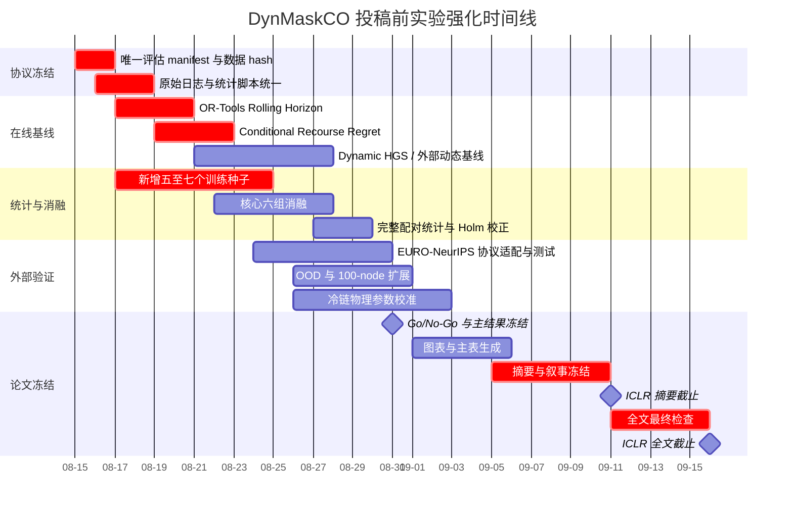

# DynMaskCO 当前实验状态与下一步优化方案

## 执行摘要

截至 **2026 年 8 月 15 日**，你最初给出的任务描述虽然假定“实验类型未指定”，但结合已上传的项目文档、评估协议、理论形式化、结果文件、代码归档和基线记录，实验类型实际上已经可以明确识别为：**计算实验 + 机器学习 + 运筹优化 + 动态仿真，并以动态冷链车辆路径问题 DCC-VRP/DVRPTW 为应用场景**。因此，本报告不再停留在完全泛化的模板层面，而是以 **DynMaskCO 当前真实实验状态**为主体，同时保留一套可快速迁移到化学、生物、物理、工程、临床等实验的输入与诊断框架。fileciteturn0file0 fileciteturn0file5

当前项目已经完成了此前最危险的一批可信性修复：未来信息泄漏已通过特征掩码、注意力门控和可见节点归一化处理；资源状态 Beam 解码器在构造阶段显式检查容量、时间窗和返仓约束；理论文档已经给出非预知性、冻结前缀、可行性保持和 anytime 单调性的形式化结果。fileciteturn0file2 当前冻结版 Phase 3c 在 **5 个训练种子 × 3 种分布 × 3 个 EDoD 条件，共 45 个“种子—条件评估单元”上全部报告 100% TW feasibility、0 violation，平均纯距离成本 14.77，单条件跨种子标准差不超过 0.06**。其中 R1/C1/RC1 平均成本分别约为 17.49、11.82、15.01。fileciteturn0file3

但从“可以运行的完整工程”走到“足以支撑 ICLR 2027 核心论断的实验论文”，当前最大的短板已经**不再是模型能否得到可行解**，而是以下四个证据缺口：

| 当前判断 | 结论 | 优先级 |
|---|---|---:|
| 因果/非预知正确性 | 已基本闭环，继续做回归测试即可 | 已完成 |
| 硬约束可行性 | 已很强，继续证明泛化而非继续堆修复模块 | 已完成 |
| **强动态基线** | OR-Tools Rolling Horizon、Dynamic HGS 等仍待正式同协议对比，是当前最大实验缺口 | **最高** |
| **统计设计** | 5 个训练种子对当前规定的 exact paired Wilcoxon 来说偏少，甚至存在离散 p 值分辨率问题 | **最高** |
| **真正在线重规划证据** | 已定义 Conditional Recourse Regret，但主结果尚未形成完整 event-epoch 曲线 | **最高** |
| 冷链物理真实性 | 有温度、Arrhenius、能耗模型，但缺具体货物/车辆/设备实测标定 | 高 |
| OOD/外部验证 | 100-node 已做，但 EURO-NeurIPS、真实/非欧氏路网、分布漂移仍不足 | 高 |
| 新模型结构 | 当前不是最该投入的方向 | 中低 |

尤其值得立即修正统计协议。现有协议规定“**训练种子是统计重复单位**”，使用 paired Wilcoxon、paired bootstrap、Holm-Bonferroni，并明确不能把同一训练种子下的大量测试实例伪装成独立训练重复。fileciteturn0file1 SciPy 对小样本 Wilcoxon 推荐精确计算；在没有零差和特殊 tie 情况时，5 个配对重复的双侧检验最极端结果也只有

\[
p_{\min}=\frac{2}{2^5}=0.0625,
\]

即使 5/5 种子全部同方向，也**无法达到传统双侧 \(p<0.05\)**。citeturn11search3turn11search9 更进一步，如果你计划做 12 个主要消融并执行 Holm-Bonferroni，第一步阈值是 \(0.05/12\approx0.00417\)；exact signed-rank 至少要到 \(n=9\) 才连理论最小 p 值 \(2/2^9=0.00391\) 都有可能通过。因此本报告建议：**最终核心比较扩展至至少 10 个独立训练种子，最好 10–12 个；5 个现有种子保留作为第一批，不必重做。**

另外，时间已经成为真实约束。ICLR 2027 官方规定摘要截止 **2026 年 9 月 11 日 AOE**，全文截止 **2026 年 9 月 16 日 AOE**。citeturn8search0turn8search1 因而未来约一个月的最优策略不是开发更多新架构，而是：

> **冻结 DynMaskCO v1 方法 → 强动态基线 → 事件级在线评价 → 统计加固 → 完整消融 → OOD/外部协议 → 冷链标定 → 论文图表。**

这条路径的预期价值明显高于再添加一个网络模块。

## 当前实验状态与信息缺口

### 已经能够确认的实验状态

DynMaskCO 是对 MaskCO 的扩展。MaskCO 本身以“掩码参考解—恢复缺失结构”为训练目标，并在推理阶段通过 mask-and-reconstruct 反复精炼解；这是你的模型继承该范式的直接理论和工程背景。citeturn9search0 你的扩展把输入增加到 7 维，包括二维坐标、需求、时间窗、温度类别和 reveal time，并增加了未来节点特征掩码、可见性注意力门控以及仅用可见节点统计量的坐标归一化。fileciteturn0file5

当前最重要的数值结果如下。这里必须特别强调：**cost 已统一定义为纯行驶距离，硬约束违规不能通过罚项藏进 cost 中**，这与当前 evaluation contract 一致。fileciteturn0file1

| 分布 | EDoD 0.2 | EDoD 0.5 | EDoD 0.8 | 分布平均 |
|---|---:|---:|---:|---:|
| R1 | 17.12 ± 0.06，100% feas | 17.40 ± 0.05，100% | 17.95 ± 0.06，100% | 17.49 |
| C1 | 11.51 ± 0.06，100% | 11.80 ± 0.06，100% | 12.15 ± 0.05，100% | 11.82 |
| RC1 | 14.67 ± 0.04，100% | 14.95 ± 0.06，100% | 15.41 ± 0.06，100% | 15.01 |
| **平均** | **14.43** | **14.72** | **15.17** | **14.77** |

上述数字来自当前 `results.json`，9 个条件均为 5 训练种子结果且 TW violation 为 0。fileciteturn0file3

R1、EDoD=0.5 下，项目记录的 OR-Tools clairvoyant comparator 为 9.1，而 DynMaskCO 为 17.40，所以绝对差为 8.30，相对 clairvoyant 约 91%。fileciteturn0file3 这一结果应继续称为 **Clairvoyance Gap / 信息劣势**，而不是 optimality gap，因为 clairvoyant comparator 与在线策略拥有不同信息集。当前文档已经正确区分了 `Gap_ref`、`Clairvoyance Gap` 与静态优化意义上的 optimality gap。fileciteturn0file4

更重要的是，项目已经形成了一条比较完整的“主张—机制—证据”链：

| 主张 | 当前机制 | 现有证据 | 判断 |
|---|---|---|---|
| 非预知决策 | feature masking + attention gate + visible-only normalization | future perturbation / cardinality / target leakage 测试；理论命题 | **强** |
| 已执行路线不可更改 | frozen prefix | 前缀不变性命题 + 代码约束 | **强** |
| 硬可行性 | resource-state beam | `_can_go` 检查容量、TW、返仓；45/45 条件评估 100% | **强** |
| 动态性适配 | K=5 online sequence training | 当前成本/可行性结果 | **中强** |
| 在线优越性 | event-level rolling horizon | Recourse Regret 已定义，但动态强基线仍缺 | **不足** |
| 冷链价值 | temperature/quality/energy dynamics | 有仿真指标 | **中等** |
| 真实场景泛化 | 100-node + synthetic distributions | 有规模扩展，无充分真实路网/外部协议 | **不足** |

理论上，你已经做了很多论文在实验后期才补的工作。当前形式化文档证明：只要未来特征替换为与未来 realization 无关的常量、注意力阻断未来节点、归一化只依赖可见节点且参数与随机种子固定，就能推出动作分布只依赖当前 filtration；资源状态解码器则通过逐步约束动作集证明容量和时间窗可行性保持。fileciteturn0file2

### 当前最值得警惕的五个问题

**第一，当前最强 comparator 不是最强 online competitor。** OR-Tools 的 9.1 是 clairvoyant benchmark；它能够量化“知道未来值多少钱”，但不能回答“在相同信息和时间预算下，你是否优于一个强大的传统在线重规划器”。当前基线表自己也明确把 OR-Tools-RH 与 Dynamic HGS 留为“待测”。fileciteturn0file4 这恰好是当前最大缺口。OR-Tools 官方本身已经原生支持 VRPTW 的时间累计维度、等待和时间窗约束，因此实现 frozen-prefix rolling-horizon comparator 没有方法学障碍。citeturn10search0

而且已经存在针对 DVRPTW 的强方法。Dynamic HGS 明确把 Hybrid Genetic Search 适配到在线、批次到达的 DVRPTW，并在 EURO Meets NeurIPS 2022 数据上显著改善动态基线。citeturn8academia25 Baty 等的 CO-enriched ML 方法也是直接解决 Dynamic VRPTW with dispatching waves，并在 EURO Meets NeurIPS 2022 动态赛道取得第一。citeturn8academia24 **这两项至少应进入 Related Work，最好有一项进入可运行基线。**

**第二，5-seed 统计协议需要升级。** 这不是说现有结果“不可信”——14.77 的跨种子方差确实很小——而是说当前规定的显著性检验与样本量数学上不协调。fileciteturn0file1 最合理做法是增加 5–7 个训练种子，而不是把 128 个测试实例当成“128 个模型重复”。

**第三，主论文要区分“45 个评估单元”和“测试实例数”。** `45/45` 是非常好的工程摘要，但 45 来自 5 个训练种子 × 9 个条件，不应写得像只有 45 个客户实例。实验配置又写有每组 128 个测试实例。fileciteturn0file5 最终论文应同时报告：

\[
N_{\text{train seed}},\quad
N_{\text{condition}},\quad
N_{\text{base instance}},\quad
N_{\text{event trajectory}}
\]

并在表注中清楚给 denominator。

**第四，文档存在配置漂移风险。** evaluation contract 对 Beam 的正式评价设置写的是 `beam_width=16`、`cycles=1`、`sampling_steps=1`，而实验细节文件另处又记录 `runs × cycles = 8 × 40`。fileciteturn0file1 fileciteturn0file5 代码归档中也仍存在历史脚本解析 `Gap`、旧 checkpoint map 等兼容逻辑。fileciteturn0file6 这不一定意味着结果错误，但在投稿复现时会造成“到底哪条命令生成主表”的审计风险。**必须建立唯一 canonical manifest。**

**第五，冷链物理模型还处在“合理模拟”而非“校准模型”层级。** 当前有 Newton cooling、开门冲击、Arrhenius 品质损失和固定冷却功率参数。fileciteturn0file5 但从上传资料尚未看到“这些 \(UA/C\)、door coefficient、\(k_c\)、cooling power 是由哪种商品、哪种厢体、哪款制冷机、何种环境温度数据拟合而来”的证据。中国现行 GB/T 28843-2024 已强调冷链物流中的实时信息采集、动态监测、温湿度和追溯记录；WHO 对药品冷链也把 temperature mapping 与 monitoring 视为适当储存条件的重要组成。citeturn12search2turn12search5turn10search1 因而如果论文把“cold-chain physics”作为主要贡献，最好至少完成一次文献/厂商/实测参数标定；若时间不足，则更稳妥的论文叙事是 **“online vehicle routing 是方法核心，cold chain 是 constrained application”**。

### 仍需提供或冻结的必要输入

下面是一个以后任何实验都可以复用的输入清单。对于本项目，我同时标出了当前状态。

| 必要输入项 | 当前状态 | 优先级 | 建议提供格式 / 当前示例 |
|---|---|---:|---|
| **实验目的** | 已知 | P0 | 一句话：证明 DynMaskCO 在非预知动态 VRPTW 中兼具可行性、质量和实时性 |
| **核心假设** | 部分明确 | P0 | H1 因果屏蔽无泄漏；H2 resource beam 保证可行；H3 online training 降低成本；H4 相同预算优于在线传统基线 |
| **主要论文 claim** | 部分明确 | P0 | 建议固定为最多 3 个主 claim，避免“动态+冷链+理论+速度+泛化”同时作为主创新 |
| **实验对象/问题定义** | 已知 | P0 | DCC-VRP/DVRPTW；50/100-node；R1/C1/RC1；EDoD 0.2/0.5/0.8 |
| **原始数据/样本** | 部分已有 | P0 | `.npz` + generator seed + base instance ID + event trajectory ID |
| **原始逐实例结果** | 尚需统一 | P0 | 推荐 Parquet/CSV：seed, instance, event, method, cost, feas, late, latency, Q, E |
| **关键参数** | 已有但有漂移 | P0 | YAML/JSON manifest，明确 beam=16、cycles、2-opt、time budget 等 |
| **设备型号** | 已知 | P1 | 当前记录为 2× RTX 5090 32GB；同时记录 CPU/RAM/CUDA/JAX/commit |
| **运行环境** | 较完整 | P0 | `environment.lock` + git SHA + Docker/Conda freeze |
| **环境/外生条件** | 计算层已有，冷链层不足 | P1 | \(T_{amb}(t)\)、路况、车速、温湿度、车辆制冷参数 |
| **已执行步骤** | 已知 | P1 | P0 修复、Phase 2、Phase 3、理论化均有记录 |
| **评价指标** | 已明确 | P0 | Service-first：TW/Cap/Completion → cost/Q/E → latency/churn |
| **在线评价指标** | 定义已有、结果不足 | P0 | event-level Conditional Recourse Regret |
| **成功标准** | 尚需预注册 | P0 | 例如 feasibility 非劣、cost improvement、p95 latency、OOD degradation |
| **失败标准** | 未完全冻结 | P0 | 例如任何 future perturbation 改变当前 logits；prefix violation>0；公平预算下被强基线支配 |
| **训练/测试随机化方案** | 较明确 | P0 | 至少 10 个 train seeds；方法间同 instance/event/seed |
| **统计功效/样本量** | 需升级 | P0 | 当前 5 seed → 建议核心对比 10–12 seed |
| **对照组/基线** | 不完整 | P0 | Clairvoyant OR-Tools 已有；OR-Tools-RH、Dynamic HGS 待完成 |
| **时间预算** | 评价协议已有 | P0 | 50/100/250/500/1000 ms 固定 wall-clock sweep |
| **人员配置** | 未知 | P1 | 姓名/角色/每周可投入人时 |
| **现金/GPU预算** | 未知 | P1 | 人民币上限、GPU-day 上限、存储上限 |
| **冷链标定来源** | 缺失 | P1 | 商品、车辆/冷机型号、温度 logger 或官方/厂商曲线 |
| **外部/OOD数据** | 不足 | P1 | EURO-NeurIPS、非欧氏/不对称距离矩阵、不同 reveal process |
| **最终冻结日期** | 可确定 | P0 | 建议 8 月 31 日方法 freeze；之后只允许 bug fix |

这里真正需要你后续补充的，不再是“实验是什么”，而主要是：**论文的三个最终主 claim、实际算力/现金预算、可用人力、冷链具体商品与硬件标定对象、以及是否能获取 EURO-NeurIPS/真实路网数据。**

## 跨类型瓶颈与诊断框架

为了保留你最初要求的“领域不指定时仍可复用”的分析框架，下表给出化学、生物、物理、工程、计算、机器学习、临床等实验的常见瓶颈。风险、成本、时间为**方法规划用相对评级**，不是监管评级。

| 实验类型 | 常见性能瓶颈 | 潜在原因假设 | 首选诊断方法 | 风险 | 成本 | 周期 | 可验证性 |
|---|---|---|---|:---:|:---:|:---:|:---:|
| 化学 | 产率低、选择性差、重复性差 | 温度/pH/纯度、传质、催化剂失活、污染 | 空白/阳性对照、DOE、GC/HPLC/谱学、物料平衡 | 高 | 中高 | 中 | 高 |
| 生物 | 批次差、活性下降、背景高 | 样本异质性、培养状态、批次效应、污染 | 生物学重复、阴阳性对照、盲法、QC 样本 | 高 | 高 | 长 | 中高 |
| 物理 | 信噪比低、漂移 | 仪器零偏、环境振动/温漂、系统误差 | 校准曲线、reference standard、重复测量、误差传播 | 中高 | 中高 | 中 | 高 |
| 工程 | 性能达不到设计值、失效率高 | 参数耦合、制造公差、边界条件错误 | DOE、FMEA、传感器日志、应力/极限测试 | 中高 | 高 | 中长 | 高 |
| **计算/运筹** | 解质量、运行时间、不可行率 | 算法瓶颈、错误 comparator、协议不公平、实现 bug | 单元测试、固定实例、solver audit、time-budget Pareto | 低物理风险 | 中 | 短 | **很高** |
| **机器学习** | 泛化、泄漏、种子波动、基线弱 | 分布泄漏、选择偏差、超参过拟合、训练/部署不匹配 | leakage test、OOD、消融、多 seed、强基线 | 中 | 中高 | 中 | **很高** |
| 临床 | 效应不稳定、失访、混杂 | 随机化不足、盲法失败、纳排偏差、功效不足 | 预注册、随机/盲法、CONSORT 流程、独立统计分析 | **很高** | **很高** | **长** | 中 |

**对 DynMaskCO 而言，真正应该采用的是“计算/运筹 + 机器学习 + 工程仿真”的联合诊断思路。** 目前性能瓶颈不是 TW feasibility，因为 resource-state decoder 已使这项指标饱和；继续把大量时间投入“把 100% 变成更稳的 100%”边际收益很低。最值得优化的目标应按如下顺序排列：

\[
\boxed{
\text{在线对比有效性}
>
\text{统计证据}
>
\text{同预算成本}
>
\text{事件级 regret}
>
\text{OOD}
>
\text{冷链物理标定}
>
\text{网络结构微调}
}
\]

这也与近期 NCO 研究趋势一致：MaskCO 已经证明 masked reconstruction 是有效的解学习与精炼范式；NEXCO 等工作进一步把硬约束 feasibility projection 融入生成过程。citeturn9search0turn12search0 对你而言，再做一个不同 mask policy 很难比“证明你的方法在真正动态在线协议下击败强 comparator”更有论文价值。

一个额外的外部警示来自 FrontierCO：该基准工作特别针对“小规模合成数据上的 ML solver 与实际、大规模 CO 问题之间的差距”进行评估。citeturn9academia33 这与 DynMaskCO 当前“50/100-node + 合成 Solomon-like generator”的主要验证范围高度相关，因此 **OOD/外部数据不是锦上添花，而是回应很自然的 reviewer concern。**

### 推荐图表体系

正式论文最好不要只给更多表，而是让每张图回答一个清晰问题：

| 图表 | 横轴 | 纵轴 | 要回答的问题 |
|---|---|---|---|
| **Service-first Pareto 图** | p95 latency / wall-clock | distance cost | 同预算下谁在 Pareto front？ |
| **EDoD 敏感性折线** | EDoD | cost / regret | 动态程度增加时性能怎样退化？ |
| **Recourse Regret 曲线** | event epoch | \(R_e^{rec}\) / normalized regret | 随着未来逐步揭示，信息劣势是否收敛？ |
| **Ablation waterfall** | 模块删减 | Δcost / Δfeas | 哪个模块真正贡献性能？ |
| **Seed paired slope graph** | 方法 A/B | 每个 seed 的 cost | 是否每个训练重复都同方向改善？ |
| **Anytime 曲线** | 50–1000 ms | best incumbent cost | 神经方法的速度优势是否公平成立？ |
| **OOD heatmap** | train regime × test regime | 相对性能下降 | 是否只是拟合 generator？ |
| **温度轨迹图** | 路线时间 | cargo/compartment temperature | 冷链机制是否真的改变物理暴露？ |
| **质量—能耗 Pareto** | Energy | Quality loss | \(\lambda_q,\lambda_e\) 是否产生有意义 trade-off？ |

## 优化策略与优先级

下面把你要求的实验设计、参数扫描、对照、盲法、数据 QC、统计功效、校准、自动化、并行化、样本量、模型选择与正则化统一到一套实施表。这里的优先级是**根据当前 DynMaskCO 状态重新排序的**，不是泛泛的 ML 清单。

| 优化策略 | 实施步骤 | 预期效果 | 所需资源 | 主要风险 | 优先级 |
|---|---|---|---|---|:---:|
| **强在线基线** | 实现 OR-Tools-RH；冻结相同 prefix；只看当前 filtration；统一事件流 | 填补最关键 competitor 缺口 | 1 人，2–3 天 CPU/GPU | 协议稍有不同就失去公平性 | **P0** |
| **Dynamic HGS 对比** | 尽量复现其 EURO 协议或将双方接入统一 adapter | 显著增强动态路由可信度 | 1 人，3–5 天 | 环境/数据适配成本 | **P0** |
| **事件级 Recourse Regret** | 每个 event 固定 prefix，clairvoyant 解剩余问题 | 直接量化信息价值和补救差距 | OR-Tools + 日志 | 求解剩余问题时间高 | **P0** |
| **增加训练种子** | 在现有 5 seed 基础上新增 5–7 seed | 支持更有意义的配对统计 | 约 5–7 额外训练 run | 期限压力 | **P0** |
| **统计预注册** | 预先固定 primary endpoint、检验、Holm family、CI | 防止结果后选择 | 几小时 | 后期无法“挑指标” | **P0** |
| **统一实验 manifest** | 单一 YAML 记录 commit/data hash/CLI/seed/hardware | 消除 cycles/runs 等配置漂移 | 半天 | 旧脚本继续被误用 | **P0** |
| **数据质量控制** | 输入 hash、instance ID、重复检测、NaN/单位/TW sanity | 防止静默数据错误 | 自动化脚本 | 初期增加工作量 | **P0** |
| **完整消融** | visibility、normalize、beam、online-seq、2opt、thermal 分层拆除 | 证明贡献归属 | 额外训练/推理 | 12 组全训成本高 | **P1** |
| **实验设计 DOE/参数扫描** | 对 beam width、keep rate、budget 做小型因子设计 | 找 Pareto 而不是单点最好参数 | 多数仅推理 | 测试集调参过拟合 | **P1** |
| **样本量/功效分析** | pilot 方差 → 最小有意义效应 → seed 数量 | 避免“显著但无意义”或欠功效 | 统计脚本 | 用 instance 替代 seed 会伪重复 | **P0** |
| **对照/盲化** | evaluator 不读取方法名；统一 seed/trajectory | 降低人为调参和选择偏差 | 自动 evaluator | ML 中不能完全传统双盲 | **P1** |
| **设备/模型校准** | 温度 logger/厂商数据拟合 \(UA/C,k_{door},P\) | 强化 cold-chain claim | 数据/设备/文献 | 时间不足 | **P1** |
| **外部 benchmark** | EURO-NeurIPS + 非欧氏/不对称路网 | 验证分布外能力 | 数据适配 | 协议差异 | **P1** |
| **自动化回归** | 每个 commit 自动跑 future leakage、prefix、cost semantics | 防止已修 bug 回归 | CI/GPU 少量 | 测试过慢 | **P0** |
| **并行化** | seed × baseline × regime 独立调度两块 GPU | 缩短 wall-clock | 当前 2×GPU | 同时运行导致计时不公平 | **P1** |
| **模型选择** | 只用 validation 选 checkpoint/超参；test 一次冻结 | 防测试泄漏 | 无额外算力 | 历史结果已多次看 test | **P0** |
| **正则化** | weight decay/dropout/early stop 小范围验证 | 仅当 OOD/过拟合证据出现时再做 | 训练资源 | 很可能低收益 | P2 |
| **自适应 mask** | keep-rate × EDoD sweep 后再决定是否保留 | 可能降低成本 | 推理/少量训练 | 已有方向可能缺 signal | P2 |

这里尤其建议改变“参数扫描”的方式：**不要以最终测试集成本最小为目标继续 sweep。** 先指定 validation generator seeds；所有 beam width、keep rate、2-opt step、\(\lambda_q,\lambda_e\) 只在 validation 上选择；最终 test manifest 一旦冻结只运行一次。否则即使没有传统意义的数据泄漏，也会产生 researcher degrees of freedom。

对于评价时间，现有 evaluation contract 的 `[50,100,250,500,1000] ms` wall-clock sweep 是正确方向。fileciteturn0file1 Routing Arena 也特别主张在固定时间预算以及 anytime solution trajectory 下评价神经与 OR 路由求解器，正好支持你从“某方法 0.03s vs 另一个 55s”转为公平预算曲线的决定。citeturn9academia34

### 建议的论文主假设

为了降低剩余实验复杂度，建议正式预注册四条即可：

\[
H_1:
\quad
\text{DynMaskCO 满足 future-invariance 与 prefix-invariance}
\]

\[
H_2:
\quad
\text{Resource-state decoding 在测试域和 OOD 域维持近零硬约束违规}
\]

\[
H_3:
\quad
\text{相同信息集和 wall-clock 下，DynMaskCO 在 cost-latency Pareto 上不被强 online baseline 支配}
\]

\[
H_4:
\quad
\text{Online-sequence training 对可行条件下的纯距离成本产生可复现改善}
\]

“冷链品质/能耗改善”建议作为次级 hypothesis，除非能在投稿前完成物理参数校准。

## 可验证的小规模改进实验

下面三个方案特意设计成“即使结果不如预期也有科学价值”，而不是必须成功才能使用。

### 短期：同预算在线基线闭环

**目的。** 回答当前最危险的 reviewer question：

> “你比一个同样不能预知未来、每次事件都重新求解 VRPTW 的传统方法到底好在哪里？”

**假设。** 在相同已知订单、相同 frozen prefix 和相同 wall-clock budget 下，DynMaskCO 至少在 **cost–latency–service Pareto** 中保持非支配，而不仅是比静态 clairvoyant 慢/贵。

| 项目 | 设计 |
|---|---|
| 实验对象 | 先只做最关键的 R1、EDoD=0.5 |
| 方法 | DynMaskCO frozen v1 vs OR-Tools Rolling Horizon |
| 信息集 | 两者严格共享 \(\mathcal F_e\) |
| prefix | 两者共享已执行车辆动作；已执行边不可修改 |
| 时间预算 | 50 / 100 / 250 / 500 / 1000 ms/event |
| 测试样本 | 现有 128 个 base episodes；同一 method pair 共用 trajectory |
| 模型种子 | 先跑现有 5 checkpoint；正式版扩展至 10 |
| 指标第一层 | TW feas、Cap feas、Completion、unserved、late |
| 第二层 | pure distance、Conditional Recourse Regret |
| 第三层 | p50/p95/p99 latency、route churn |
| 对照 | clairvoyant OR-Tools 只用来计算 regret，不参与 online 排名 |
| 设备 | 现有 CPU + RTX 5090；计时必须隔离资源 |
| 时间 | 约 2–3 天 |
| 成功判据 | 无服务水平劣化，并在至少一段实用预算范围形成 Pareto 优势 |
| 失败也有价值 | 若 OR-Tools-RH 全面占优，应重写论文 claim 为“学习型低延迟可行构造/representation”而非在线 SOTA |

OR-Tools 官方 VRPTW 接口已经支持时间窗、累计时间和等待，因此这个基线是现实且低风险的第一步。citeturn10search0

这里的“128 episodes”不是新的训练样本量估计，而是**利用已有测试设计做第一轮 paired benchmark**。正式统计应同时保留 episode-level paired CI 和 training-seed-level不确定性；SciPy `bootstrap(..., paired=True)` 会对成对数据使用相同重采样索引，适合实现你 evaluation contract 中规定的 paired bootstrap。citeturn11search0

### 中期：统计加固与核心消融

**目的。** 判断 100% 可行性和低成本究竟来自哪一部分，并使统计设计真正能够支撑主论文结论。

**假设。** Resource Beam 是 feasibility 的主要来源；K=5 online sequence training 主要降低可行解上的 cost；可见节点归一化和 attention gate 是因果正确性所必需。

建议先做“核心六组”，而不是一开始就训练 12 个完整模型：

| 变体 | 改动 | 主要问题 |
|---|---|---|
| Full | 完整 DynMaskCO | 主模型 |
| – visible normalization | 恢复全节点 normalization | 是否重新产生统计泄漏 |
| – attention gate | 取消 gate | future leakage 是否出现 |
| – resource beam | 换普通 decoder | feasibility 是否崩溃 |
| – online seq | 单步训练 | cost 提升是否消失 |
| – 2-opt | 不做最终局部搜索 | 模型/搜索贡献分离 |

实施步骤应为：

1. 固定数据 generator seeds 和 test set。
2. 新增 **5 个训练种子**，把核心方法提升到至少 10 个独立训练重复。
3. 对只涉及推理机制的消融，不重复训练；直接复用同一 checkpoint。
4. 对训练机制消融，至少做相同种子集合。
5. 每个 seed 输出逐 instance 原始结果，不只输出平均值。
6. 先报告 paired effect 和 95% CI，再报告 p 值。
7. 多重比较前预先定义同一个 Holm family，不能实验结束后分拆 family。
8. 泄漏消融不以“性能下降”为成功标准，而以 **future perturbation 是否改变当前输出**为判断标准。

**样本量。** 对“12 个主要比较 + 双侧 exact Wilcoxon + Holm”而言，9 个无 tie 的独立配对重复只是“最极端情况下有可能通过第一层 Holm 阈值”的数学下限，不是充分功效。因此推荐 **10–12 seeds**。5 个现有训练种子无需浪费，新增 5–7 个即可。当前 5-seed 结果继续作为稳定性证据。fileciteturn0file3

**成功判据。** 不要求所有组件都显著。真正理想的结果反而是一个清晰故事：

- 去 beam → feasibility 明显下降；
- 去 online-seq → feasibility 仍保持，但 cost 变差；
- 去 causal components → future-invariance 测试失败；
- 去 2-opt → cost 有有限下降但主可行机制仍成立。

这会形成非常干净的因果归因。

### 长期：外部/OOD 与冷链真实性验证

**目的。** 证明模型并非只适应自己生成的 Solomon-like synthetic distribution，并决定“cold-chain”能否继续作为标题级贡献。

**假设。** 方法在不同 reveal process、规模和距离结构下仍保持硬约束稳定；物理标定后的 thermal-aware routing 能形成可解释的质量—能耗 trade-off。

建议分两轨并行：

**外部动态路由轨**使用 EURO Meets NeurIPS 2022 D-VRPTW protocol。你的代码归档已经有 `euro_adapter.py`，意味着工程入口已经存在。fileciteturn0file6 优先比较 Dynamic HGS 与 CO-enriched ML 的公开协议/结果，因为两者直接针对这一动态问题。citeturn8academia25turn8academia24 PyVRP 则可作为静态/每事件强 VRPTW solver 的补充，它本身是基于高性能 Hybrid Genetic Search 的 VRPTW solver。citeturn8academia26

**冷链标定轨**至少选一个明确场景，例如“冷冻食品配送”或“药品冷藏配送”，不要继续使用抽象 `class=0/1/2` 而不给物理出处。收集以下之一即可：

- 真实车辆温度 logger 曲线；
- 制冷机厂商功率/温度恢复曲线；
- 公开实验论文的厢体 \(UA\)、热容、door-opening response；
- 权威 temperature mapping 数据/操作规范。

中国 GB/T 28843-2024 已明确强化冷链运输、仓储、装卸中的温度/湿度信息记录、动态监测、异常处理和追溯。citeturn12search2turn12search5 WHO 2026 温度映射工具则提供了冷藏/冷冻设备空间温度记录与 mapping 的方法学参考。citeturn10search1

建议长期样本规模：

| OOD 维度 | Pilot | 正式版 |
|---|---:|---:|
| 100-node | 已有结果基础上补 raw episodes | ≥128/条件 |
| 不同 EDoD/reveal distribution | 32–64/条件 | ≥128/条件 |
| EURO benchmark | 先全跑可获取实例 | 按官方测试协议 |
| 非对称/路网距离 | 32–64 | ≥128 |
| 热参数扰动 | 50 Monte Carlo scenarios | 200+ scenarios |
| 环境温度扰动 | 3–5 个温度 regime | 同 base instance 配对 |

**成功标准不应设成“必须击败所有方法”。** 更合理的是提前注册：

- Prefix violation = 0；
- feasibility 在 OOD 上仍处于可接受区间；
- 与 IID 相比成本退化有明确 CI；
- 在某个实用时间预算上不被所有传统方法同时支配；
- 温度/能耗结果对合理参数扰动不发生定性翻转。

### 推荐执行时间线

其中 9 月 11 日摘要和 9 月 16 日全文日期来自 ICLR 2027 官方 Author Guidelines。citeturn8search0

## 文献检索与证据补强

现阶段不建议漫无目的地“再看更多 NCO 论文”，而应该按“哪一条论文 claim 缺什么证据”来检索。

### 最高优先级：直接父方法和约束生成

首先应锁定 **MaskCO 原始论文/官方 ICLR 页面**，因为这是你的直接技术起点。MaskCO 的核心就是通过掩码参考解产生大量部分解学习样本，并在推理中以 mask-and-reconstruct 做局部搜索式精炼。citeturn9search0

随后检索 2025–2026 constrained generative CO 方法，特别关注“可行性不是事后 repair，而是生成过程的一部分”的工作。例如 NEXCO 使用 candidate set 与 feasibility projection 在扩展过程中维护约束，这和你 resource-state Beam 的论文定位有直接对话关系。citeturn12search0

推荐关键词：

`神经组合优化 约束可行性 生成式组合优化 掩码生成 路径规划`

`neural combinatorial optimization constrained decoding masked generation feasibility projection resource-aware decoding`

数据库优先级：**OpenReview / ICLR 官方页面 → arXiv 原论文 → 作者官方代码**。不建议以博客作为关键技术论据。

### 最高优先级：动态 VRPTW 强基线

这里是当前文献检索投入产出比最高的部分。

应至少精读：

**Dynamic HGS**：针对客户批次在线到达的 DVRPTW，把 HGS 的 giant-tour representation、cost、population、crossover、local search 等机制改造为动态版本。citeturn8academia25

**CO-enriched ML for DVRPTW**：把 ML 与组合优化层融合，直接解决 EURO Meets NeurIPS 2022 的 dynamic VRPTW dispatching-waves 场景，且该方法在比赛中排名第一。citeturn8academia24

**PyVRP**：作为高性能 VRPTW/VRP solver，适合作为静态 comparator 或 rolling-horizon 内核。citeturn8academia26

推荐关键词：

`动态车辆路径 时间窗 在线重规划 滚动时域 动态混合遗传搜索`

`DVRPTW non-anticipatory rolling horizon hybrid genetic search dispatching waves`

`EURO Meets NeurIPS 2022 dynamic vehicle routing`

`online vehicle routing committed prefix frozen prefix`

### 高优先级：公平评价和真实/OOD泛化

Routing Arena 的核心问题正是 neural routing solver 在 baseline 选择和时间预算评价上的不一致，并提出固定计算预算和 anytime trajectory 评价。citeturn9academia34 因而它应该作为你“为什么必须统一 wall-clock”的方法学依据之一。

FrontierCO 则直接讨论 ML-based CO solver 长期依赖小规模 synthetic benchmark 带来的现实有效性疑问。citeturn9academia33

推荐关键词：

`neural routing solver benchmark fixed time budget anytime`

`combinatorial optimization sim-to-real synthetic benchmark OOD`

`routing asymmetric travel time real road network generalization`

你尤其应增加：

\[
\text{Euclidean synthetic}
\rightarrow
\text{asymmetric matrix}
\rightarrow
\text{road-network / external benchmark}
\]

三层实验，而不只是继续 50→100 nodes。

### 高优先级：冷链物理与中国标准

中文检索优先从**全国标准信息公共服务平台、市场监管总局、国家卫生健康委相关食品安全标准、CNKI/万方**开始。

最直接的标准来源是 GB/T 28843-2024《食品冷链物流追溯管理要求》，2024 年 9 月 1 日实施。官方解读强调物流全链条温度控制、动态监测、信息采集与异常记录。citeturn12search2turn12search5

检索关键词建议：

`冷藏车 厢体传热系数 温度恢复 开门 热负荷`

`冷链配送 车厢温度动态模型 制冷能耗`

`食品冷链 品质衰减 Arrhenius 温度 时间`

`冷链物流 温度监测 车辆 制冷机 功率`

`time temperature integrator refrigerated vehicle thermal model`

`Arrhenius food quality degradation cold chain routing`

厂商资料检索时要记录**具体型号**，不要写“典型冷机功率”。论文中最好能形成：

\[
\text{设备型号/文献数据}
\rightarrow
\text{参数拟合}
\rightarrow
\text{模型}
\rightarrow
\text{sensitivity analysis}
\]

而不是直接给一个常数。

### 建议建立文献优先级矩阵

| 优先级 | 来源类型 | 当前用途 |
|---|---|---|
| A | 原始论文 / OpenReview / arXiv 作者版本 | 方法、基线、claim |
| A | 官方 solver 文档 / 官方 benchmark | 实验协议、实现正确性 |
| A | 国家标准 / WHO 等权威技术指南 | 冷链约束与测量依据 |
| B | 领域权威综述 | Related Work 组织与术语 |
| B | 设备厂商 datasheet | 热模型/能耗参数 |
| B | 博硕论文 / CNKI 原始实验数据 | 中文冷链参数补充 |
| C | 博客、二手解读 | 仅用于发现关键词，不作为关键论据 |

## 风险、预算与人员配置

### 实施风险与缓解措施

| 风险 | 发生可能性 | 影响 | 早期信号 | 缓解措施 |
|---|:---:|:---:|---|---|
| **强 online baseline 优于 DynMaskCO** | 中 | 很高 | OR-Tools-RH 在所有预算更低 cost | 不隐瞒；重新定位为低延迟/可行生成或分析在哪个预算区间有优势 |
| **公平协议不一致** | 高 | 很高 | 方法看到不同未来信息、prefix、事件 | 共享 event object；单一 evaluator；protocol unit test |
| **future leakage 回归** | 中 | 灾难性 | perturb future 后 logits 改变 | 每次 commit 跑 leakage regression |
| **5-seed 统计不足** | 高 | 高 | p 值无法达到阈值 | 补至 10–12 seeds；重视 effect CI |
| **伪重复** | 中 | 高 | 把 thousands instances 当训练重复 | 明确 seed/base-instance 两层单位；cluster bootstrap |
| **测试集调参** | 高 | 高 | 同一 test 反复选 keep rate/beam | 立即建立 validation/test freeze |
| **cost 语义再次漂移** | 中 | 高 | 某 solver 包含 penalty、某 solver 不含 | evaluator 统一从 route 重新计算纯距离 |
| **配置漂移** | 高 | 高 | cycles=1 与 40 同时出现 | 单一 `experiment_manifest.yaml` + commit SHA |
| **100% feasibility 过度宣传** | 中 | 中高 | reviewer 质疑 denominator | 同时报告 base instance、seed、condition、trajectory 数 |
| **合成分布过拟合** | 高 | 高 | OOD 成本/feas 明显崩溃 | EURO、非对称路网、不同 reveal process |
| **冷链参数缺乏依据** | 高 | 中高 | reviewer 问 k/P/UA 来源 | 文献/设备标定 + sensitivity；必要时降为 application |
| **GPU/SSH 运行中断** | 中 | 中 | seed 缺失 | tmux、checkpoint、自动 resume、hash |
| **并行运行污染 latency** | 中 | 中 | p95 波动异常 | latency benchmark 单独空机运行 |
| **论文时间不足** | 高 | 很高 | 8 月底仍在改架构 | 8 月 31 日硬 freeze；之后只做证据和 bug fix |

### 示例预算

由于你未提供真实现金预算，以下不是报价，而是供决策用的**低/中/高三档资源预算**。当前仓库记录已有 2× RTX 5090 32GB，因此最低档主要利用现有硬件。fileciteturn0file8

| 档位 | 目标 | 算力 | 人员 | 外部现金支出示例 | 可以完成的范围 |
|---|---|---|---|---:|---|
| **低** | 把论文证据补到“可投稿” | 现有 2×5090，约 5–10 GPU-days | 1 名主研究者 | ¥0–2,000 | OR-Tools-RH、+5 seeds、核心消融、统计、论文图 |
| **中** | 强化 online + OOD | 10–25 GPU-days，可少量云备份 | 1 主研究者 + 0.5 名工程协作者 | ¥5,000–15,000 | Dynamic HGS、EURO、10–12 seeds、完整消融、OOD |
| **高** | 强化真实冷链与部署叙事 | 20–40 GPU-days + 数据/测试资源 | 1 主研 + 1 工程 + 1 冷链领域协作者 | ¥30,000–100,000+ | 实车/温度 logger、设备标定、真实路网、广泛 external validation |

这里最不值得花钱的是“租更多 GPU 做大模型”；最值得投入的资源是**一个能快速实现和审计动态 OR baseline 的工程/运筹协作者**，以及有条件时获得一份真实冷链温度/车辆数据。

### 推荐人员职责

| 角色 | 核心职责 | 近期工作量 |
|---|---|---:|
| **主研究者** | 实验设计、模型 freeze、论文 claim、统计解释 | 100% |
| **算法/OR 协作者** | OR-Tools-RH、Dynamic HGS、协议审计 | 50–100%，1–2 周 |
| **实验工程** | manifest、日志、seed 调度、CI、图表 | 30–50% |
| **统计复核者** | primary endpoints、Wilcoxon/bootstrap/Holm、effect size | 1–2 天集中复核 |
| **冷链领域协作者** | 参数来源、设备/商品语义、标准审查 | 1–3 天即可产生高价值 |

在人员极少的情况下，优先级应是：

\[
\boxed{
\text{OR baseline}
\rightarrow
\text{5 个新增 seeds}
\rightarrow
\text{原始日志/统计}
\rightarrow
\text{核心消融}
\rightarrow
\text{OOD}
\rightarrow
\text{冷链标定}
}
\]

而不是模型继续迭代。

### 最终 Go/No-Go 标准

当前项目自身已把 **2026 年 8 月 31 日**设为 Go/No-Go 节点。fileciteturn0file7 建议把判断标准从“实验完成了多少项”改为下面的证据门槛：

| 维度 | Go | Conditional Go | No-Go / 改叙事 |
|---|---|---|---|
| 因果正确性 | 所有 future-invariance 回归 0 泄漏 | 极小数值差可解释 | 任何稳定 future leakage |
| 硬可行性 | IID + 至少一个 OOD 近满可行 | IID 满可行、OOD 有轻微下降 | OOD 大面积失效 |
| 在线基线 | 至少在实用预算上 Pareto 非支配 | 成本略差但显著更快 | 同预算被强 online solver 全面支配 |
| 统计 | ≥10 seed 核心比较 + paired CI | 5–8 seed 但效应极强，诚实限制作说明 | 仅汇总均值，无配对原始结果 |
| 消融 | 核心模块贡献清楚 | 个别结果为 null | 无法解释 100% feas 来自哪里 |
| 外部验证 | EURO/OOD 至少一项 | 仅 100-node | 完全只有原 generator |
| 冷链 | 有参数依据/敏感性分析 | 降为 application | 仍把任意常数包装成真实物理 |
| 复现 | 单一 canonical command + commit + raw table | 少量手工步骤 | 主结果无法从冻结脚本复现 |

**综合判断：当前 DynMaskCO 已经越过“方法是否成立”的阶段，处于“证据链是否足以支持高水平投稿”的阶段。** 因果性、资源可行性、理论形式化和基础工程已经是明显优势；真正决定下一阶段论文强弱的，不会是把平均成本从 14.77 再微调到 14.5，而是能否回答三个更难的问题：

\[
\boxed{\text{和同样不知道未来的强方法相比，你是否更好？}}
\]

\[
\boxed{\text{这种优势是否跨独立训练重复、外部分布和公平时间预算成立？}}
\]

\[
\boxed{\text{你的“动态”和“冷链”是被真实协议与物理证据支持，还是只存在于生成器参数中？}}
\]

未来一个月围绕这三问组织实验，最有可能把当前“工程完成度很高”的项目转化为“论证完成度很高”的论文。