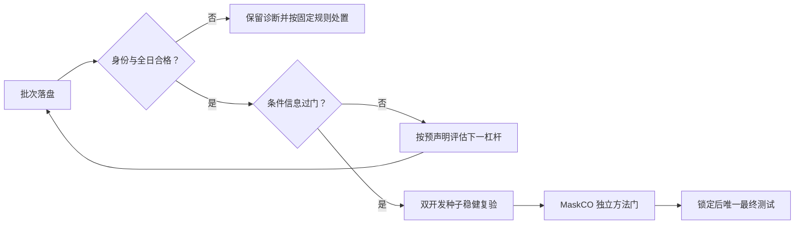

# 方向 A 总核查与下一阶段路线图（2026-09-30）

> **2026-10-08 09:44 当前依据**：正式同源码 cond_hist 补跑 270/360 臂日（75.0%），A3 尚待自动完整重裁；A2 已有条件相对正向，A1/A3 未锁论文核心增益。200 单训练日教师探针已完成，固定三状态分别为 −102.244/+59.730/硬不可行，教师具正负区分线索，但条件历史法两个有效判断也都正确，不能称 MaskCO 增益。真实 CVRP 预训练 checkpoint 的冻结隔离、合成更新/保存重载已实测通过；部署抽样原始 N/token 与场景/RNG 对齐和身份守卫通过。下一步补可独立恢复的教师归档与完整训练接线，固定教师采集成本/训练内部切分/超参，再在合格 A3 裁决基础上登记新 I3 假设并训练；40 日在线过门后才复验、有效强对照和同权重迭代消融。正式 I3 未开训，最终测试不动。证据、成本与限制见[10-08 完整记录](方向A_补跑进度与I3实现准备_2026-10-08.md)。下方有日期的旧条目保留为当时快照。

> **2026-10-08 08:56 当前依据**：同源码 cond_hist 三种子三档补跑已完成 253/360 臂日（70.3%，每档 27–29/40），冻结清单 11/11 通过，完整 gate 尚未落盘，完成后自动重裁原 A3 九批。I3 已有损失内核、反事实教师原语与本地/服务器重放测试；3 个训练种子小规模日的 15 状态教师探针一致，但全正标签不能证明机会成本区分度，也不是方法正向。正式教师集/训练 runner 尚未完成，I3 未开训。现有正向仍仅 A2，A1 未锁强对照，A3 等同版配对；最终测试不动。下一步：训练分布 200 单的预定状态覆盖/教师成本探针 → 固定 I3 配置及训练内部选择规则 → 正式训练和首开发种子在线效用门 → 过门再双种子复验及同权重迭代消融/A1 强对照。详见[10-08 实现与实验记录](方向A_补跑进度与I3实现准备_2026-10-08.md)。以下有日期的旧状态仅作历史。

> **2026-10-08 07:17 实查更新**：双烟测已通过，三开发种子同源码 cond_hist 正式补跑于昨晚 23:00 自动启动，九项任务完成 207/360 个臂日（每档 22–24/40），冻结源码 11/11 复查通过，完整报告尚未落盘。补跑链将自动重裁原九批；不提前宣布 A3 正式结果。并行完成 I3 独立损失内核与精确梯度测试，但真实教师/训练 runner/正式参数未就绪、I3 未开训。新发现 MASK 非零原始占位与注释不符，仅记表示候选，不追改旧模型或在跑源码。详见[10-08 补跑进度与 I3 实现准备](方向A_补跑进度与I3实现准备_2026-10-08.md)。当前正向仍仅 A2，最终测试不动。

> **2026-10-07 独立实证核查与执行更新（当前依据，优先于下文历史快照）**：A2 density 主档三开发种子正式资格和正向门均通过；A3 九批数值完整且为负，但共享评分源码与复用基线 hash 不一致，原跨基线比较没有正式资格。A1 仅一个开发种子，现已独立验收五臂与 V 权重并重算原数值；CI 跨零不是等价，尚不能锁“最强基线”。A1/A3 验收器与结果措辞已修订；服务器已建立 A3 同源码冻结基线，三臂一日烟测完成，cond-only 修正版烟测进行中，过前置验收后补跑三种子条件基线并重算原九批。I3 主比较改为 I3−cond_hist，训练梯度路径已写草案，尚未开训。详见[10-07 独立核查、重跑清单和后续流程](方向A_独立核查与重跑清单_2026-10-07.md)。当前有 A2 条件相对增益，没有 A1/A3 论文核心正向，最终测试不动。以下 10-01/09-30 条目仅保留为当时进度。

> **2026-10-01 目标收尾决策（优先于下文旧续核查）**：训练器曾保存/加载 init 权重；修复、T31 与四臂重训后，旧 I1 `+0.905` 作废。新版四臂数量概率 NLL 均劣于 α=1 平滑/时钟条件非学习基线，当前没有正向**概率校准**结论；四臂预测均值与真实计数的 Pearson 相关约 0.91–0.95，MAE 尚缺同口径非学习对照，不应说完全无条件计数信号。I2 partial 的 TV gap 0.084 vs 全掩码 0.234 只是点估计下降；报告区间为切片分布分位数，尚无按天配对的差值 CI，且诊断用真实未来数固定重掩码槽数，不能写“显著”或当作在线增益。当前 `tools_remote/tools_remote_rerun_rr3.sh` **只有 10 文件 hash 快照，运行仍从可变原目录启动**，还会先结束同名 tmux；该脚本未实现其注释承诺的不可变隔离。正式选择是继续原 A2 路径，但先让执行端补隔离快照/独立运行路径、会话防撞、输出目录清洁与启动身份核验，再启动 rr3；不得直接按现脚本运行。rr3 完成后按原判据分叉，A1 适配准备与训练/留出计数 NLL 曲线诊断可并行。离线预测不佳不能单独触发 I3：原触发条件是预测改善但在线决策未改善，而 A3 在线结果尚无。最终测试保持封存。

> **2026-10-01 续核查（优先于下文 09-30 快照）**：I1 `clock-pretrained` 在 40 个训练历史留出日、160 切片上的数量 NLL 为 5.336，相对未平滑训练切片边际 6.241，原报告增益 +0.905、切片 bootstrap CI [0.30,1.60]；同架构随机臂 NLL 15.567。数值已核对，但 4 切片/日的相关性要求**按天聚类配对 CI**；未平滑边际对 6/160 个训练中未见计数施加 `1e-12` 概率下限，后设 α=1 平滑时增益仅约 +0.070。因此 I1 是有价值的**离线预测线索**，尚不是稳健显著的计数结论，更不是在线效用结果。I2 部分掩码两臂据执行端已启动，本地尚无训练权重或完成报告；部分掩码真实未来条件与部署生成条件之间的分布差须单独核。1 日步骤 3 烟测仅证明接线、身份和硬可行路径可运行，不能用其 `passed=true` 裁决效用。详见 [I1 校准复核](../../../results/a1_step3/CALIBRATION_I1.md)。
>
> **S3-2 最新本地落盘**：`a1_c1rr2_reveal_40` 与 `a1_s3_2rr2_density_40` 均为完整诊断批，但独立裁决均 `formal_adjudicable=false`，原因是步骤 2 驱动启动/结束源码 hash 不一致、`source_stable=false`。主档 reveal 的 cond−uncond 为 −11.27 [−50.44,28.56]；density 为 +63.44 [23.57,103.77]，只可称**版本污染批的数值正向**。同日四臂比较中 density 的 cond 绝对效用较 reveal 低约 22.3/天，uncond 低约 97.0/天，故增大的条件差值主要来自 uncond 恶化，不能据此声称系统效用改进。超时按原协议回退并计入效用；零超时仅作晚加敏感性标签，不事后改门。rr3 须先封存不可变源码与完整身份后重跑；本地未见 rr3 正式输出。最终 20260927/28 仍保留。
>
> **接下来按依赖推进**：①冻结 rr3 源码、合同、数据与计时配置，40/40 日及 day_id、硬约束、超时和四臂身份先验收，再按原主判据裁决；若过，复验 20260930/20261001，若不过，按预声明失败机制继续 S3-3 等杠杆。②并行完成 I2 既有批次诊断；用训练日内选定的平滑/时钟非学习计数基线、按天 CI、全掩码计数与部署完整场景校准复核 I1/I2。③信息门和方法前置项闭合后，按同日同 K/10s/SAA 对最强条件非学习法做 MaskCO 单步与等预算迭代的 40 日在线效用消融，并补信息匹配强动态对照。④三层证据（系统胜强对照、稳健条件信息、MaskCO 独立增益）与身份均锁定后，才做唯一最终测试。下文 09-30 各进度数值为当时快照，不覆盖本续核查。

_本地核查更新至 2026-09-30 15:00（北京时间）。范围：A-v1 条件场景＋共用 SAA、S3-2 同版配对、运行身份、MaskCO I1/I2 原型与步骤 3 驱动。本地已运行 T1–T24＋6 项因果测试；服务器进度只取执行端 14:10 记录，本轮未连接服务器或读取 09:09 两批原始 `gate.json`。_

_期刊文献增补：2026-09-30。以下方法建议是下一轮候选规格，不追改 §6 已预声明的 S3-2～S3-6 顺序、尝试上限或统计门；本轮没有新的服务器结果。文献中的外部问题收益不当作本课题收益。_

---

## 📌 当前结论

**工程与 MaskCO 原型均有实质推进，但方向 A 尚无可用于论文主结论的稳健正向结果。** 本地复跑 T1–T24＋6 项因果测试全部通过，关键脚本语法检查通过；步骤 2／外部驱动的非有限效用与重复日回归已补。统一验收器和四臂硬门已落地，MaskCO 有 PAD 分离、需求桶修复、显式数量头及多轮重掩码入口；这些是功能进展，尚不是在线效用增益。执行端 14:10 报告 09:09 重跑 reveal 24/40、density 14/40，服务器启动 MaskCO 160 天 pretrained/random 训练；本地无这两批完整 `gate.json` 或训练权重，S3-2、A3 均**待裁决**。按已立的[步骤 3 新协议](A-v1步骤3新协议_MaskCO场景生成_2026-09-29.md)，信息门未重立前启动的 160 天训练仅作原型诊断，不能追认为正式 A3 配置或占用其预声明 ≤3 配置的收益证据。

论文主线固定为“基于 MaskCO 的掩码生成与迭代重构范式，构建面向动态冷链物流的在线优化方法”。现有条件历史采样＋SAA 是系统与条件信息的开发平台；[当前 MaskCO 场景采样器](../../../scripts/models/maskco_scenario.py)已经有显式计数与可选多轮重掩码，但槽 token 仍独立采样，训练尚无部分未来掩码重建；迭代没有通过同预算在线效用消融，也没有路线尾段重构。

| 要证明的命题 | 当前证据 | 判定 |
|---|---|---|
| 系统效用胜公平强对照 | 旧 C1 相对特定 myopic OR-Tools/PyVRP 有开发优势，但基线旧身份块缺失，修订版尚未同版复核 | 有开发线索，未形成正式系统结论 |
| 条件信息有稳健增益 | 旧 C1 首开发种子主档 +71.49 [13.51,132.06]，另两种子 +16.49 [−22.25,56.32]、+11.42 [−21.19,42.13]；S3-1 双种子复验失败 | 尚未过跨种子门 |
| 密度打包 S3-2 有效 | 13:45 首批受高负载及臂相关超时污染；09:09 重跑无本地原始输出 | 待裁决 |
| MaskCO 掩码生成与迭代重构有独立增益 | I1 数量头与 I2 重掩码代码、T21–T23 已有；联合依赖／部分掩码训练、同预算消融与 40 天步骤 3 尚无结果 | 功能原型推进，独立净效用仍未知 |
| 论文可提交 | 以上三层贡献与最终留出测试未闭合 | 尚未达到 |

## 🎯 研究目标与“正向结果”定义

本轮几天的总目标是：**在不改变 A-v1 任务与评价口径的前提下，找到一套在三个已见开发种子上稳定产生正向效用的在线方法，并把增益归因到 MaskCO 掩码生成与迭代重构。** “争取正向”是研发目标，不预支统计结论；任何测试未过都按原样留档，针对机制继续设计下一轮，而不是修改阈值、任务难度或最终测试。

| 层级 | 主问题 | 进入下一层的最低证据 | 不能混用的证据 |
|---|---|---|---|
| A1 系统能力 | 当前在线方法是否胜信息／预算／时限匹配的强动态接单对照？ | 同日、同合同、完整 40 天、硬可行且身份合格的效用比较；包括真正使用预测场景的强决策对照 | 旧 C1 对 myopic OR/PyVRP 的优势不能代表战胜最强动态对手 |
| A2 条件信息 | 条件未来信息比无条件历史是否改善决策？ | 主档 `cond_hist−uncond_hist ≥20` 且天级配对 95% CI 下界 >0、hard=1.0、全日可裁决；候选在 20260930／20261001 同判据稳健复验 | 三档共享同一批天，不能作为九个独立样本；均值为正但 CI 跨零不算过门 |
| A3 MaskCO 方法 | 掩码生成＋迭代重构是否在相同 SAA、K=10、10s 下胜强条件非学习采样器？ | [步骤 3 协议](A-v1步骤3新协议_MaskCO场景生成_2026-09-29.md)已规定信息门重立后才正式训练评估、主比较“最佳条件非学习”、同架构随机／预训练及部分掩码迭代；现有驱动与原型尚未全部对齐。正式证据是相对锁定强对照的独立在线净效用和等预算消融 | 160 天诊断训练、预测拟合分数、不同编码架构对比、单步 MASK 或 A2 收益均不能充作 A3 |
| A4 留出检验 | 锁定方法是否在真正未见日保持优势？ | 单一代码／权重／合同／超参／对照锁定后，20260927／20260928 各按协议一次测试 | 测后调参、换比较对象或重测不再是同一确认实验 |

当前优先级是先把 A2 的可信门跑通并继续争取稳健正向，同时并行准备 A3 的真正方法实现。A1 的强对照必须跟进，不能等写论文时才补。A4 仅在前三层证据与配置锁定后进行。若当前杠杆集全未过，遵守[战役协议](A-v1正向优化战役协议_2026-09-26.md)：按失败机制定向调研、预声明新杠杆、继续开发；不保证任何特定日期必然取得正结果。

## 🧾 之前每一步的结论与可继承资产

下表按因果链归纳，不把旧版本数值拼成一条“不断改善”的曲线。可继承的是修复后的实现、测试和机制认识；性能必须在相同源码／合同／数据／资源下重评。

| 阶段 | 当时发现／完成 | 现在有效的结论 | 后续使用边界 |
|---|---|---|---|
| 09-26 初始审计 | 收入双计、`−∞` 传染、生成器锁定方法缺失、采样漏出 10s；共用 SAA 修复并建立 T1–T5 | 原门不能裁决；统一 SAA 与 10s 计时是后续基线 | 修复前效用一律只作故障定位 |
| 09-26～28 影子投票诊断 | 超预算场景全置 `−1e6` 使投票退化；R1 揭示等待位置不一致使预检放行、完成全崩；R2 float32 容量边界崩溃 | T4、T9、容量边界回归使投票恢复真实边际差；未证明条件模型本身有效 | R1 前 V2、L1、L2b、旧 L2c 数字作废；不拿修复混合差值归因单杠杆 |
| 09-28～29 C1 与公平求解器 | C1 开发首种子主档 +71.5，验证种子 +16.5／+11.4 均未过；求解器容量整数缩放、需求向上取整及在途载重钉死修复后，旧 C1 对特定 myopic OR/PyVRP 有优势 | 条件信息有开发信号但不稳健；特定系统对照优势只限该旧 C1 与对应基线 | 旧 C1 无严格身份块；不得跨 Q 修订当作当前正式基线，也不得写“接单更多”解释效用优势 |
| 09-29 S3-1 待命预留 | standby=100 首种子主档 +77.7 [38.0,124.0]，双验证种子 +13.4／+8.5、CI 均跨零；standby=200 三臂同质化 | standby=100 保留候选组件但未过稳健门；standby=200 判负 | 首种子 CI 变窄、接单提升不是跨种子机制证明；不在开发集上无限微调待命常数 |
| 09-29 Q-01～Q-04 | 冻结段复制、未出车空车、求解器提交前 deadline、运行身份封存已修；T16～T18 通过 | 影子与执行的关键正确性底座改善 | 运行中旧批次只能按**实际加载版本**解释；当前磁盘源码不追认旧进程 |
| 09-30 T20–T24、验收器与原型 | T20 扩展 NaN／重复；独立验收器、四臂硬门、步骤 3 身份封存；MaskCO PAD／需求桶／数量头／重掩码；09:09 reveal/density 仍在跑、160 天对照训练启动 | 本地 T1–T24＋6 因果全绿；新脚本存在下述配对、计时规则和模型分布缺口；新批次／权重均待实际结果 | 08:44 崩溃批次及 13:45 高负载首批留诊断；09:09 服务器进度与训练启动只据执行端 14:10 回传 |
| 当前 S3 杠杆储备 | S3-3 连续超额价格 `--overage-price` 与 T19 已具备；S3-5 原 λ-margin 经双计审计不直接实施；S3-4／S3-6 按序待做 | 若 S3-2 未过，有预声明的下一步，不需临场换目标 | S3-3 网格 {5,10} 元/kWh、烟测及全量次数按既定协议；不得收益后挑阈值 |

## 🔎 本轮核查范围与证据等级

| 对象 | 本地核查结果 | 证据等级与限制 |
|---|---|---|
| [步骤 2 门驱动](../../../scripts/evaluation/run_a1_step2_gate.py) | `summarize`、`paired_all_days` 显式传 `gate_instances`，拒绝缺／重复日与非有限效用；worker 前建输出目录 | 已核当前源码和 T20；09:09 进程实际加载身份待原始封存核对 |
| [外部接单驱动](../../../scripts/evaluation/run_a1_external_accept.py) | 同步拒绝缺／重复日与非有限效用；身份缺失时配对标 `formal_adjudication=false` | 已核当前源码和 T20；旧外部报告不能追认 |
| [T1–T24](../../../scripts/tests/test_a1_saa_correctness.py)及[6 项因果测试](../../../scripts/tests/test_a1_step2_causal.py) | 本地完整重跑均 `ALL PASS`；T21–T24 分别守卫 PAD／桶／时钟、槽置换、重掩码流程、步骤 3 封存 | 功能回归通过，不覆盖实际 10s 吞吐、边界桶实际数量、跨臂 row-order 配对或联合场景统计；服务器 25 项 PASS 据执行端回传 |
| [独立摘要脚本](../../../scripts/evaluation/diag_gate_summary.py) | 会重查各臂 day ID 并打印异常 | **仅诊断**：异常不使进程失败，也不阻止继续打印 runner 的 `passed` |
| [统一验收器](../../../scripts/evaluation/diag_adjudicate.py) | 独立检查 40 日、有限效用、硬可行并输出原因码；与原报告分离 | 已落地；未按 `day_id` 重排效用向量后配对，且将“任一超时”直接写成 `formal_adjudicable=false`，需按下文审计；身份字段核验尚不完整 |
| [S3-2 差分脚本](../../../scripts/evaluation/diag_s3_density_analysis.py) | 四臂全日／身份失败即退出 2，输出两个同臂绝对差及交互差 | 硬门较前版已修；效用向量仍沿原行序，排序 ID 只用于完整性检查；不同 row 顺序会错配，须按 ID 建向量 |
| [MaskCO 采样器](../../../scripts/models/maskco_scenario.py)与[训练器](../../../scripts/training/train_maskco_scenario.py) | PAD 与 MASK/NULL 分离、需求按桶解码、显式数量头、时间支持掩码、可选迭代重掩码、预训练编码归一统计修复 | 已核源码与 T21–T23；仍是独立槽采样，时钟不进模型，边界桶采后删单，迭代条件未受部分掩码训练；本地未见新权重或在线效用 |
| [I1 校准脚本](../../../scripts/evaluation/diag_i1_calibration.py)与[步骤 3 驱动](../../../scripts/evaluation/run_a1_step3_compare.py) | 有留出历史日切片、数量／桶统计；步骤 3 加源码与模型封存、跨运行身份检查 | 校准脚本已烟测据执行端，正式校准结果未见；步骤 3 `formal_adjudication` 当前仅等于身份合格，不代表完整日／硬可行／超时资源均过 |
| [启动脚本](../../../scripts/evaluation/launch_rev2.sh) | Python 非零或 `gate.json` 为空时写 FAIL，避免旧版无条件 DONE | 已修旧误导；仍须核 JSON 可解析、报告身份及完整日，并防旧文件／半写文件。脚本改动发生于 09:09 批次启动后，不追认为批次启动版 |
| 本地结果目录 | 仅见旧首批 `a1_c1r_reveal_40` 等材料；未见 `a1_c1rr2_reveal_40` 或 `a1_s3_2rr2_density_40` 的本地原始 `gate.json` | 09:09 重跑状态只来自执行端回传 |

执行端报告：08:44 重跑因 progress 输出目录不存在而首日崩溃；目录创建顺序已修，09:09 重新启动。14:10 记录 reveal 24/40、density 14/40，负载约 23；同时启动 160 天 MaskCO pretrained/random 训练。这是进度回传，不是 S3-2 已完成或 10s 性能公平的结论。**新增身份风险**：本地 `run_a1_step2_gate.py` 修改时间 12:46，晚于 09:09 启动；该文件属于 `SOURCE_FILES_STEP2` 的启动／结束封存清单。若服务器在批次期间同路径更新过它，结束时 `source_stable` 将失败。须以服务器两批各自的 startup/end SHA 核定，不能根据本地时间戳直接宣判；也不能通过改回文件或回填身份追认。

## ⚠️ 尚需关闭的裁决缺口

### 完整日检查已修，但诊断脚本不是硬门

`T20` 在本地验证双侧 39/39 不可裁决、40/40 可裁决、单日 `utility=None`、`NaN` 及重复 `day_id` 均不可裁决；两个 runner 已把非有限效用纳入 `adjudicable`。测试对步骤 2 驱动的导入仍用 `except Exception` 跳过子项；本地环境实际导入并通过，但未来环境若导入失败，测试总体 `ALL PASS` 可能只覆盖外部驱动。正式 CI 还必须按 `day_id` 重排，不能只验证排序后的 ID 集。

`diag_gate_summary.py` 仍是退出码 0 的观察工具；新的 `diag_adjudicate.py` 已补机器可读失败，不能再写成“统一验收器尚未实现”。但它目前在各臂仅检查 ID 集，随后直接按原列表顺序相减；本地三日合成探针中正确差值 `[10,10,10]` 被算成 `[-10,20,20]`。先修按 `day_id` 索引排序并补乱序反例，再用于正式判定。验收器的 `numeric_passed` 还要求第三臂 `explicit_feat` 硬可行，而当前步骤 2 主比较只要求 cond/uncond 两臂；若这是新资格条件，应与原数值门分开，不能改写预声明的主判据。验收器固定用 20260926 作为 bootstrap 种子，复验报告应从实际 gate seed 读取。缺必需身份字段、配置／合同／数据匹配亦应显式检查，而非只信任 `identity.source_stable` 一个布尔值。

### 身份合格不等于结果正式可裁决

[`run_identity.py`](../../../scripts/evaluation/run_identity.py) 已核共享源码、完整合同、数据字节与 shape/dtype、预算和计时配置，且要求两侧启动／结束源码稳定。旧 C1 `gate.json` 无身份块，确实不能作为新外部臂的正式配对基线。09:09 的 reveal 批次**有望**成为同版基线，但必须在落盘后确认 `identity.source_stable=true`、40 个唯一日、合同与数据匹配及实际加载版本。尤其要核 `run_a1_step2_gate.py` 的启动／结束哈希：它在本地 12:46 有修改，若服务器同路径更新，运行身份可能被破坏。任何不稳定批次保留原始数值作诊断，后续正式重跑应使用不可变隔离目录／镜像，避免分析修订触碰在跑源码。

步骤 2 的 `main_comparison.passed` 在 `seal_end` 前按数值计算，未并入 `source_stable`；外部驱动和新步骤 3 驱动的 `formal_adjudication` 目前均只等于身份核验，可与缺日或硬不可行并存。新的独立验收器已经分出 `numeric_passed` 与 `formal_adjudicable`，但须先修配对顺序与资源资格规则，才能成为权威入口。正式结论至少要同时满足身份、完整性、有限效用、硬约束和原预声明数值门；身份合格的负结果同样保留正式资格。

### S3-2 四臂差分须先验收四臂

差分脚本现已强制验收四臂 `0..39`、效用有限、两份身份兼容及共享配置，失败即退出 2；先前“只打印 MISMATCH／重复日字典覆盖”的缺口已经关闭。**剩余缺口**是 `_arm` 验证排序后的 ID，却按 JSON 原列表顺序返回效用；四个列表哪怕都完整，行序不同仍会错配。先按 `day_id` 建唯一映射并输出 `0..39` 有序向量，补四臂乱序回归。验证通过后，分别保留 reveal 与 density 各自的原条件门，并分别报告 `cond_density−cond_reveal`、`uncond_density−uncond_reveal` 的同日配对均值及 CI。这两个量才表示各自场景臂里密度策略对**绝对效用**的作用。再报告
`(cond_density − uncond_density) − (cond_reveal − uncond_reveal)` 的同日整天重采样 CI；它是“密度策略是否改变条件信息优势”的交互差，不能单独证明密度策略提高绝对效用，更不能替代 density 自身的主判据。

### 运行完成标记须来自成功验收

启动脚本已从旧版无条件 `DONE` 改为只在 Python 退出码 0 且 `gate.json` 非空时写 DONE，否则写 FAIL；旧版误导问题有止损。`-s` 只证明非空，尚不能证明 JSON 可解析或同批身份／完整日验收通过，也不能排除旧目录残留。后续批次用唯一输出目录、保存进程退出码与启动清单；报告先写临时文件再原子改名，成功标记由验收通过后产生。当前 09:09 批次不因本脚本的**事后修改**而被追认或中断。

### 资源竞争要按统一规则处理

13:45 首批的高负载与臂相关超时足以标记资源污染并保留诊断。新验收器在 12:55 加入“任一天任一臂超时>0，整批 `formal_adjudicable=false`”；这条规则**晚于 09:09 当前批次启动**，而原 10s 契约允许超时后保计划／拒单、计入效用，并未把零超时写成主门。故不能把 12:55 规则追溯为当前批次的预声明资格条件。09:09 报告应同时给出原协议下的身份／完整日／硬可行／数值结果，以及按新零超时敏感性规则的诊断标签；若有超时，不筛日、不抹去原效用。下一正式批次是否采用更严的零超时资格门，应在启动前写明动机、资源阈值与所有臂对称执行规则。执行端 14:10 回传负载约 23，也不能单凭平均负载认定无干扰；仍看逐臂超时分布与效用关系。不得根据效用符号选择保留或废弃批次。

## 🧭 下一阶段执行顺序

`09:09 运行落盘 → 独立资格验收 → 预声明数值裁决 → 稳健复验／下一杠杆 → MaskCO 独立方法门 → 最终留出测试` 是不可跳过的顺序。

| 顺序 | 执行端动作 | 可验收产物 | 助手核查重点 |
|---|---|---|---|
| 1 | 保留 08:44 崩溃日志及残留标记记录；等待 09:09 两批各自完成，不筛天 | 两份原始 `gate.json`、逐日 progress、完整日志、启动及结束源码封存 | **先核 12:46 脚本更新有无影响服务器源码封存**；文件可解析、无旧输出混用 |
| 2 | 对两批逐臂做完整性与资源审计；修验收器 row-order 配对 | 每臂 40 个唯一日、有限效用、硬可行率、逐日超时和总时长表；乱序反例回归 | 原协议正式资格与新增“零超时”敏感性标签分别汇报，不追溯加门 |
| 3 | 先分别裁决 reveal、density 主档，再算四臂差分 | 主档 `cond−uncond ≥20`、95% CI 下界 >0、hard=1.0、全日可裁决；四臂差分及 CI | 差分只作 S3-2 归因，不代替原门 |
| 4A | 若 density 或 reveal 通过原门，在已见开发种子 20260930／20261001 同配置复验 | 两种子逐日原始输出与同判据报告 | 两种子都达门前不锁配置 |
| 4B | 若未过，依[战役协议第 6 节](A-v1正向优化战役协议_2026-09-26.md)推进 S3-3 连续超额价格（5、10 元/kWh）、S3-4 廉价影子搜索、S3-6 场景工程 | 每杠杆预声明、烟测、≤约定次数全量和失败记录 | 不改任务、主档、δ 或最终种子；S3-5 原 λ-margin 已审计不直接实施 |
| 5 | reveal 身份合格后重做必要强对照配对；并行核 160 天模型留出校准、200 天正式训练谱系，完善联合生成与部分掩码训练 | 同身份强动态对照；I1 校准报告、I2 同预算在线消融 | 系统胜对照、条件增益、MaskCO 增益三层分开 |
| 6 | 锁定单一源码／权重／合同／配置后，20260927／20260928 各按协议只测一次 | 留出测试完整报告及所有失败尝试清单 | 不用最终测试调参或改判据 |

若 09:09 批次的服务器 `source_stable=false`，先定位具体文件与启动／结束 SHA、确认是否为运行期间同路径更新；该批保留为**版本污染诊断**，不凭效用符号选择是否保留。随后在不可变隔离目录以同一预声明配置、数据和资源条件重跑，并重新封存；这属于恢复有效测量，须把失效批与重跑批同时列入尝试清单。若身份稳定但有合法 10s 超时，则按原协议计入效用，另报资源敏感性，不自动按 12:55 后设零超时规则抹掉正式数值。

MaskCO 开发可与 S3 运行并行。当前显式数量头已解决“完全靠 NULL 隐式计数”的一部分问题，但所有 MASK 槽仍同分布、逐槽独立采样；这不等于同日未来订单的联合依赖。多轮重掩码是代码入口，训练样本仍为“可见前缀＋未来全 MASK”，尚无“保留一部分已生成未来 token 再重构其余”的训练条件。须先测数量与联合校准、边界时钟及等预算迭代，再说方法增益；收益不能来自共享 SAA 修复或更长算时。

## 🗓️ 未来几天的总任务

40 天三档批次可能持续数小时至十余小时；日期是工作窗口，不是保证出结果的截止日。未落盘时只做独立的前置工作，不用旧批或两天烟测代替。

| 窗口 | 主任务与交付物 | 当日判定 | 并行任务 |
|---|---|---|---|
| 09-30（D0；已推进至 14:10） | 保存 08:44 崩溃证据；继续只读巡检 09:09 reveal／density；验收器、四臂硬门及 T20–T24 已落地 | reveal 24/40、density 14/40 仅是执行端进度，不宣判 S3-2；先核 12:46 同路径源码更新风险 | 160 天 pretrained/random 训练已启动，按步骤 3 协议只能标原型诊断；补 row-order、边界桶数量、预训练 PAD 与同架构对照测试规格 |
| 10-01（D1，或两批落盘当日） | 保留两份原始 `gate.json`、日志、progress、启动／结束 SHA；逐臂验收 3 档×3 臂×40 日；计算 reveal／density 主门和四臂差 | 先判正式资格，再读效用；身份或数据不合格则仅诊断 | 列出旧 C1、强对照需同版重评的最小清单 |
| 10-02（D2，依 D1 分叉） | **过门**：同配置跑 20260930／20261001 两个已见开发种子；**未过**：按预声明对 S3-3 的 {5,10} 元/kWh 各做 2 天 `p_c=0` 烟测 | 双种子都达原门才锁稳健候选；烟测只检查正确性和价格尺度 | 先读 160 天训练产物与历史留出校准，关掉时间桶边界、预训练编码、数量／token 头不一致缺口；不要把训练 loss 当 A3 |
| 10-03～10-04（D3–D4，按运行容量） | 完成稳健复验或 S3-3 各 ≤1 次 40 天三档；仍未过按机制推进 S3-4／S3-6；更新全部失败记录 | 不把不同源码修订混成杠杆效果；每次尝试有身份、主对照和结论 | 训练日部分掩码样本、联合依赖与等预算迭代对账；明确 160 留出诊断→200 正式训练／同身份基线的切换；另行安排事件诊断回放 |
| 此后（证据齐备时） | 同版强动态对照、MaskCO 方法消融、锁定单一配置；最后做唯一留出测试 | A1／A2／A3 不齐则继续开发，不以日历推进最终测试 | 论文方法、结果和失败尝试附录 |

每日看板至少包含：进程／源码身份、完成日数、异常日、各臂超时与最大耗时、硬可行率、主档差值和 CI、正式资格、下一动作。服务器再次拥挤时先记录资源与超时，不因结果符号决定废弃或重跑。所有正式批次原始文件不覆盖、不删失败尝试。

## 🛠️ 实现验收清单

### 结果、统计与运行身份

1. **独立验收器先于分析**：`diag_adjudicate.py` 已纯读取 `gate.json` 重算 40 日／有限效用／硬可行并输出原因码；先修四臂与验收器**按 `day_id` 重排配对**，补完整必需身份字段及配置／合同／数据核验。每批保存原报告与 `adjudication.json`，不回填。计时超时若按协议保计划＋拒单，应完整计入效用与次数；09:09 批次同时给原协议结果与 12:55 新零超时敏感性标签，不因晚加规则筛日或改判据。
2. **数值门与正式资格分开**：`numeric_passed` 保持原 `cond−uncond ≥20` 且天级配对 CI 下界 >0、hard=1.0、全日可裁决；`formal_adjudicable` 汇总身份、全日、有限效用、硬约束与运行环境。步骤 2 当前 `main_comparison.passed` 不含 `source_stable`，外部驱动 `formal_adjudication` 目前只代表身份核对，二者都不能单独作为最终标签。合格负结果同样是正式结果。
3. **四臂对照与交互差**：当前脚本已经硬验四臂日全集与身份；补唯一日索引排序后，逐日计算 `cond_density_i−cond_reveal_i`、`uncond_density_i−uncond_reveal_i` 及 `d_i=(cond_density_i−uncond_density_i)−(cond_reveal_i−uncond_reveal_i)`，三个对照都对完整日索引联合 bootstrap，保留四臂相关性。前两项是各信息臂内绝对效用作用，第三项是条件优势交互；均仅机制分析，不代替 density 自身原条件门，也不收益后新增阈值。
4. **启动与产物**：当前在跑批次原样保存；后续每批用新目录与不可变清单，封存命令、源码、依赖、权重、合同、数据、线程与资源。`launch_rev2.sh` 已按 Python 退出码和文件非空写 DONE／FAIL；下一步再要求 JSON 可解析、身份与全日验收及原子落盘，防旧文件和半写文件。启动封存须与实际加载版本对上，不能用事后工作树追认。

### 下一杠杆与 MaskCO 主方法

5. **S3-3 连续超额价格**：[`scenario_saa.py`](../../../scripts/evaluation/scenario_saa.py)已有 `overage_price×max(0,E−B)`；保持真实认证和合同 `B` 不变，不恢复全场景 `−1e6`。{5,10} 元/kWh 先各做 2 天 `p_c=0` 正确性／尺度烟测，再按协议各最多一次 40 天三档。正式报告记录实际能耗、服务数及超时；影子超额量、逐事件接拒 margin、预算拒绝类型需要**另加诊断埋点或训练日回放**，当前 `gate.json` 不含这些字段，不能从逐日效用倒推。S3-5 原 λ-margin 因双计风险不叠加；S3-3 若未过，再按预声明边界做 S3-4 影子局部搜索、S3-6 软 k-NN／收缩／两阶段数量。
6. **MaskCO 数量与联合生成**：PAD／MASK／NULL 已分离，显式数量头、需求桶与时间支持掩码已实现；下一步是边界时间桶保持实际数量、时钟真正进入数量／token 条件，以及部分掩码训练和同日订单**相关性**。当前相同 MASK 槽的 token 仍独立抽样，不能称联合未来集合已验证。多轮重掩码入口要在训练日学过“保留已生成未来＋重建其余”的条件，并在部署 10s 内与同算力单步对照。若要声称在线**路线**掩码重构，再增加可变尾段模块，冻结已执行前缀与 committed leg，最终由共用 C0 认证。外生需求头先条件于可见需求历史与时钟；车辆／资源状态用于决策价值或重掩码策略，若进入需求头须给因果理由及消融。
7. **模型与强对照公平**：A3 使用同日、同 SAA、K、10s、车队和合同，对[步骤 3 协议](A-v1步骤3新协议_MaskCO场景生成_2026-09-29.md)中的“最佳条件非学习”采样器。现[步骤 3 驱动](../../../scripts/evaluation/run_a1_step3_compare.py)将主比较硬编码为 `maskco−cond_hist`、δ₃=20；若 S3-6 或其他开发锁定方法强于 cond_hist，不能把旧代码结果称作协议主门，需在正式运行前固定强对照并改驱动／登记协议版本。现 pretrained 臂用冻结 CVRP encoder＋adapter，random 臂用 `EncoderMLP`，**不是同架构随机初始化消融**；须做相同 CVRP encoder 架构随机权重且同冻结／训练策略的对照，现有 random 仅作不同编码器参考。另报单步／等预算迭代、数量／联合、资源条件消融。主指标是真实在线效用，预测拟合只作机制诊断。A1 还需信息匹配强动态接单／rollout；learned 对照封存实际权重、provider 调用、fallback、设备与预载时间。

### MaskCO 原型：已修项目与剩余方法缺口

以下按当前源码和 T21–T24 重核。160 天 pretrained/random 训练已由执行端启动，可保存为**原型诊断**；若下列剩余缺口影响目标分布，须在修复后重新训练，不能用旧权重追认新实现。

| 部位 | 已实现／已验证 | 剩余问题与下一回归 |
|---|---|---|
| [训练批次](../../../scripts/training/train_maskco_scenario.py) | `PAD_TOKEN` 与 MASK/NULL 分离，每例恰 `m_max` 个受监督 MASK 槽，PAD 在外层注意力和 token loss 被屏蔽；T21 通过 | T21 核监督槽数，未核同一样本在不同 batchmate 下**有效 logits／单例 loss**一致；pretrained 内部编码器是否受 PAD 影响另测 |
| [需求桶解码](../../../scripts/models/maskco_scenario.py) | 历史需求池改按 `(温区,空间,需求桶)` 分层，空池在桶内回退；T21 两 token／空池测试通过 | 真实历史池、全部合法 token 的 `order_to_token(decode_token(tok))==tok` 与容量／时窗合法性作全域回归；不要把两 token 测试写成全域校准 |
| [数量头与时钟](../../../scripts/models/maskco_scenario.py) | 数量头输出 0..200，过去完整时间桶被采样前屏蔽；T21 在 `clock=0` 验证数量 | **边界桶仍采后删单**：本地探针令数量头恒为 1、token 恒落 `[0,0.5)`，`clock=0.25` 时 200 场景仅 115 场景保留 1 单。改为边界桶内按 `reveal>clock` 截断采样或重新抽至保留数量，同时保证真实 `P(N_future\mid clock,visible)` 条件含时钟；回归多时钟下“采样数＝实际保留数”及数量校准。当前模型前向只接订单 token，时钟尚未作为条件输入 |
| [联合依赖与迭代](../../../scripts/models/maskco_scenario.py) | T22 验可见 token 置换不变，T23 验重掩码函数路径；`--iterative` 可选 | 同类 MASK 槽仍给同分布并独立抽 token，不能表示同日订单间条件相关；训练仍只有“可见过去＋全未来 MASK”，没有“保留生成未来＋重建其余”的部分掩码监督。补联合统计、部分掩码训练，等预算同日单步／多步 10s 净效用与超时消融；T22 的对称性不是联合建模证据 |
| 预训练编码与可见截断 | `PretrainedEncoder` 坐标均值／尺度只用有效可见 token；外层注意力屏蔽 PAD | 冻结的 `_cvrp.encode(x3)` 仍在外层 PAD 屏蔽**之前**运行，未见其内部接收 PAD mask；须实测同一样本有／无 PAD 时有效编码与 logits 是否一致。采样器仍 `vis[:m_max]` 静默截断；当前 200 单数据下通常不触发，但要对超限显式报错或规定保留策略，禁止无声明丢可见订单 |
| [I1 校准](../../../scripts/evaluation/diag_i1_calibration.py) | 有训练历史日 `[160,200)` 留出切片，报告计数和 token 桶统计；尚无本地完整数值报告 | 桶质量用**真实 `n_act`**加权，故只测 token 条件边际，未测数量头＋解码后的完整场景，也未测同日订单相关性；`nll_marginal` 从同一被评估切片估计，对留出比较不公平。应使用训练日边际基线、完整部署采样的预测数量与联合／相关统计，并报告有效样本数与 CI |

另需核训练历史身份：当前 160 天权重用于 `[160,200)` 留出诊断是合理的，但按步骤 3 协议信息门未重立前不能归为正式训练评估。[步骤 3 驱动](../../../scripts/evaluation/run_a1_step3_compare.py)默认用 200 天建立历史采样器、解码池和预算。若用 160 天权重直接跑其 200 天默认配置，训练资料与 cond_hist 基线不一致；若把 `--train-instances` 改为 160，又可能改变预算 `B` 并与步骤 2 的 200 天同版基线身份不符。先在 160 天权重上完成方法诊断；正式 A3 在信息门与方法前置项通过后，建议在训练历史内按天交叉拟合做校准选择、再以固定 200 天重训单一模型，并用相同 200 天谱系重跑／验证锁定的最强非学习条件基线；权重、池、预算与训练日集合全部封存。

### MaskCO 从原型到主方法的分层交付

| 子包 | 具体实现 | 必须通过的检查 | 论文角色 |
|---|---|---|---|
| I0 因果接口 | `VisibleSnapshot` 只含当前可见订单、时钟、车辆位置／载重、剩余预算与不可撤销承诺；外生需求头先条件于可见需求历史＋时钟，本方资源进决策／掩码策略 | 任意修改隐藏订单真值，当前输出分布与动作不变；已执行前缀及 committed leg 逐步不变 | 保证在线可部署 |
| I1 数量＋联合场景 | 显式数量头已是原型；下一步令计数真正条件于时钟、边界桶不丢单，加入槽依赖或其他可检验联合机制，并做部分掩码 token 重建 | 留出训练日数量校准、部署采样后实际数量、时间／温区／空间／需求的联合与同日相关统计；NULL 与 PAD 不混用 | 证明“掩码生成”真实建模未来联合不确定性 |
| I2 迭代与事件尾段 | 高置信保留／重掩码入口已存在；下一步训练部分掩码条件并固定每事件算时。可变车队尾段是更强论文主张的独立模块，任何改变经车队级可行认证 | 同预算单步 vs 多步、随机 vs 决策敏感重掩码、冻结不变与 10s 超时回退；K、下游认证和输入信息保持一致 | 证明“迭代重构”对真实在线效用有额外作用，路线重构另作消融 |
| I3 效用对齐（仅在 I1／I2 诊断后） | 若 CE 拟合改善而动作无收益，按另立协议用决策价值／终局效用训练或选样，明确与需求分布预测的区别 | 同架构同参数预算消融、训练日闭环标签、开发日逐天配对；不读最终日 | 解决预测好但决策无用的目标错位 |

推荐顺序是保留已启动的 160 天原型训练作诊断，先关边界桶数量、预训练 PAD 影响和 160／200 历史身份，再完善 I1 联合统计与部分掩码训练，随后做 I2 的两轮端到端闭环；I3 是失败机制触发的下一杠杆，不提前把所有变化同时加入。I1 单独跑赢 SAA 只说明条件生成价值；若论文主张包含 MaskCO 的**迭代**贡献，必须有同预算单步／多步效用消融；若进一步主张在线**路线**组合重构，就必须有可变尾段重构及其独立消融。I2 的一次事件流程应是：冻结当前承诺 → 生成／重构候选场景（路线尾段模块启用时仅改变可变部分）→ 在剩余 10s 内用同一 SAA／C0 认证比较候选 → 只提交硬可行且未超时的动作；否则保旧计划并按协议拒单。采样、模型前向、多轮重构、搜索及认证都计入同一决策时限。

## 🚫 容易忽略或写错的地方

| 常见误用 | 正确做法 |
|---|---|
| 数值 `passed=true` 或出现 `gate.json` 就写“正式通过” | 先核进程退出码、身份、全日、有限效用、硬约束、资源口径；负结果也保留正式资格 |
| 双方 39/39、重复日、`NaN` 或单日崩溃后仍算 CI | 不筛天；原始失败日保留，整批标不可裁决；不做 complete-case 选择 |
| 高负载批次结果不好才申请重跑 | 先确定可重复的资源和超时条件并保存每批；后续重跑规则在看收益前写定 |
| 四臂差分为正就宣布 density 成功 | 各配置先分别过原条件门；四臂差只作机制归因 |
| 用四臂交互差声称 density 的绝对效用提升 | 另算 `cond_density−cond_reveal` 与 `uncond_density−uncond_reveal` 两个同臂配对差，四臂交互只解释条件优势是否被改变 |
| 从现有逐日 `gate.json` 直接汇报逐事件 margin／动作翻转 | 当前报告未保存这些字段；单独在下一批诊断回放埋点，标明非正式结果与计时口径 |
| T21 已绿就宣称数量与联合未来分布校准 | PAD／需求桶是已修；仍要验证边界桶实际数量、时钟条件、完整部署样本及同日联合相关性，必要时修复后重训 |
| `formal_adjudication=true` 就宣称步骤 3 正式过门 | 该字段现只代表身份核验；逐日完整、有限、硬可行、资源标签与主数值门须另验 |
| 各臂日 ID 完整就直接按原 JSON 行序相减 | 先各自按 `day_id` 重排；加入行序置换而 ID 不变的反例，确保效用差与 CI 不变 |
| 12:55 新增“任一超时即不正式”直接用于 09:09 批次 | 该规则晚于当前批次启动；保留原协议效用和超时，零超时仅作后设敏感性标签，后续若采用须启动前声明 |
| 将三档同日结果或多次开发搜索当独立重复 | 按天配对，三档相关；开发三种子均已见，全部尝试记录；最终两种子仅一次 |
| 把旧 C1−myopic OR 优势写成“服务更多／MaskCO 胜所有方法” | 分解收入、燃油、拒绝损失、服务数；A1、A2、A3 分开报告，强动态对照另补 |
| 把修复前 V2、R1 前 L1、旧 C1 与新代码相减归因单杠杆 | 只做同版同日单因素比较；旧批只用于故障定位或开发历史 |
| 为追正结果调整任务合同、主 `p_c`、δ 或先看最终 seed | 固定任务与原门；新科学任务另立协议；20260927／20260928 锁定后各测一次 |

## 🔬 期刊文献带来的方法判断（09-30 增补）

**优先级判断：先校准“条件信息是否改变接单动作”，再改善少量场景的决策代表性与车队剩余资源估值，最后把这些机制做成 MaskCO 的掩码生成／事件迭代重构。** 当前跨种子幅度不足，单纯把生成分布拟合得更像历史，未必能把主档 `cond−uncond` 从 +8～16 提到预声明的 ≥20 且 CI 全正。这个判断是对本项目证据与期刊方法的综合推断，不是文献已经证明本项目必然获益。

| 文献线索 | 论文实际解决什么 | 对方向 A 可借鉴的机制 | 适用边界 |
|---|---|---|---|
| Bent 与 Van Hentenryck 的多场景规划、Hvattum 等人的场景合议 [R1–R2] | 随未来请求生成情景计划，用计划共识辅助动态路由 | 不只比较场景原始似然；检查不同场景是否使**当前接／拒和车队承诺**产生不同选择 | 原论文目标与冷链效用、能耗和 10s 认证不同；不能直接引用其收益幅度 |
| Bertsimas 与 Kallus 的条件处方 [R3] | 用不完美侧信息做条件随机优化 | S3-6 的软邻居、有效样本量和收缩应服务于**决策值**，而非只追求未来订单预测误差 | 本项目的状态分布由在线策略诱导，训练日切片并非独立同分布；不能套用其渐近保证 |
| Goodson 等人多车 rollout；Ulmer 等人离线值函数＋在线 rollout [R4–R5] | 估计当前动作对后续服务能力的影响 | 建立信息匹配的强接单对照；若 SAA 全日影子模拟过慢，尝试短期仿真＋终端剩余资源价值 | Ulmer 等人的具体案例是单车；本项目多车、多温舱、冻结段和 C0 要重新建模 |
| Zhang 等人的剩余服务时间背包近似；Soeffker 等人的车队资源平衡 [R6–R7] | 将车辆剩余时间／车队松弛度映射到未来奖励 | 对每车“剩余可用时间、容量、能量、地理覆盖”建立**边际机会成本**，比全局固定 λ 更贴近拥塞车辆与空车差异 | 文献中的“初始线路平衡一定好”不适用于本任务；空车保留和可执行认证必须照旧 |
| Pisinger 与 Hemmati Golsefidi 的决策导向生成场景 [R8] | 用少量合成场景保留两阶段优化的关键决策属性，含 prize-collecting VRP 实验 | 在固定 K=10 下追求能区分接／拒的场景集，而不是生成最多或最像的订单 | 已有生成式场景搜索，不能把“决策感知生成”写成首创；其离线两阶段求解也不能直接塞进本项目 10s 事件循环 |
| Elmachtoub 与 Grigas 的 SPO 思路 [R9] | 让预测训练关注下游决策损失 | 若 MaskCO CE 变好但在线效用不变，改用训练日的接／拒决策后悔值作价值信号 | SPO+ 的线性目标／多面体等适用条件不覆盖本项目非线性冷链仿真，不能声称直接使用其理论保证 |
| Lin 等人的温度依赖品质路径模型 [R10] | 静态预冷物流中把动态温度与品质约束并入路径优化 | 论文冷链实验应报告品质／能耗／服务／时窗分解与参数敏感性 | 品质模型本身并非本课题新方法；C0 参数仍是 pilot，不写成实车验证 |

文献综述 [R11] 将随机动态车辆路径视为信息模型和决策模型共同作用的序贯问题。它支持本项目把条件场景生成、在线策略与可执行认证拆开做证据门，也意味着“生成分布更准”本身不足以证明在线策略更好。

### 先做的诊断：给下一杠杆确定病因，不改变现批裁决

**当前 09:09 批次的 `gate.json` 与 progress 文件只保存逐日汇总／进度，未保存逐事件接拒 margin、场景效用或动作。** [SAA 决策函数](../../../scripts/evaluation/scenario_saa.py)在内存中算出 `acc_u`、`rej_u` 后提交，但没有把 margin 持久化。因此现批落盘后可直接做的是逐日配对、服务／能耗／超时分解；以下事件级分析需要**下一次独立、只读诊断回放**，不能当作当前批次已有证据。诊断埋点至少写 `run_identity/day_id/event_id/clock/arm/p_c`、行动前资源快照、可行插入车数、两分支完整场景效用、`(acc_u−rej_u)/K`、动作、超时阶段及本事件耗时；拒单前的认证失败也单独编码，避免把“无可行插入”误作负 margin。若埋点会改变 10s 内耗时，诊断回放明确标非正式，或把写日志的时间同等计入各臂且重新通过正式资源门；不得把加埋点后的效用与未加埋点的正式批次做同版因果差。

在 S3-2 同版批次通过身份、完整日和资源验收后，以其逐日结果确定**待诊断的现象**，随后在独立回放中取每个可见决策事件的条件／无条件场景接拒 margin、最终动作、可行插入车数、车队时间松弛分布、预算剩余、温区。要比较同一个历史事件的 cond／uncond margin，须用同一可见状态做并行反事实评估；两策略真实轨迹访问的事件与状态可能不同，不能简单按 `day_id/event_id` 硬配成同状态效果。后续机会损失只能在训练日用独立场景池作**反事实近似**，不能从已发生的单一路径称为“真实反事实”。按天聚合，至少回答以下三个问题：

1. **信息是否到达决策边界**：条件与无条件未来样本在数量、空间、揭示时间、温区上有差异时，是否足以改变接／拒 margin 的符号？报告动作分歧率、margin 翻转率、翻转事件的配对效用及超时率；不以预测似然代替效用。
2. **估值是否错位**：在训练日的因果回放状态上，用独立于被评估 K=10 样本的较大训练场景池，估计两动作的后续价值差。对照当前影子 margin 的符号与校准曲线；按“预算紧／松、车队松弛方差高／低、候选车少／多”分层。较大池只作**离线训练诊断或教师**，不能偷用开发／最终日真实未来，也不能用于在线决策而不计时。历史回放要避免把旧策略访问的状态误作任意策略的无偏样本。
3. **资源或计算是否淹没信号**：报告每臂 `n_eff`（软邻居时）、不可行影子比例、场景间动作方差、每事件 SAA 完成数及超时、车队空车占比。若信息已引起正确翻转但 10s 内严重超时，优先做计算预算与候选筛选；若信息本身弱，优先 S3-6／联合生成；若翻转方向常错，优先机会成本／短期 rollout。

这些诊断是**机制分析**，不新增主判据，也不允许按有利子组挑论文主结论。正式逐日结论只用完整、身份合格批次；独立诊断回放须记录自己的源码／合同／数据身份与所有失败日，坏批仅用于计算故障定位。

### S3 完成后的新杠杆候选：先预声明，再运行

若 S3-2 及后续候选尚未锁定稳健配置，已有 S3-3 连续超额价格、S3-4 廉价影子搜索、S3-6 软 k-NN／收缩／数量两阶段仍按[战役协议 §6](A-v1正向优化战役协议_2026-09-26.md)推进；一旦原协议要求转入稳健复验，就先复验。下表是**S4 草案**，尚未注册为实验，不能提前拿 S3 的结果反向选阈值或把多个变更合成“一次成功”。每项正式启动前单独写明假设、唯一主对照、参数与次数、预期方向、失败条件、资源门及代码身份。

| 优先级 | 候选与实现细节 | 必做的单因素对照与证伪信号 | 为什么值得试 |
|---|---|---|---|
| S4-A：决策边界场景集 | 由训练日条件模型生成候选池，先用轻量近似评分选 K=10：覆盖接／拒 margin 临界、车队能量／时间约束临界及主要时空模式；如采用非均匀选择，按训练池的预定分层频率校准并归一场景权重，避免只选极端场景而扭曲期望。在线生成、筛选、SAA、认证均计 10s；复杂的“候选→求解→全池评价”循环放在离线训练，不塞入在线事件。 | 与**同一条件采样器随机 K=10**只差选样规则；另与 S3-6 最强非学习条件采样器对比。若真实事件动作不变或超时抵消收益，判此机制无净增益。主 A2 仍比较该规则的 cond／uncond 同构两臂。 | K 固定时提高每个场景对动作的价值；直接针对“6/6 方向一致但幅度不足”。受 [R1–R3,R8] 启发，具体规则是本项目提案。 |
| S4-B：车队资源后决策价值 | 训练日因果回放学习 `V(s_after)`，特征至少有每车可插入时间松弛、剩余容量、能耗余量、位置覆盖及其跨车方差；在线做当前动作后的短期可执行模拟，再由 `V` 估尾段价值。**替换**完整影子尾段或只补“截断后剩余段”的价值，绝不在完整终局效用上再加一次。 | 同场景源、K、10s 比完整 SAA 与短期＋V；再做无 V／随机 V、去掉车队异质性特征。若性能仅来自更多计算或重复计收益，不算方法增益。cond／uncond 同规则。 | 可能降低 S3-2 的计算超时，并修正“空车和拥塞车同价”的机会成本。受 [R4–R7] 启发。 |
| S4-C：强动态合议／rollout 对照 | 在同一可见状态、相同训练历史、K 和 10s 下，构建场景合议与短期 rollout 接单臂；各自通过同一 C0 真值认证与冻结约束。 | 相对现有 myopic OR/PyVRP、C1/S3 和 MaskCO 分别配对；记录其前向时间、求解完成率及 fallback。若它胜本方法，论文必须如实报告并据此改方法。 | 这是论文**强对照**，也帮助判断正向结果是生成模型价值还是弱基线造成。受 [R1–R2,R4–R5] 启发。 |

S4-A/B 的顺序由前述**事先定义的失败机制**决定，不由哪一个两天烟测的收益更好决定。若 S3-6 已有软邻居／收缩提升，就把它固定为 S4-A/B 的共同条件基线，不重复把同一收益算到 MaskCO。若 A2 在所有开发种子仍不过，可继续机制驱动研发；但开发数据上反复挑出的最好配置存在选择偏差，论文确认只依赖锁定后的唯一留出测试。

### MaskCO 主方法建议：用“决策敏感掩码”形成独立贡献

建议将 I1–I3 具体化为 **条件未来集合的掩码生成 + 决策敏感的迭代重构 + 可变车队尾段重构**，并坚持三项能力分别消融。

1. **I1 联合未来集合**：条件输入只取 `VisibleSnapshot` 和训练历史。显式预测未来订单数或时间桶×温区计数；用含槽身份／规范排序的集合槽和 `MASK`／`NULL`／`PAD` 区分实际缺单、未知与填充。槽间注意力建模同日订单相关性，输出揭示时间、位置、需求、温区的联合条件分布；每项在训练日做校准。不能把已知真实未来、测试日统计量或全日未来数量放入在线输入。
2. **I2 场景迭代**：训练时随机局部掩码＋重建，部署时先生成 K=10，再只重掩码对当前接／拒 margin 敏感且仍未知的未来 token；保留其他样本以减少抖动。重掩码权重可由训练日反事实 margin 翻转标签监督，初版先用可解释的 margin／熵规则。必须固定总前向／SAA 时间；“多轮更好”若来自多花计算，需另报同计算单轮／多样本对照。
3. **I2 路线尾段**：当前承诺及已执行段作硬冻结 mask；仅对尚未执行的车辆尾段提出插入、移位或交换候选，利用模型评分或局部搜索重构。所有候选经共用 C0 认证，越限不提交。若只做未来场景 token 迭代重采样，论文可以主张“迭代场景重构驱动在线决策”，前提是同预算消融证明其真实效用；不能声称已实现或验证“在线路线尾段掩码重构”。若场景重采样也只有单步，则只能主张条件场景生成＋SAA。
4. **I3 决策感知训练（触发式）**：当联合场景校准改善而 A2/A3 无收益时，训练日按状态交叉拟合教师：独立大场景池求近似最佳接／拒 `a*`，K=10 生成场景给出 `aθ`，以两动作在**独立评估池**的效用差构造非负决策后悔值；先做偏好排序／带基线的策略梯度，再看是否值得复杂黑箱搜索。训练池、教师池、评估池按**天**隔离；开发三种子只用于预声明的选择和复验。此处借鉴 [R8–R9] 的目标对齐思想，**不是**直接套用 SPO+ 定理。

步骤 3 的主比较必须在训练前独立冻结：相同可见信息、相同下游 SAA/C0、K=10、10s、同日、强条件非学习基线，报告净在线效用、硬可行、超时和实际模型/搜索耗时；给 A3 单独定义阈值与多次开发选择记录。必要消融包括：无预训练／随机权重、独立槽／联合槽、固定数量／数量头、单步／等预算迭代、仅场景迭代／加路线尾段重构、随机重掩码／决策敏感重掩码。**A2 的 `cond−uncond` 和 A3 的 `MaskCO−强条件采样器` 是两个不同的因果问题，不互相替代。**

### 论文可发表性的边界

真正有辨识度的主张应是：在动态冷链取货回仓的硬时窗、容量、热学／品质、能耗预算及不可撤销承诺下，提出**因果可见、可认证、限时**的 MaskCO 掩码生成与事件迭代重构，并分别证明条件信息价值和掩码／迭代的独立在线效用。场景规划、预测处方、生成式场景选择、VFA/rollout 和温度品质 VRP 均已有期刊先例 [R1–R10]；本文不能把这些单点概念声称为首创。若只有旧 C1 胜 myopic OR/PyVRP，或只有损失下降，证据仍不足以支持这个方法论文主张。

为达到投稿标准，除主门外至少准备：同信息强动态对照、逐日配对效用与 CI、完整失败尝试、三开发种子异质性、质量／能耗／服务／拒单损失分解、温区与 EDoD 敏感性、10s 性能剖面、所有 hard/fallback 的原始计数，以及源码／权重／合同／数据身份。最终 20260927／20260928 只能锁定后各测一次。上述补充分析可解释机制，但不能替换预声明主判据或用最终结果挑模型。

## 📚 证据入口与维护约定

- [项目当前状态](../../../项目当前状态.md)与[执行进度表](../结果与进度/执行进度表.md)是运行状态入口；较早时间戳的段落为历史快照。
- [A-v1 正向优化战役协议](A-v1正向优化战役协议_2026-09-26.md)固定开发种子、主档、δ、杠杆顺序与唯一最终测试。
- [09-30 早期工作复核](方向A_2026-09-30工作进度与缺口复核.md)保留发现与随后修复的历史；本文件以 15:00 本地代码／测试及执行端 14:10 回传更新当前结论。进度表顶部 14:10 之后的真实结果若发生变化，必须以原始报告与身份重新更新本文件，不能只按状态文字改结论。
- 本文件中的“本地已证实”仅指当前源码、T1–T24＋6 因果本地复跑、边界时间桶与乱序配对合成探针；服务器会话、负载、服务器测试和训练启动是执行端报告。未见两份重跑完整原始输出前，不对 S3-2 下结论；未见 160 天权重、校准与正式在线比较前，不对 A3 下结论。

## 🧩 课题总流程与当前进度

课题的完整研究链是：**动态冷链取货回仓问题与 C0 运营合同 → 因果可见的在线状态／冻结承诺 → 共用 SAA 与可执行认证 → 条件未来场景价值门 → 基于 MaskCO 的数量／联合掩码生成及事件迭代重构 → 同信息强动态对照和组件消融 → 三开发种子稳健选择 → 唯一留出测试 → 论文叙事与可复现归档。** 论文贡献必须落在中间的 MaskCO 方法及其真实在线效用；前面的 SAA、影子策略和正确性修复是必要底座，不自动成为方法贡献。

| 总阶段 | 已有资产 | 当前状态 | 下一交付 |
|---|---|---|---|
| 1. 问题与物理／效用口径 | A-v1 取货回仓、冷链品质／制冷能耗、预算、接拒效用、C0 合同 | 任务与主评价口径冻结；物理参数仍属仿真 pilot，不能宣称实车验证 | 合同与单位身份随每批封存，论文明确仿真假设 |
| 2. 因果在线可执行性 | reveal 门控、可见归一、冻结前缀／committed leg、车队认证及 T1–T24＋6 因果回归 | 本地全绿；统一验收器已实现但乱序配对与新增资源资格规则待修 | 修验收器并保留原协议与新增敏感性标签的边界 |
| 3. 条件信息与 SAA | uncond／cond／explicit 三臂，K=10，10s，旧 C1 首种子正向、两复验种子未过 | **当前所在：S3-2 修订版 reveal／density 09:09 批次在跑；14:10 回传 24/40、14/40，原始结果未见** | 两批同版主门、四臂绝对效应＋交互差；过门则双种子复验，否则按序 S3-3／S3-4／S3-6 |
| 4. 公平强对照 | OR-Tools／PyVRP 特定 myopic 臂及 CC_Compare 适配工作 | 旧 C1 身份不足以追认新配对；信息匹配的强动态对照仍需补 | 同版身份合格后重算必要对照，区分原生算法、适配和 fallback |
| 5. MaskCO 主方法 | 数量头、PAD/桶修复、重掩码入口、T21–T24、步骤 3 身份封存；160 天 pretrained/EncoderMLP random 训练据执行端已启动 | 该训练先于协议的信息门，仅诊断；数量边界、时钟条件、联合依赖／部分掩码训练、同架构随机对照仍缺；10s 净效用未测 | 保存 160 天留出诊断；先过信息门并修方法前置，再同身份 200 天正式 A3、等预算消融与最佳条件非学习基线 |
| 6. 稳健性与留出 | 开发种子 20260926／20260930／20261001 已见；最终 20260927／20260928 保留 | 无锁定配置；最终未测 | 先锁源码／权重／超参／对照和统计计划，再唯一测试 |
| 7. 论文与复现 | 论文主线已固定，失败批次与修复链有档可查 | 方法成果证据链尚未闭合 | 用系统、条件信息、MaskCO 独立贡献三层组织结果，连同全部失败与身份材料归档 |

**当前最重要的两条并行线**：①取得 09:09 两批原始材料，先修并运行按日配对的独立验收，区分原协议结果与晚加零超时标签，再按预声明裁决；②保存 160 天 MaskCO 训练与留出校准，先处理边界时间桶／PAD 内部编码／联合依赖及训练资料一致性，再做 200 天同身份在线方法比较。若 S3-2 不稳健，按预声明继续争取正向；若开发结果稳健，也仍须补强对照与 MaskCO 独立增益。最终测试只能在锁定后唯一运行，开发趋势不能预支结论。

## 📚 参考文献与全文入口（09-30 核对）

以下链接指向期刊 DOI／出版社或作者机构页面。`[本地全文]` 仅表示已保存并核验 `%PDF-`、页数与 SHA-256 的**个人研究副本**；两篇 Management Science 文件是作者公开工作稿，引用论文结论时仍以期刊版为准。本地文件清单及来源见[全文索引](../文献调研/方向A_期刊全文_2026-09-30/README.md)。开放全文的可读性不等于其中方法可直接用于本项目。

1. **[R1]** Bent, R. W., & Van Hentenryck, P. (2004). Scenario-Based Planning for Partially Dynamic Vehicle Routing with Stochastic Customers. *Operations Research*, 52(6), 977–987. [期刊 DOI](https://doi.org/10.1287/opre.1040.0124) · [作者公开 PDF](https://cs.brown.edu/research/pubs/pdfs/2004/Bent-2004-SBP.pdf)。相关性：多场景计划与动作共识；目标是服务数，不是本项目冷链效用。
2. **[R2]** Hvattum, L. M., Løkketangen, A., & Laporte, G. (2006). Solving a Dynamic and Stochastic Vehicle Routing Problem with a Sample Scenario Hedging Heuristic. *Transportation Science*, 40(4), 421–438. [期刊 DOI](https://doi.org/10.1287/trsc.1060.0166)。相关性：样本场景合议与强动态对照。
3. **[R3]** Bertsimas, D., & Kallus, N. (2020). From Predictive to Prescriptive Analytics. *Management Science*, 66(3), 1025–1044. [期刊 DOI](https://doi.org/10.1287/mnsc.2018.3253) · [本地作者工作稿](../文献调研/方向A_期刊全文_2026-09-30/Bertsimas_Kallus_2020_Management_Science_working_paper.pdf) · [公开稿来源](https://optimization-online.org/wp-content/uploads/2015/02/4773.pdf)。相关性：侧信息下的条件决策；本项目收缩策略是进一步提案。
4. **[R4]** Goodson, J. C., Ohlmann, J. W., & Thomas, B. W. (2013). Rollout Policies for Dynamic Solutions to the Multivehicle Routing Problem with Stochastic Demand and Duration Limits. *Operations Research*, 61(1), 138–154. [期刊 DOI](https://doi.org/10.1287/opre.1120.1127)。相关性：多车后决策状态与 rollout 强对照。
5. **[R5]** Ulmer, M. W., Goodson, J. C., Mattfeld, D. C., & Hennig, M. (2019). Offline–Online Approximate Dynamic Programming for Dynamic Vehicle Routing with Stochastic Requests. *Transportation Science*, 53(1), 185–202. [期刊 DOI](https://doi.org/10.1287/trsc.2017.0767)。相关性：离线值函数与在线 rollout；原问题单车。
6. **[R6]** Zhang, J., Luo, K., Florio, A. M., & Van Woensel, T. (2023). Solving Large-Scale Dynamic Vehicle Routing Problems with Stochastic Requests. *European Journal of Operational Research*, 306(2), 596–614. [期刊 DOI](https://doi.org/10.1016/j.ejor.2022.07.015) · [本地期刊正式版](../文献调研/方向A_期刊全文_2026-09-30/Zhang_Luo_Florio_VanWoensel_2023_EJOR.pdf) · [大学公开仓储](https://pure.tue.nl/ws/files/257493078/1_s2.0_S0377221722005677_main.pdf)。相关性：剩余服务时间与奖励到达价值的近似。
7. **[R7]** Soeffker, N., Ulmer, M. W., & Mattfeld, D. C. (2024). Balancing Resources for Dynamic Vehicle Routing with Stochastic Customer Requests. *OR Spectrum*, 46, 331–373. [期刊 DOI／开放全文](https://doi.org/10.1007/s00291-024-00747-1)。相关性：车队松弛度与资源平衡对后续接单的影响。
8. **[R8]** Pisinger, D., & Hemmati Golsefidi, A. (2026). Deep Generative Scenario Search for Stochastic Optimization. *European Journal of Operational Research*, 2026 年 6 月 25 日在线发表；本文件日期时按在线版引用，卷期页码待正式刊期。 [期刊 DOI](https://doi.org/10.1016/j.ejor.2026.06.029) · [DTU 开放全文入口](https://orbit.dtu.dk/en/publications/deep-generative-scenario-search-for-stochastic-optimization/)。相关性：决策导向的小场景集；论文已包含 prize-collecting VRP。
9. **[R9]** Elmachtoub, A. N., & Grigas, P. (2022). Smart “Predict, then Optimize”. *Management Science*, 68(1), 9–26. [期刊 DOI](https://doi.org/10.1287/mnsc.2020.3922) · [本地作者工作稿](../文献调研/方向A_期刊全文_2026-09-30/Elmachtoub_Grigas_2022_Management_Science_working_paper.pdf) · [公开稿来源](https://optimization-online.org/wp-content/uploads/2018/12/6398.pdf)。相关性：用决策损失而非仅预测误差评价模型；SPO+ 理论条件不直接涵盖 C0 仿真。
10. **[R10]** Lin, N., Kanellopoulos, A., Akkerman, R., Zhang, J., & Ruan, J. (2025). Vehicle Routing in Precooling Logistics with Dynamic Temperature-Dependent Product Quality Decay. *European Journal of Operational Research*, 321(2), 407–427. [期刊 DOI](https://doi.org/10.1016/j.ejor.2024.09.041) · [本地大学公开稿](../文献调研/方向A_期刊全文_2026-09-30/Lin_et_al_2025_EJOR_precooling.pdf) · [大学公开仓储](https://edepot.wur.nl/675716)。相关性：品质随温度变化的物流口径与新意边界；其预冷业务不等于本项目取货回仓。
11. **[R11]** Soeffker, N., Ulmer, M. W., & Mattfeld, D. C. (2022). Stochastic Dynamic Vehicle Routing in the Light of Prescriptive Analytics: A Review. *European Journal of Operational Research*, 298(3), 801–820. [期刊 DOI](https://doi.org/10.1016/j.ejor.2021.07.014) · [大学公开 PDF](https://mediatum.ub.tum.de/doc/1765523/1765523.pdf)。相关性：信息模型、决策模型和序贯求解的结构化综述。
