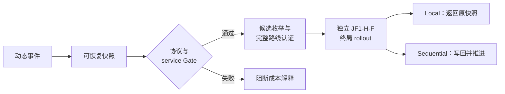

# 论文方法部分草稿

> 版本边界：2026-09-13 路线 B。§1–7 描述已有任务/模拟器/oracle 底座；§8 是待实现的主模型设计，不能在投稿时未经核对写成已完成。文献支持仿真不等于实车验证。

## 1. 问题定义：动态冷链取货回仓

本文研究动态冷链取货回仓问题（dynamic cold-chain pickup-to-depot）。给定中心仓库、同构车辆集合 \(\mathcal V\) 与动态订单集合 \(\mathcal O\)，订单 \(i\) 具有位置 \(x_i\)、需求量 \(q_i\)、服务时间 \(s_i\)、时间窗 \([a_i,b_i]\)、温区类别 \(z_i\)、揭示时刻 \(r_i\) 和初始品质 \(Q_i^0\)。车辆从仓库空载出发，在客户处完成取货后把货物运回中心仓库。与配送问题不同，载重在客户服务完成后增加；订单在进入车辆以前由外部合规冷库保管，因此策略相关的品质累计从 `service_finish` 开始，而不是从车辆离仓或订单生成时开始。

每辆车只执行一次行程。车辆返仓后一次性卸下其 cargo manifest 中的全部货物并关闭，不允许 multi-trip 或 depot reload。一个实例只有在全部订单恰好取货一次、所有启用车辆均已返仓、全部货物已经交付仓库且终局 manifest 为空时才算完成。该运营语义与当前 `current_load += demand`、返仓清空 manifest 的状态转移一致；若将来改为 depot-to-customer 配送，必须建立新的合同版本，不能复用本实验结果。

## 2. 非预知信息结构与事件驱动决策

策略在时刻 \(t\) 只能访问过滤信息集 \(\mathcal F_t\)，其中只包含满足 \(r_i\le t\) 的订单及截至当前时刻已经发生的车辆和冷链状态。未揭示订单的坐标、需求、时间窗、温区及未来揭示序列均不得进入模型、启发式或候选动作生成器。神经表示使用 visible-only normalization；未来节点特征被屏蔽，注意力层对不可见节点施加屏蔽偏置。

环境只在存在 `replan_ids` 时触发决策，包括初始时刻、订单揭示和已有计划耗尽。单纯的服务完成或返仓完成若未产生新的重规划需求，则延续原计划。已经执行的路线前缀和正在执行的 committed leg 不可撤销；不属于本次重规划集合的车辆尾部计划也保持冻结。由此，本次动作的可变车辆集合定义为

\[
\mathcal V_t^{\mathrm{mut}}=\{v\in\mathcal V:\ v\text{ 处于 idle/ready 且 needs\_replan}\}.
\]

候选枚举、匿名新路线的物理车辆匹配、动作应用和最终写回均使用同一 \(\mathcal V_t^{\mathrm{mut}}\)，从而避免把动作认证在一辆车上、却写入另一辆车，或静默修改 committed 车辆的计划。

## 3. 可恢复状态与完整车队动作

每个合法决策点由 `RecourseSnapshotV2` 或冷链扩展 `recourse_snapshot_v3_cc` 表示。快照记录实例与事件编号、时钟、可见和已服务掩码、车辆位置/时间/载重/状态、committed leg、有序 mutable suffix、已服务路线、trace、强制计划、JF1-H-F 的 deferred 状态以及冷链 manifest。`state_hash` 对这些字段和路线顺序做确定性绑定；恢复前必须重算并精确匹配，缺失或不一致均视为协议错误。

对当前客户 \(i\) 的动作不是单条孤立路线，而是完整车队计划上的 coupled insertion：

\[
a=(i,\text{slot},\text{position},\text{predecessor},\text{successor}).
\]

`slot` 可以是由 anchor 标识的现有可变车辆，也可以是匿名 `NEW_ROUTE`。动作先从原 suffix 移除客户，再插入目标位置，其他车辆的计划逐字保持不变。每个候选通过完整 suffix replay 认证时间窗、共享容量、返仓期限和温区兼容性；通过认证只说明该动作在当前已知状态下局部可执行，不能替代终局 100% service Gate。

## 4. 冷链状态、品质与能耗目标

冷链轨迹由版本化合同 `coldchain-contract-v1` 和唯一状态转移 `coldchain_state.transition_segment` 执行。车辆状态包含各温区舱温、zone load、订单级 cargo manifest、累计能耗、累计距离、已交付记录和热约束统计。每段行驶、等待和服务按实际持续时间推进舱温；取货开门事件产生温升与恢复能耗；新订单只在服务完成时加入 manifest；返仓段在到达仓库前继续累计品质损失，到达后再结算并卸货。

当前 pilot 热模型采用一阶集总温度演化。对温区 \(z\)，无主动制冷时的自然温度为

\[
T_z^{\mathrm{nat}}(\Delta t)=T_{\mathrm{amb}}+
(T_z-T_{\mathrm{amb}})\exp(-k_z\Delta t).
\]

温区开启时，再按冻结的降温速率向设定点截断；基础制冷能耗按功率与持续时间累计。开门热量通过温区热容转化为舱温上升，其恢复能耗使用由温差决定并设下界的 COP 计算。该模型当前用于方法学开发，所有参数仍标记为 pilot，不能解释为真实车辆的已校准物理模型。

订单品质按实际温区平均温度递推。温区 \(z\) 的温度相关衰减率为

\[
k_z(T)=k_{z,\mathrm{ref}}\exp\left[
\frac{E_{a,z}}{R}\left(\frac{1}{T_{\mathrm{ref}}}-\frac{1}{T}\right)
\right],
\]

货物剩余品质在持续时间 \(\Delta t\) 后更新为 \(Q'=Q\exp[-k_z(T)\Delta t]\)。终局品质损失按订单数量和商品价值加权。冷链复合目标为

\[
J_{CC}=\frac{D}{s_D}+\lambda_Q\frac{Q}{s_Q}
+\lambda_E\frac{E}{s_E},
\]

其中 \(D\)、\(Q\) 和 \(E\) 分别为行驶距离、终局品质损失和制冷能耗。当前正式协议使用 `o0cc-pilot-devmean-equal-v2`：\(\lambda_Q=\lambda_E=1\)，三个 scale 由 hard-feasible JF1-H-F 在 DEV-CAL 九个 cell 上等权估计并在 DEV-GATE 以前冻结。等权是归一化后的方法学口径，不代表经济价值权重；参数或单位变化导致 baseline 分布变化时必须重新冻结 profile。

## 5. Hard-feasible baseline 与 service-first Gate

对照基线为 JF1-H-F。它首先执行原始 JF1-H 的 joint assignment，再对 dropped 客户在本次 mutable scope 内枚举合法插入与 `NEW_ROUTE`，使用最小增量的完整计划层 repair，并维护 deferred ownership。为给晚揭示、紧时间窗订单保留可执行余量，基线固定 `slack_vehicles=1`；能被 committed 车辆在时间、容量和返仓条件下潜在服务的客户允许显式延期，预留车辆只用于无法等待的订单。

成本比较前先执行 service-first Gate。最低要求包括：`complete=true`、`n_unserved=n_duplicate=0`、时间窗/容量/返仓/温度硬约束可行、全部订单已取货、全部货物返仓、终局 manifest 为空、所有启用车辆返仓，以及 `ownership_violations=terminal_unresolved=0`。缺字段、非有限值、非整数计数、状态恢复失败或 distance/trace accounting 不一致属于 `PROTOCOL_ERROR`；合法但未完成服务属于 `SERVICE_GATE_FAIL`。两者均阻断成本结论。

## 6. Sequential 与 local oracle

Oracle 的共同 continuation 是一条全新的、状态隔离的 JF1-H-F 实例。每个候选都从同一快照恢复，强制应用完整车队动作，再使用该 continuation rollout 到终局。候选只有在终局协议有效且通过 service Gate 后才进入成本比较。

Sequential oracle 在真实 oracle 轨迹访问到的每个决策点，按冻结顺序 `(tw_end, reveal_time, customer_id)` 逐客户处理。对当前客户枚举单客户 `(slot, position)` 动作，并显式评估保持当前计划：客户已在计划中时为 `KEEP`，尚未分配时为 `DEFER`。若候选成本 \(J_a\) 满足

\[
J_a<J_{\mathrm{keep}}-\tau,\qquad
\tau=10^{-9}+10^{-9}\max(1,|J_{\mathrm{keep}}|),
\]

则按 `(cost, action_id)` 稳定选择最优动作并写回当前计划；否则保持 `KEEP/DEFER`。后续客户和事件在已经修改的轨迹上继续，因此该指标测量的是单客户动作连续组合后的轨迹级 headroom。

Local baseline-state oracle 则始终停留在 JF1-H-F 访问到的原始快照。每个客户都从同一 incumbent plan 独立施加一个动作并 rollout，不把前一个客户的选择写回。其客户级差值为

\[
\Delta_{e,i}^{\mathrm{local}}=
\min\{J_{e,i,a}:a\text{ hard-pass}\}-J_e^{\mathrm{keep}},
\]

若没有严格改善动作则记为 0。统计时先在客户内求最优、再对事件求均值、最后得到实例级均值；置信区间只能在实例/seed 组层重采样，不能把同一实例中的数千个候选当作独立样本。Local 衡量当前动作空间的状态级潜力，sequential 衡量这些局部选择能否沿轨迹稳定组合；两者不能混名。

## 7. Oracle 的研究定位

Sequential 与 local oracle 都使用了从当前决策点到终局的完整未来 rollout，因而只能作为离线诊断和监督标签生成机制。它们用于判断既定动作空间是否存在冷链效用 headroom，并为后续 utility-aligned masked reconstruction 生成 `(state, action, terminal utility)` 监督信号。在线部署时未来订单尚不可知，不能直接运行该 oracle；最终 DynMaskCO-CC 必须仅依赖 \(\mathcal F_t\) 中的可见状态预测动作效用。确定性证书和 fallback 约束当前可执行计划，不保证未知未来全部服务；完整服务须由完整 episode 的实际结果验证。

## 8. DynMaskCO-CC 主模型（设计稿，尚待实现与验证）

模型从当前可见订单编码与 fleet/thermal tokens 构造状态表示。事件掩码覆盖新揭示订单和需要重规划/存在风险的可变路线片段，已执行前缀、committed leg 和不可写车队区域保持不变。
masked action decoder 对 certified 的车队—插入动作输出分布，执行一次重构后在更新的可见计划上再次评分，至多 K 轮或达到在线预算。

离线监督来自共同 continuation 的候选终局效用。只有 service/hard-pass 的候选参与成本 soft target；协议错误不参与损失，合法 service-fail 保留并报告覆盖率。
模型使用 context-balanced listwise KL，可辅以 pairwise 与因果不变性项。未来订单可用于离线生成标签，不能进入模型特征、event mask、候选筛选或在线动作接受规则。

> **版本说明（2026-09-17）**：已运行的原型采用连续效用 Huber 回归 +（D 组）可变邻接重构损失，与本节 listwise KL 不同；负结果只对应已运行版本，本节模型仍为待实现设计。

先冻结 encoder 训练 head/adapter/decoder；M0 为相同底座的一次性 utility scorer 诊断，M1 的贡献必须体现为掩码重构循环对真实在线动作的增量。
模型不得在线调用真实未来终局 oracle 选择动作；安全回退到完整 incumbent 也只保证保持当前计划，不保证所有未知未来可服务。

核心比较为 event/no-random mask、iterative/one-shot、pretrained/generic-feature-only、thermal/removed 以及 joint/distance labels。
若某项无增量，如实删除该必要性主张；不能把整方法改善自动归因于每个组件。

## 9. 数据与评价（最终数值待实际实验确定）

新 TRAIN 用于 teacher 和训练，DEV-MODEL 用于开发选择，FINAL-TEST 在最终模型、模拟合同、预算与统计方案固定后用于主模型、强对照及核心消融。
历史 DEV-CAL/PROTO/GATE 与已查看 VAL128 不作新的未见 TEST，也不回灌训练。
O0-CC ORACLE-VAL 是另一个可选确认集合，不是模型 validation，不是启动训练前提。

各方法共享 pickup-to-depot、strict-online、evaluator 和任务设定；允许不同整方法搜索设计，在线耗时包含候选、认证与重构。
同基础实例配对；九场景共用内部 seed 时整组处理；学习重复与实例作为交叉因素分析。完整统计以评估口径为准，不把 action 当独立实验重复。

## 10. 当前已知与待证明

pilot DEV-GATE v4 已记录 sequential GO，说明固定模拟设定下的有限动作 headroom；不证明 learned method 有效。
本轮论文研究路线是 literature-informed simulation，而非现实对象标定。公开基准附加的温区/reveal 字段必须写为合成扩展。
模型提升、相对强基线竞争力、掩码/迭代/冷链机制、新颖性与泛化均待实际证据；不写真实节电、实际保鲜或部署安全结论。
